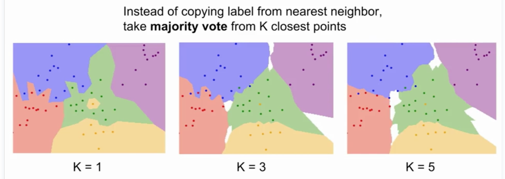
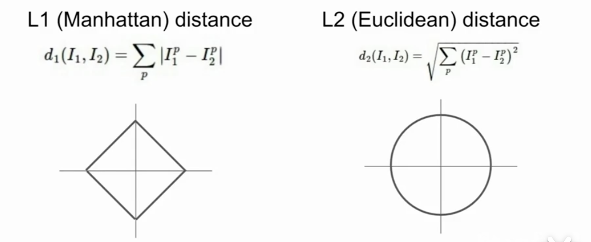
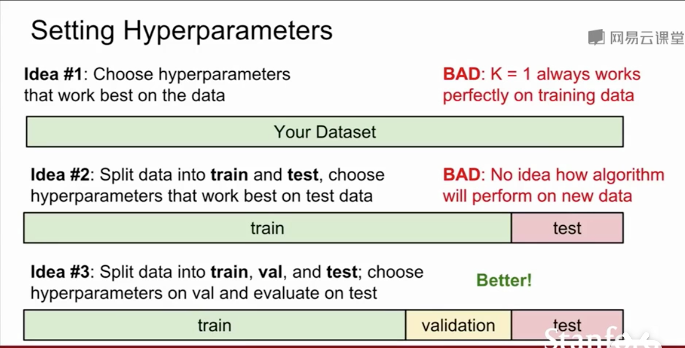
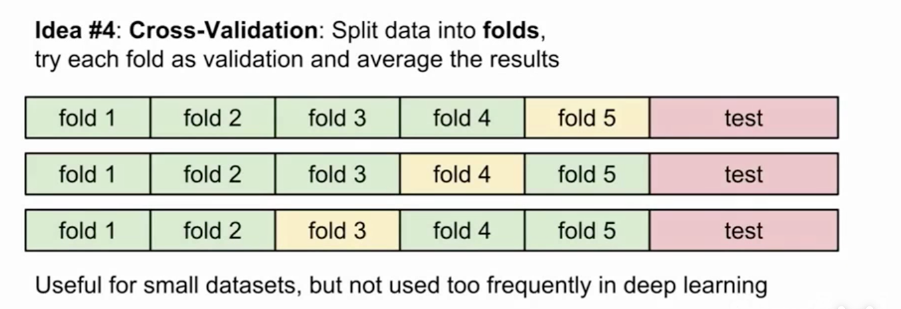
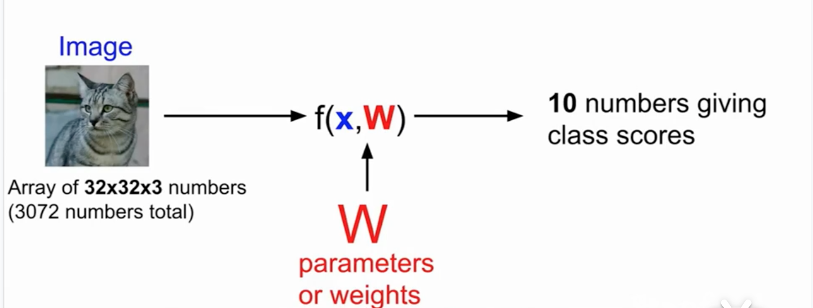
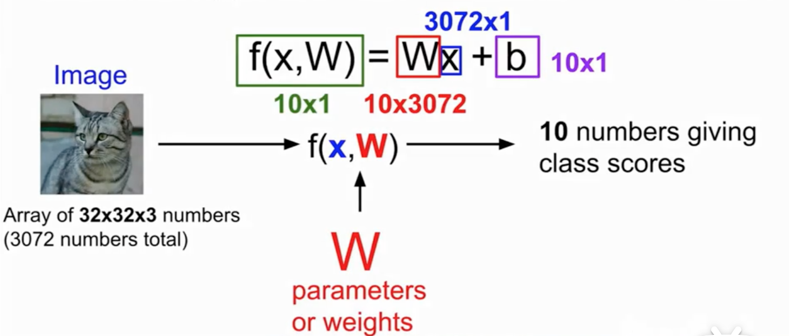
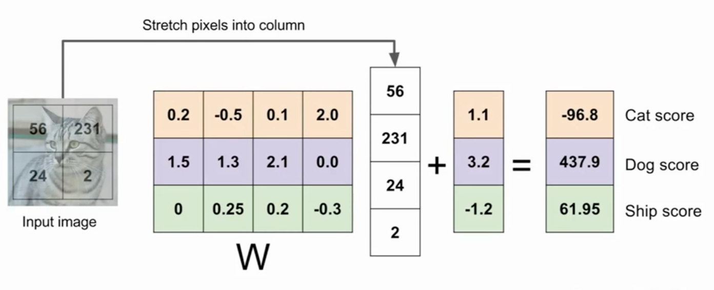
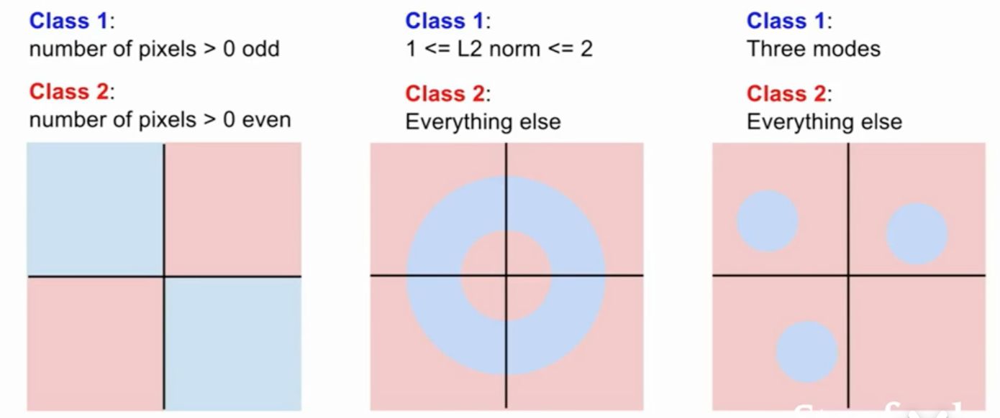

# 图像分类  

## Fisrt classifier: Nearest Neighbor
1. 在训练集中保存所有的图片和标签，
2. 输入图片之后，在训练集中找到最接近的图片和其标签

- 训练集
```python
    def train(images, lables):
        # Machine learning!
        return model
```

- 测试集

```py
    def predict(model, test_images)
        # Use model to predict labels
        return test_labels
```

> CIFAR 10 数据集，可用于练习

## 0. L1 distance d(I1,I2) = 

### 曼哈顿距离

## 1. nearest neighbor classifier

```python
    import numpy as np

    class NearestNeighbor:
        def __init__(self): 
            pass
        def train(self, X, y):
            *** X is N x D where each row is an example. Y is 1-dimension of size N ***
            # the nearest neighbor classifier simply remember all the training Data
            self.Xtr = X
            self.ytr = y

        def pridict(self, X):
            ***X is N x D where each row is an example we wish to predict label for ***
            num_test = X.shape[0]
            # lets make sure that the output type matches the input type
            Ypred = np.zeros(num_test, dtype = self.ytr.dtype)

            # loop over all test rows
            for i in xrange(num_test): 
                # find the nearest training image to the i'th test image
                # using the L1 distance (sum of absolute value differences)
                distances = np.sum(np.abs(self.Xtr - X[i, :]), axis = 1)
                min_index = np.argmin(distances) # get the index with smallest distance
                Ypred[i] = self.ytr[min_index] #predict the label of the nearest example
            
            return Ypred
```
这种方式在训练时只需要O(1)的时间复杂度
但是在测试集上却又O(n)的时间复杂度。这刚好和我们所需要的相反，我们需要在训练的时候可以时间长一点，但使用时越快越好。

### 2. K nearest neighbors
为了避免，单个点对整个图片造成的噪点影响，可以采用KNN的方式，选取最近的K个点，然后根据这K个点中颜色最多的那个来决定当前点的颜色。



#### 2.1 Distance Metric
- L1 (Manhattan) distance
    取决于你选择的的坐标系统，如果你转动坐标轴，将会改变点之间的L1距离
- L2 (Euclidean) distance
    L2是一个确定的，无论你如何旋转坐标轴,L2的值都不会发生变化

如果你输入的特征向量，如果向量中的一些值有一些重要意义，对你的任务获取L1可能合适，如果只是一些普通的值，你不知道他们实际上代表的含义，那么L2可能更自然一点


KNN不光可以用于颜色的分类，只要是可以标识成数据并且可以计算距离的问题，都可以使用这个算法，比如文字，图像等

demo about knn
http://vision.stanford.edu/teaching/cs231n-demos/knn/

### Hyperparameters

what is the best value of K to use?
what is the best distance to use?

他们不一定能从训练数据中学到，你要提前为算法做出选择。并且这是没有办法从数据中学习到的

#### Setting Hyperparameters
在设置数据集比例时需要注意的问题



KNN 基本不会用在图片处理上，
- Very slow at test time
- Distance metrics on pixels are not informative
- Curse of dimensinality
### 思考的两个问题
当我们在思考计算机视觉时，有两种考虑方式
 - 在平面上的高维点概念  because the pixels of the image,     allow us to think of these images as high dimensional vectors
 - 具体图像观察 looking at the concrete images


 ## Linear Classification
 线性分类是一个最简单，但是非常重要的算法，它像一个积木，可以拼接建立一个完整的神经网络乃至真个卷积网络。  
 ### c参数表示 Parametric Approach
 线性分类器是参数模型中最简单的例子。在KNN算法的设置中没有参数，取而代之的是，我们通常会保留训练集中所有的种类， 并在测试时使用。但是在线性分类中，一个参数化的方法中，我们将总结我们对训练数据的认识，并把所有的认识，都用在这些参数**W**中。在测试的时候，我们不再需要实际的训练的数据。 这使得带参数的的算法效率更高.
 
 在深度学习中，整个描述都是关于函数F(x)的正确结构。

 ### line function
 权重用W表示，或者是θ。训练集中的所有数据，都会提现在最后的权重参数W中
 
 

弊端
- 线性分类每个模板要求对应一个函数，不太灵活
- 没办法解决非线性问题
