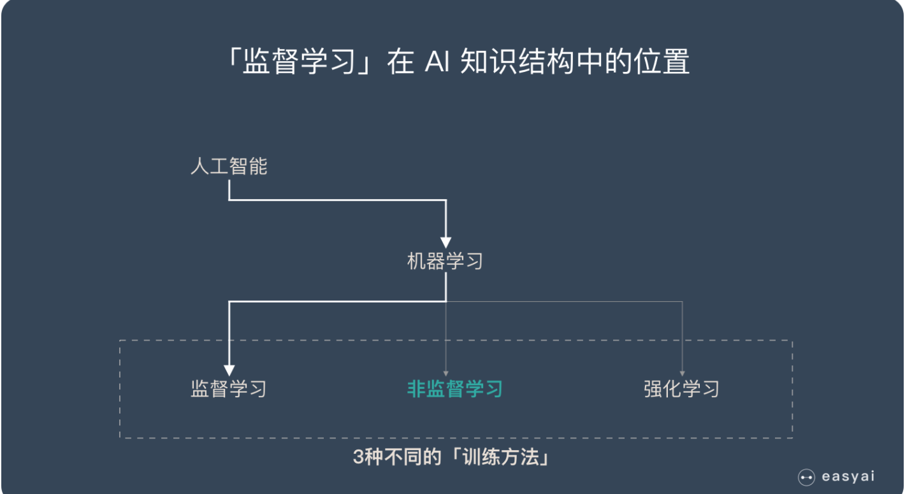

# 监督学习和非监督学习
监督学习和非监督学习是机器学习中的两个分类。

## 1.监督学习
监督学习需要有明确的目标，很清楚自己想要什么结果。
监督并不是指人站在机器旁边看机器做的对不对，而是下面的流程：
1. 选择一个适合目标任务的数学模型
2. 先把一部分已知的“问题和答案”（训练集）给机器去学习
3. 机器总结出了自己的“方法论”
4. 人类把”新的问题”（测试集）给机器，让他去解答

举个栗子：  
我们准备了一大堆猫和狗的照片，我们想让机器学会如何识别猫和狗。当我们使用监督学习的时候，我们需要给这些照片打上标签。我们给照片打的标签就是“正确答案”，机器通过大量学习，就可以学会在新照片中认出猫和狗。这种通过大量人工打标签来帮助机器学习的方式就是监督学习。这种学习方式效果非常好，但是成本也非常高。

### 1.1 任务
监督学习有两个主要的任务
1. 回归
回归：预测连续的、具体的数值。比如：支付宝里的芝麻信用分数
2. 分类。
分类：对各种事物分门别类，用于离散型

### 1.2 主流的监督学习算法
- 朴素贝叶斯  
   分类
- 决策树  
  分类
- SVM  
  分类
- 逻辑回归  
  分类
- 线性回归  
  回归
- 回归树  
  回归
- KNN  
  分类+回归
- Adaboosting  
  分类+回归
- 神经网络    
  分类+回归

## 2. 无监督学习
无监督学习是机器学习中的一种训练方式/学习方式。
无监督学习是一种机器学习的训练方式，它本质上是一个统计手段，在没有标签的数据里可以发现潜在的一些结构的一种训练方式。

举个栗子：  
我们把一堆猫和狗的照片给机器，不给这些照片打任何标签，但是我们希望机器能够将这些照片分分类。通过学习，机器会把这些照片分为2类，一类都是猫的照片，一类都是狗的照片。虽然跟上面的监督学习看上去结果差不多，但是有着本质的差别：

### 2.1 例子
案例1：发现异常

> 有很多违法行为都需要”洗钱”，这些洗钱行为跟普通用户的行为是不一样的，到底哪里不一样？
如果通过人为去分析是一件成本很高很复杂的事情，我们可以通过这些行为的特征对用户进行分类，就更容易找到那些行为异常的用户，然后再深入分析他们的行为到底哪里不一样，是否属于违法洗钱的范畴。

案例2：用户细分

> 这个对于广告平台很有意义，我们不仅把用户按照性别、年龄、地理位置等维度进行用户细分，还可以通过用户行为对用户进行分类。通过很多维度的用户细分，广告投放可以更有针对性，效果也会更好。

案例3：推荐系统

> 大家都听过”啤酒+尿不湿”的故事，这个故事就是根据用户的购买行为来推荐相关的商品的一个例子。
比如大家在淘宝、天猫、京东上逛的时候，总会根据你的浏览行为推荐一些相关的商品，有些商品就是无监督学习通过聚类来推荐出来的。系统会发现一些购买行为相似的用户，推荐这类用户最”喜欢”的商品。

### 2.2 常见算法
常见的两类算法是：聚类和将维

- 聚类：
  简单说就是一种自动分类的方法，在监督学习中，你很清楚每一个分类是什么，但是聚类则不是，你并不清楚聚类后的几个分类每个代表什么意思。
- 降维：
  降维看上去很像压缩。这是为了在尽可能保存相关的结构的同时降低数据的复杂度。

#### 2.2.1 聚类
**K均值聚类（K-means）** K均值聚类就是制定分组的数量为K，自动进行分组。
步骤如下：
1. 定义 K 个重心。一开始这些重心是随机的（也有一些更加有效的用于初始化重心的算法）
2. 寻找最近的重心并且更新聚类分配。将每个数据点都分配给这 K 个聚类中的一个。每个数据点都被分配给离它们最近的重心的聚类。这里的「接近程度」的度量是一个超参数——通常是欧几里得距离（Euclidean distance）。
3. 将重心移动到它们的聚类的中心。每个聚类的重心的新位置是通过计算该聚类中所有数据点的平均位置得到的。
4. 重复第 2 和 3 步，直到每次迭代时重心的位置不再显著变化（即直到该算法收敛）。

**层次聚类**
如果你不知道应该分为几类，那么层次聚类就比较适合了。层次聚类会构建一个多层嵌套的分类，类似一个树状结构。
步骤
1. 首先从 N 个聚类开始，每个数据点一个聚类。
2。 将彼此靠得最近的两个聚类融合为一个。现在你有 N-1 个聚类。
3. 重新计算这些聚类之间的距离。
4. 重复第 2 和 3 步，直到你得到包含 N 个数据点的一个聚类。
5. 选择一个聚类数量，然后在这个树状图中划一条水平线。

#### 2.2.2 降维
**主成分分析 – PCA**主成分分析是把多指标转化为少数几个综合指标。

主成分分析经常用减少数据集的维数，同时保持数据集的对方差贡献最大的特征。这是通过保留低阶主成分，忽略高阶主成分做到的。这样低阶成分往往能够保留住数据的最重要方面。

步骤：
1. 第一步计算矩阵 X 的样本的协方差矩阵 S（此为不标准PCA，标准PCA计算相关系数矩阵C）
2. 第二步计算协方差矩阵S（或C）的特征向量 e1,e2,…,eN和特征值 , t = 1,2,…,N
3. 第三步投影数据到特征向量张成的空间之中。利用下面公式，其中BV值是原样本中对应维度的值。

**奇异值分解 – SVD**

## 3 二者的对比
以上面猫狗分类为例，非监督学习中，虽然照片分为了猫和狗，但是机器并不知道哪个是猫，哪个是狗。对于机器来说，相当于分成了 A、B 两类。
他们的差异
1. 监督学习是一种目的明确的训练方式，你知道得到的是什么；而无监督学习则是没有明确目的的训练方式，你无法提前知道结果是什么。
2. 监督学习需要给数据打标签；而无监督学习不需要给数据打标签。
3. 监督学习由于目标明确，所以可以衡量效果；而无监督学习几乎无法量化效果如何。
