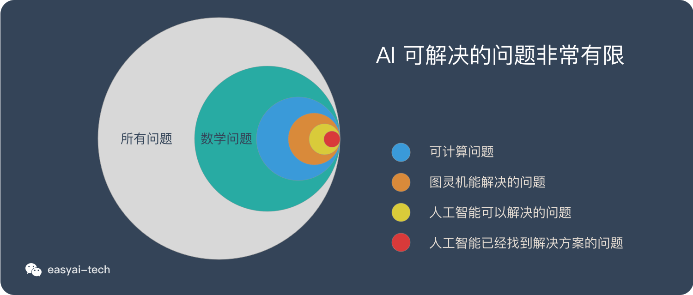

# 图灵

图灵是计算机的鼻祖，现代计算机的冯若依曼体系结构，也是在图灵的基础上的一次实现。在人工智能领域，经常能听到和图灵相关的一些词汇 
 - 图灵机
 - 图灵测试
 - 图灵完备

 这些词汇分别代表了什么意思呢？

 ## 图灵机
 图灵机（英语：Turing machine），又称确定型图灵机，是英国数学家艾伦·图灵于1936年提出的一种将人的计算行为抽象化的数学逻辑机，其更抽象的意义为一种**计算模型**，可以看作等价于任何有限逻辑数学过程的终极强大逻辑机器。

这个概念首次提出是在图灵1936年发表的“On Computable Numbers, with an Application to the Entscheidungsproblem”(《论可计算及其在判定性问题上的应用》)。文章描述了这种计算模型，并且证明了，只要图灵机可以被实现，就可以用来解决任何可计算问题。

 ### 计算模型
 计算模型（computational model）是计算科学中的一个数学模型，它使用大量的计算资源来用计算机模拟研究一个复杂系统的行为。被研究的系统通常是一个复杂的非线性系统，这种系统不易取得简单、直观的解析解。相比于推导数学分析来解决问题，它是通过在计算机中调整系统参数并研究实验结果的差异来完成模型。模型的操作理论可以从这些实验来推断/推导。

 常见的计算模型有天气预报模型、地球模拟器模型、飞行模拟器模型、分子蛋白质折叠模型和神经网络模型。

 ## 图灵测试
 图灵测试（英语：Turing test，又译图灵试验）是图灵于1950年提出的一个关于判断机器是否能够思考的著名思想实验，测试某机器是否能表现出与人等价或无法区分的智能。测试的谈话仅限于使用唯一的文本管道，例如计算机键盘和屏幕，这样的结果不依赖于计算机把单词转换为音频的能力。

 ### 测试内容
 如果一个人（代号C）使用测试对象皆理解的语言去询问两个他不能看见的对象任意一串问题。对象为：一个是正常思维的人（代号B）、一个是机器（代号A）。如果经过若干询问以后，C不能得出实质的区别来分辨A与B的不同，则此机器A通过图灵测试。

 ### 涉及的技术课题
 - 自然语言处理
 - 知识表示
 - 自动推理
 - 机器学习
 - 计算机视觉（完全图灵测试）
 - 机器人学 （完全图灵测试）

 ## 图灵完备
 在可计算性理论，如果一系列操作数据的规则（如指令集、编程语言、细胞自动机）可以用来模拟任何图灵机，那么它是图灵完备的。这意味着这个系统也可以识别其他数据处理规则集，图灵完备性被用作表达这种数据处理规则集的一种属性。如今，几乎所有编程语言都是具有图灵完备性的。这个词以引入图灵机概念的数学家艾伦·图灵命名。

 一个计算系统可以计算任何图灵-可计算函数，被称作图灵完全（或者图灵完备）。或者任何可以模拟通用图灵机的系统。

 ### 图灵完备语言
如今主流的编程语言（C++，Java，Python，以及等等等等）都是图灵完备的语言。关于语言优劣之争也只是在其封装、优化等方面，以及因为这些区别而产生的“不同语言适用于不同情况”的争执。如果我们回到最底层，就会发现它们可以实现的功能其实完全一样，并且本质上就是一个图灵机。

 ### 非图灵完备语言
 - 正则语言，通过有限状态机进行识别
 - XML，HTML，JSON，和YAML 用来表示结构化数据而不描述计算