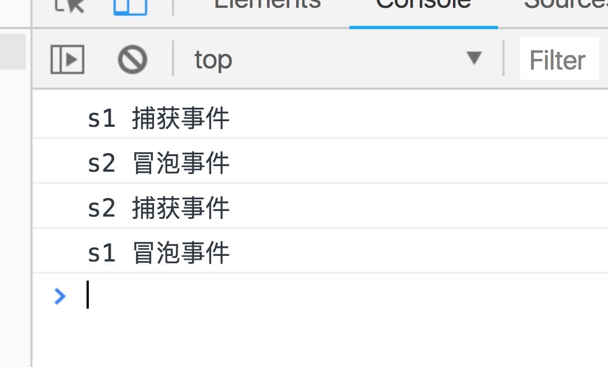

# 冒泡和捕获

## 1. 问题的由来

从一段代码说起

``` html
    <div id="outer">
        <p id="inner">

        </p>
    <div>
```
父子元素，分别绑定了点击事件

``` javascript
    document.getElementById('outer').addEventListener('click', function(e) {
        alert('outer click!');
    })

    document.getElementById('inner').addEventListener('click', function() {
        alert('inner click');
    })
```

那么问题来啦，当我点击 内层inner元素时，是只弹`inner click`，还是`outer click`也会弹，如果两个都会弹的话，他们的弹出顺序又是怎么样的？
带着这个问题向下看。

## 2. 浏览器之争

JS代码依赖解释器去解析，浏览器说让它怎么弹，它就会怎么弹。

针对第一个问题（是只弹一个还是两个都弹），浏览器厂商没有分歧，都一致选择了两个都弹——如果只触发一个的事件，也就不会出现冒泡还是捕获这个问题。至于为什么选择两个都弹，我们后面再说。OK,因为第一个问题的选择，直接导致了第二个问题，那是**先触发内部元素还是先触发外部元素呢？**

我们给两种方式分别取了名字，`事件冒泡(event bubbling)`和 `事件捕获(event capturing)`。

#### 2.1 事件冒泡
  顾名思义，主张像冒泡一样，自下而上，自小变大，也就是先触发内部，一次向上触发,直到最外层元素documt:父元素-祖父元素->...->document。  

  开头的代码为例：  
 `p -> div -> body -> html -> document`

#### 2.2 事件捕获
  与冒泡相反，主张自顶而下，document-> ...->祖父元素->父元素->target元素
  
  开头的代码为例：  
 `document -> html -> body -> div -> p`

#### 2.3继续回来，浏览器之争
网景 和 微软 曾经的战争还是比较火热的，当时， 网景主张捕获方式，微软主张冒泡方式。后来 w3c 采用折中的方式，平息了战火，制定了统一的标准——先捕获再冒泡。

关键来了 - <span style="font-size:24px; color:#ff5e5e">先捕获再冒泡</span>


## 3. 先捕获再冒泡

先捕获再冒泡，就是说，在一次操作中，并不是只有捕获或者只有冒泡，而是一个先后执行的过程。
并且将事件绑定在捕获阶段还是冒泡阶段可以由参数决定。 

```javascript
    element.addEventListener(event, function, useCapture)
```

第一个参数定义了绑定的事件  
第二个参数定义事件执行的回调  
第三个参数就是定义该回调发生在事件冒泡阶段（false）还是事件捕获阶段(true)。默认为false.

## 4 捕获 & 冒泡
当事件捕获和事件冒泡一起存在的情况，事件又是如何触发呢。
这里记被点击的DOM节点为target节点

 1.  document 往 target节点，捕获前进，遇到注册的捕获事件立即触发执行

 1. 到达target节点，触发事件（对于target节点上，是先捕获还是先冒泡则捕获事件和冒泡事件的注册顺序，**先注册先执行**）

 1.  target节点 往 document 方向，冒泡前进，遇到注册的冒泡事件立即触发
```html
    <div id="s1">s1
        <div id="s2">s2</div>
    </div>
    <script>
    s1.addEventListener("click",function(e){
            console.log("s1 冒泡事件");         
    },false);
    s2.addEventListener("click",function(e){
            console.log("s2 冒泡事件");
    },false);
            
    s1.addEventListener("click",function(e){
            console.log("s1 捕获事件");
    },true);
            
    s2.addEventListener("click",function(e){
            console.log("s2 捕获事件");
    },true);
    </script>
```

其执行顺序为：

s1捕获  s2冒泡  s2捕获  s1冒泡


## 5. 疑问补充

#### 4.1 为什么两个都要触发，只触发点击的元素不可以吗？
理论上可以，但会遇到一些问题比如，有一个需求点击ul内部的li标签，获取里面的数字。  
```html
    <ul id="wrapper">
        <li>1<li>
        <li>2<li>
        <li>3<li>
        <li>4<li>
        <!-- 动态添加一个新元素 -->
        <li>5</li>
    </ul>
```
我们当然可以直接在li上绑定click事件。  
但是，假如我初始化绑定之后，又动态得添加了一个li标签。那么我是不是需要为每次添加的元素，都重新添加一个绑定事件？  
这样当然可以。  
但更方便的做法是：我把cilck事件绑定在wrapper上，根据事件捕获原理，事件会自上而下传递给li。  
我们只需要获取这个事件的目标元素（e.target），即可以完成对点击元素的获取。

这就是经常会听到的<span style="color:red; font-size:20px;">事件委托</span>。

*注：（假如目标元素内有子元素，获取到的是它的子元素怎么办）

```html
    <ul id="wrapper">
        <li>
            1
            <span>我是一个li标签内的子元素!!!!!!!!!!!!</span>
        <li>
        <li>2<li>
        <li>3<li>
        <li>4<li>
        <!-- 动态添加一个新元素 -->
        <li>5</li>
    </ul>
```

css 解决方案：
```css
li >  * {
  pointer-events: none;
}
```

jquery解决方案：
```javascript
// on中的第二参数就是我们的目标元素的选择器
$('ul#wrapper').on('click', 'li', function(event) {
    // dosomething
})
```

