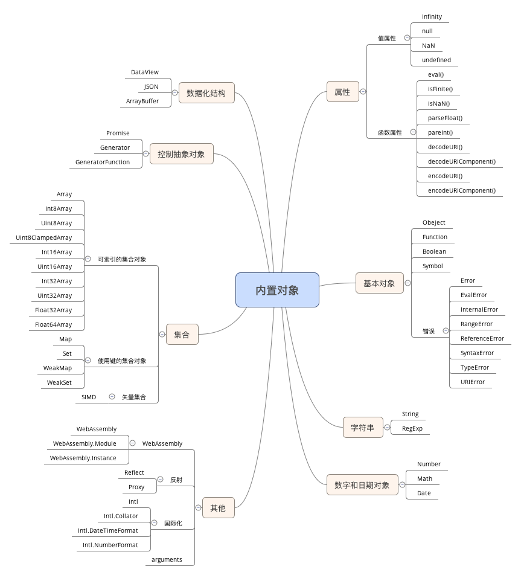

## JavaScript基础
- JavaScript严格区分大小写

---
## 数据类型
最新的ECMAScript标准定义了7种数据类型：
- 6中原始类型
- - Boolean
- - Null
- - Undefined
- - Number
- - String
- - Symbol (ES6)

- Object

注*:没有Array Int Float 

Array 属于Object ; Int Float属于Number

> 除 Object 以外的所有类型都是不可变的（值本身无法被改变）。例如，与 C 语言不同，JavaScript 中字符串是不可变的（如，JavaScript 中对字符串的操作一定返回了一个新字符串，[原始字符串并没有被改变](垃圾回收.md)）。我们称这些类型的值为“原始值”。

由于原始值的这种特性，我们就要关注旧的值，如何处理，也就是[垃圾的回收](垃圾回收.md)。
 
---

#### Number
根据 ECMAScript 标准，JavaScript 中只有一种数字类型：基于 IEEE 754 标准的双精度 64 位二进制格式的值（-(263 -1) 到 263 -1）。它并没有为整数给出一种特定的类型。除了能够表示浮点数外，还有一些带符号的值：+Infinity，-Infinity 和 NaN (非数值，Not-a-Number)。

要检查值是否大于或小于 +/-Infinity，你可以使用常量 Number.MAX_VALUE 和 Number.MIN_VALUE。另外在 ECMAScript 6 中，你也可以通过 Number.isSafeInteger() 方法还有 Number.MAX_SAFE_INTEGER 和 Number.MIN_SAFE_INTEGER(253-1) 来检查值是否在双精度浮点数的取值范围内。 超出这个范围，JavaScript 中的数字不再安全了，也就是只有 second mathematical interger 可以在 JavaScript 数字类型中正确表现。

(双进度浮点数)

---

### String
JavaScript的字符串类型用于表示文本数据。它是一组16位的无符号整数值的“元素”。在字符串中的每个元素占据了字符串的位置。第一个元素的索引为0，下一个是索引1，依此类推。字符串的长度是它的元素的数量。

String 也是一个对象，但是由于每次修改操作都是返回一个新值，所以不会有浅拷贝的问题。

----

### 对象 Object
- 标准对象和函数  
    一个JavaScript对象就是键和值直接的映射。  
    函数是一个附带可被调节功能的常规对象。 

- 日期对象Data

- 有序集：数组和类型数组

- 键控集：Maps,Sets,WeakMaps, WeakSets

- 结构化数据JSON

详情如下图：  

### 关于如何理解Number和String即是一个基础类型但是又出现在了Object里。

既然Javascript是区分原始值和Object,而且Number和String又都是Object里的对象，但是Number和String又属于原始值类型，为什么呢？

这要从原始值的定义入手，原始值定义有一个关键词是值本生无法改变,那么也就是说虽然Number和String属于Object,拥有一些属性和方法,但是用他们定义的值无法被改变，每次改变都有一个新值的出现，而旧的值就留在内存中，等待回收。

