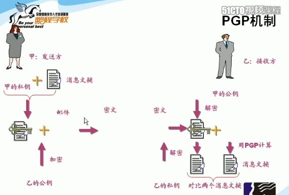

## HTTPS
- 什么是公钥和私钥，为什么是安全的？

- 对称加密和非对称加密

### 1、什么是公钥和私钥，为什么是安全的。 

#### 1.1 公钥和私钥的性质

不讨论数学原理，讨论其实现和传输过程。    
我们先假定一个数据的发送方和一个数据的接收方（就叫小红和小明好了！）  
发送方小红拥有一对密钥：公钥和私钥。  
接收方小明也同样拥有一对密钥：公钥和私钥。  
注意：这四把钥匙（密码）各不相同！  

>公钥：公钥是可以在网络上传输的，也就是说接收发送双方都可以知道彼此的公钥，当然，如果你用网络嗅探等技术，也可以在网络上嗅探的公钥的内容，但你仅有公钥是无法解密文件的。

>私钥：私钥是用户各自私有的，不会在网络中传输（也就是说不需要接收发送双方彼此交换此密钥），这就保证了此密码的安全性，黑客无法在网络中嗅探到该密钥，而是被严格的储存在用户自己的主机中。
 
公钥和私钥的关系：公钥加密的数据只有私钥可以解锁，私钥加密的数据只有公钥能解锁，而两者都无法自己解锁自己！这一点是保证数据无法被窃取的关键！而公钥和私钥的唯一区别也接就是公钥会互相交换在网络上传输，而私钥自己保留不在网络上传输。

OK 有了这个做铺垫，我们再来它如何作用域传输

#### 1.2 传输过程
发送方小红要向接收方小明发送一封情书，但是小红呢，比较害羞，怕某些别有用心的人偷看到他写的悄悄话，就利用了加密技术，让网络上无聊的人们无法偷窥到它的情书。
  - 通过握手协议，小红和小明交换自己的公钥，公钥是可以在网络上传输的
  - 第一步:小红用自己的私钥给情书上了第一道锁，这个私钥只有她自己知道。
  - 第二步：其实两人之前相互了解过（通信过），这个时候已经都拥有的对方的公钥，所以小红又在第一步的基础上用小明的公钥给情书加了第二把锁。
  - 第三步：这个时候小红这边就已经把情书加密好了，她很满意，因为已经万无一失了！她把加了两把锁的情书发到网络上传送给小明，这个时候网络上的黑客们也许已经在小红和小明初次幽会并交换公钥的时候窃取到了两人的公钥。但请想想小红的加锁过程，最外面一道锁（第二道锁）是用小明的公钥加密的，也就是说要用小明的私钥来解密才可以打开，但黑客最多只能拥有两人的公钥，而无法获得小明的私钥，这就有效的避免的数据被窃取，即使黑客截获了情书，也只能看到一堆杂乱无章的乱码，而无法真正得知情书的内容。
  - 第四步：小明顺利的接收到了小红的情书，利用自己的私钥，成功解开的外层的锁。（外层的锁是小红用小明的公钥锁的！）
  - 第五步：小明又拿出了小红的公钥，解开了情书内层的锁。这时候就可确定情书确实是小红发的，而不是其他人伪造来忽悠自己的。（内层的锁是小红用自己的私钥锁的！）

    最终，小明成功的看到了小红的情书   
    

#### 1.3 几点疑问

1. 小红可不可以只用小明的公钥加密，然后小明用自己的私钥解密，为什么小红要多一层自己的私钥加密？

    为了更安全，确认双方的身份，第五步不能省。由于公钥可以在传输过程中，可以被他人获取，所以如果没有这一个私钥加密的话，用户可以冒充小红和小明进行通信，所以为了使双方身份一致，需要小红用私钥对自己的信息进行一次加密。

2. 如何生成这样的公钥私钥，实现私钥加密公钥解密，公钥加密私钥解密？

    这就需要一套加密算法，法：RSA、ECC（移动设备用）、Diffie-Hellman、El Gamal、DSA（数字签名用）等等。

### 2. 对称加密和非对称加密  

#### 2.1 对称加密

对称加密采用了对称密码编码技术，它的特点是文件加密和解密使用相同的密钥加密

#### 2.2 非对称加密
与对称加密算法不同，非对称加密算法需要两个密钥：公开密钥（publickey）和私有密钥（privatekey）。

公开密钥与私有密钥是一对，如果用公开密钥对数据进行加密，只有用对应的私有密钥才能解密；如果用私有密钥对数据进行加密，那么只有用对应的公开密钥才能解密。因为加密和解密使用的是两个不同的密钥，所以这种算法叫作非对称加密算法。

#### reference

