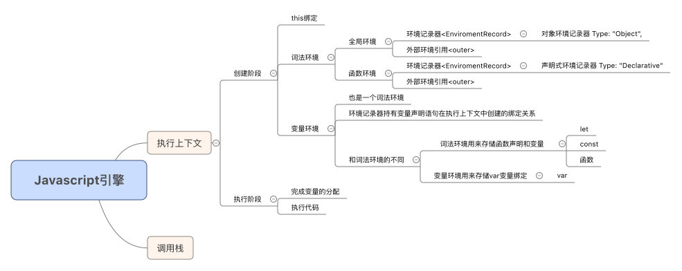

# 执行上下文

## 脑图



## 代码理解

```js
    let a = 20;
    const b = 30;
    var c;

    function multiply(e. f) {
        var g = 20;
        return e * f * g;
    }

    c = multiply(20, 30);
```

执行上下文：

``` JS

    GlobalExectionContext = {

        ThisBinding: <Global object>,

        LexicalEnvironment: {
            EnvironmentRecord: {
                Type: "Object",
                // 这里绑定标识符
                a: <uninitialized>,
                b: <uninitialized>,
                multiply: <func>
            },
            outer: <null>
        },

        VariableEnvironment: {
            EnvironmentRecord: {
                Type: "Object",
                // 在这里绑定标识符
                c: undefined,
            },
            outer: <null>
        }
    }

    FunctionExectionContext = {

        ThisBinding: <Global Object>,

        LexicalEnvironment: {
            EnvironmentRecord: {
                Type: "Declararive",
                // 这里绑定标识符
                Arguments: {0: 20, 1:30, length: 2}
            },
            outer: <GlobalLexicalEnvironment>
        },

        VariableEnvironment: {
            EnvironmentRecord: {
                Type: "Declarative",
                // 在这里绑定标识符
                g: undefined
            },
            outer: <GlobalLexicalEnviron>
        }
    }
```
