## 一、原型对象

JS里没有类的概念，全部都是对象，但是通过new 的方式我们可以实现和Class类似的效果。

```javascript
    function Foo(name,age) {
        this.name = name;
        this.age = age;
    }

    var foo = new Foo('wyl', 28);

```

为了区分这两者的不同，方便后续描述方便，我们把`Foo`这样的定义称为**大对象**，`foo`这样的定义称为**小对象**.

从这个例子我们就可以看出，foo和Foo直接有着非常密切的联系，那这种联系在编程中如何体现呢？这里就要提到他们的中间桥梁 —— 一个对象。在开始介绍它之前，我们给它取名字叫`原型对象`。

- 它长什么样子呢？
- 它的作用又是什么呢？

先从一个最常见但是没有最常用的属性说起：

## 1  `__proto__`

JS提供了一个叫做`__proto`的属性，它简直太常见了。任何对象均有此属性（真的吗？？？！！！）。

### 1.2 小对象的`__proto__`
我们先来看看小对象下的`__proto__`：  
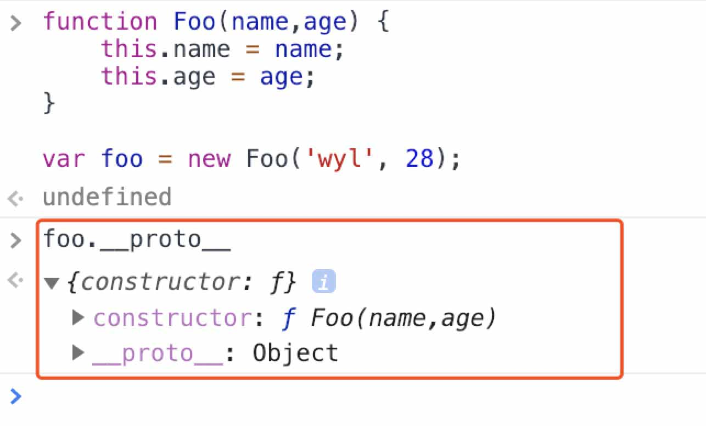  

它指向一个对象——有两个属性组成:constructor和又一个`__proto__`(考虑到一切对象皆有`__proto`,这里也就不足为奇)。

```javascript
    {
        constructor: {
            ...
        },
        `__proto__`: {

        }
    }
```

这个对象就是我们今天要重点要研究的对象——**原型对象**。

通过上面的例子我们已经知道可以通过 `小对象.__proto__`来获取到其对应的原型对象。进一步分析这个原型对象，它有两部分组成

#### 1.`__proto__`

#### 2.constructor

我们先顺着`__proto__`看下去
原型对象的`__proto__`指向了另外一个对象：

```javascript
    {
        constuctor: {
            // f Object()
        },
        hasOwnProperty: f{},
        isPrototypeOf: f{},
        protertyIsEumerable: f{},
        toLocaleString: f{},
        toString: f{},
        valueOf: f{},
        `__defineGetter__`:f{},
        `__defineSetter__`:f{},
        `__lookupGetter__`:f{},
        `__lookupSetter__`:f{},
        get: f{},
        set: f{}
    }
```

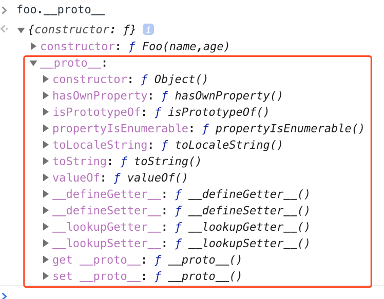

到这里我们发现，这个对象怎么没有`__proto__`呢？说好的所有对象都有`__proto__`，这是什么原因呢，我们这里不做展开，在后面会解释这个问题，先要明白三点：

1. 小对象.`__proto__`  = 原型对象
2. 原型对象.`__proto__` = 一个确定的对象(没有`__proto__`)。
3. 这个确定的对象是JS里唯一没有`__proto__`的对象

小对象的`__proto__`看完，我们来分析一下大对象，既然大对象也是对象，那么它一定也有`__proto__`。

### 1.3 大对象的`__proto__`

还是之前的代码，在控制台输入 
> `Foo.__proto__`  
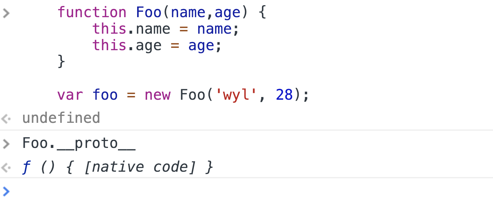

看到返回的是一个字符串`ƒ () { [native code] }`，不是我们想象中的对象。这就是JS帮我们封装好的代码，也就是说底层语言留给我们的接口。  
那native code 是什么东西呢，我们放后面讲，现在需要明白第四点

4. 大对象.`__proto__` = 我们不可改动的native code

`__proto__`先告一段落，我们再来看prototype

## 2. prototype

之前我们讲了`__proto__`，这个prototype又是什么鬼？先来看一张图

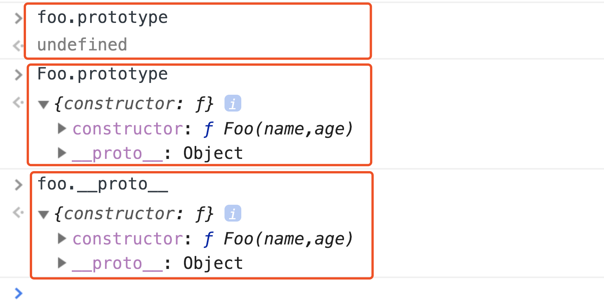

分别输入:  

```javascript
 >foo.prototype
 >Foo.prototype
 >foo.`__proto__`  
```

从输出的结果来看，小对象没有prototype,大对象的prototype和小对象的`__proto__`指向同一个对象，没错就是我们开始讲到的原型对象！！ 它们之间的联系终于建立起来了，为了验证这个关系，向控制台输入
> foo.`__proto__` === Foo.prototype
结果是什么呢？  
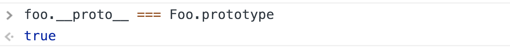

<p style="color:red">true!!</p>,实锤无误了。  
样我们得到了小对象、大对象、原型对象之间的关系。我们再之前的结论里添加第五条：  

5. 小对象没有prototype；大对象.prototype === (其对应)小对象.`__proto__` === 原型对象

这个关系建立之后，再去分析原型对象的内部结构。回忆一下Foo的原型函数  

```javascript
    {
        constructor: {
            ...
        },
        `__proto__`: {

        }
    }
```

由两部分组成，`__proto__`之前我们看过，指向了一个没有`__proto__`的原型对象。
我们现在来看另一个属性，constuctor:

## constructor

constructor顾名思义：构造函数。那我们来仔细看看这个constructor有些什么：

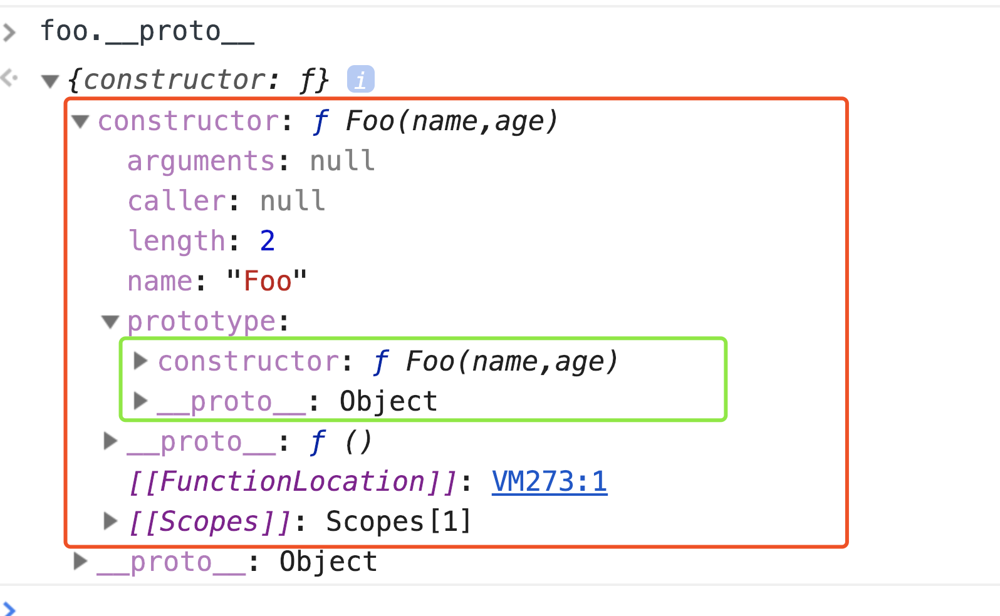
红色框内是constructor的内容，大体属性是下面几个：

```javascript
    constructor: {
        arguments: null,
        caller: null,
        length: number,
        name: 'Foo',
        prototype:  {
            constructor: {},
            `__proto__`: {}
        },
        `__proto__`: f()
    }
```

这个constructor是何方神圣呢？是谁的构造函数呢，从它的name属性来看，它应该就是Foo()函数，为了验证这个猜想，在控制台输入：
> foo.`__proto__`.constructor === Foo;

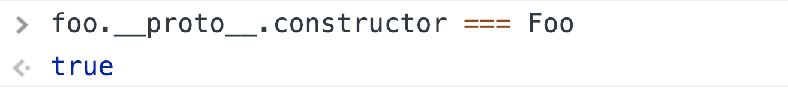

得到的结果印证了我们的猜想，我们再来看上上图绿色的部分，这恰好和我们之前prototype联系起来。

> \>`foo.__proto__.constructor` === Foo;

> \> `Foo.prototype` === `foo.__proto__` === `foo.__proto__.constructor.prototype` === 其对应的原型对象;

prototype只出现在constructor对象内，所以小对象没有prototype,原型对象没有prototype。controctor和prototype一定是成对出现的，通过是否拥有constructor属性可以判断这个函数是否可以new 一个新对象：

- 可以new就代表有prototype属性
- 没有constuctor的对象没办法new

至此原型对象、`__proto__`、prototype、constructor、大对象、小对象之间的关系已经建立。现总结如下：

1. 小对象.`__proto__`  = 原型对象
2. 原型对象.`__proto__` = 一个确定的对象(没有`__proto__`)。
3. 这个确定的对象是JS里唯一没有`__proto__`的对象
4. 大对象.`__proto__` = 我们不可改动的native code
5. 小对象没有prototype；大对象.prototype === (其对应)小对象.`__proto__` === 原型对象
   -`foo.__proto__.constructor` === Foo;
   - `Foo.prototype` === `foo.__proto__` === `foo.__proto__.constructor.prototype` === 其对应的原型对象;

我们回过头再去看之前遗留下来的两个问题：

 1. 没有`__proto__`属性的对象是什么
 2. 大对象.`__proto__`指向的native code 是什么

## 二、没有`__proto__`属性的对象是什么

### Object

 我们知道，JS里的一切皆对象，我们要建立一个对象，一般都可以用一下方法：

1. 直接new Object()

    ```javascript
        var obj1 = new Object();
    ```

2. 也可以通过{} 快速创建

    ```javascript
        var obj2 = {};
    ```

obj1和obj2这种方式是等效的，{}是new的快捷写法，也可以说是一种语法糖写法。  

那通过这样的方式呢

```javascript
    function Foo() {

    }

    var foo = new Foo(){}
```

他们有什么区别呢？  
区别就是foo 对象和 obj1、obj2的原型对象不同  

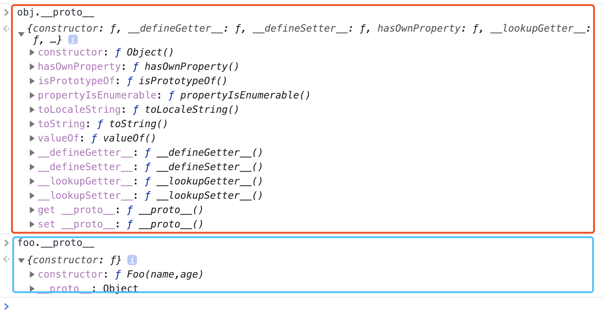    
红色框内是obj的原型对象，蓝色框内是自定义对象foo的原型，明显多出了好多。

什么原因呢？  
 因为`function Object() {}`这个对象时JS Core帮我们写好的，和我们自己定义的相比，里面定义了好多方法。

仔细观察这个`obj.__proto__`（红色框内容），这个原型对象没有`__proto__`,再仔细对比，这和我们之前发现的没有`__proto__`那个对象一模一样。

  

也就是说，之前我们一直提到的那个没有`__proto__`的对象就是JS原生定义好的Object的原型对象,而且这个对象是唯一的，所有的原型对象的`__proto__`，都指向它。
为了验证我们的猜想，我们再建立一个对象。

```javascript
    function Foo2() {

    }

    var foo2 = new Foo2();
```

然后在控制台输入：
> \>: `foo.__proto__.__proto__` === Object.prototype

> \>: `foo2.__proto__.__proto__` === Object.prototype

> \>: `foo2.__proto__.__proto__` === `foo2.__proto__.__proto__`

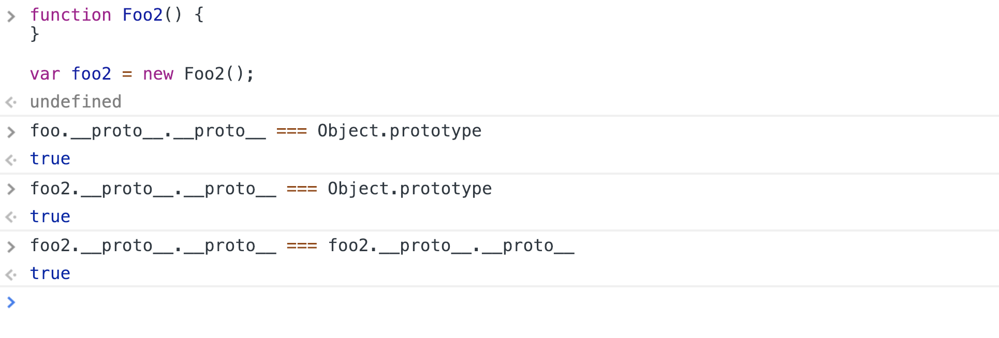  

输出结果确定，

6. 除Object的原型对象没有`__proto__`外，其他原型对象的`__proto__`都指向Object的原型对象，这个原型对象的内容由JS Core 提前定义。

第一个问题解决之后，来看第二个问题

## 三、大对象.`__proto__`指向的native code 是什么

> 小对象.`__proto__` == 对象.prototype == 原型对象。

那大对象.`__proto__`是什么东西呢，从控制台来看是一个神秘的native code。似乎宣告了这条路已经走不下去了，山重水复疑无路，柳暗花明又一村。直接使用`Foo.__proto__`没有结果，综合之前的`foo.__proto__.constructor == Foo`,就有：`Foo.__proto__` == `foo.__proto__.constructor.__proto__`。我们是不是可以通过小对象去看大对象的`__proto__`呢？  
马上尝试：  

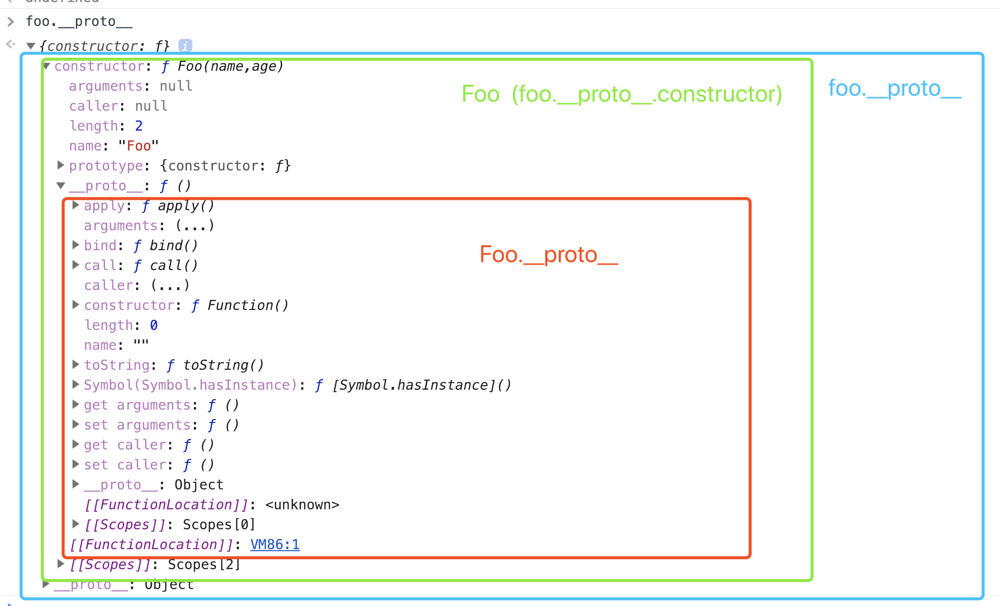 

成功拿到了`Foo.__proto__`对象，从结构上看

```javascript
    {
        apply: ƒ apply()
        arguments: (...)
        bind: ƒ bind()
        call: ƒ call()
        caller: (...)
        constructor: ƒ Function()
        length: 0
        name: ""
        toString: ƒ toString()
        Symbol(Symbol.hasInstance): ƒ [Symbol.hasInstance]()
        get arguments: ƒ ()
        set arguments: ƒ ()
        get caller: ƒ ()
        set caller: ƒ ()
        __proto__: Object
    }
```

它也有constructor属性，所以这也是一个原型对象。 什么情况？

这就不能不说JS里的万剑归宗对象`Function`。

### Function

```javascript

    function Foo(name, age) {
        this.name = name;
        this.age = age;
    }
    var foo = new Foo();

```

通过这种方式，我们定义了foo和Foo的大小关系，foo取名小对象，Foo取名大对象。

那么Foo是从哪里来的呢？

> Function 构造函数 创建一个新的Function对象。 在 JavaScript 中, 每个函数实际上都是一个Function对象。

翻译一下就是，Foo其实也是一个Funtion对象。
语法:

> new Function ([arg1[, arg2[, ...argN]],] functionBody)

### 参数

#### 1. arg1, arg2, ... argN

   被函数使用的参数的名称必须是合法命名的。参数名称是一个有效的JavaScript标识符的字符串，或者一个用逗号分隔的有效字符串的列表;例如“×”，“theValue”，或“A，B”。

### 2. functionBody

   一个含有包括函数定义的JavaScript语句的字符串。

Foo也可以被写为：

```javascript
    var Foo = new Function('name', 'age', 'this.name = name;this.age = age')
```

按照我们之前的规则，如果Foo是大对象的话，Function 就是一个大大对象。则有：  

大对象.`__proto__` == 大大对象.prototype(Function 的原型对象)  
为了验证正确与否，我们在控制台输入：
> \>:`Foo.__proto__` === Function.prototype  

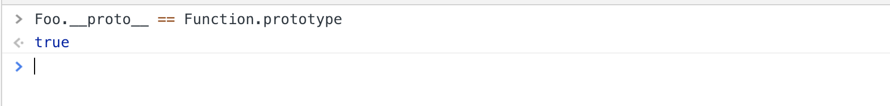 

验证了这个关系的正确，所以我们看到的native code 其实就是Function的原型函数。直接输入`Function.prototype`返回native code。
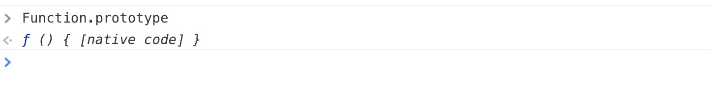 
但是采用曲线救国的方式：
 
从这个图可以知道，Function是所有大对象的大对象，就是我们所说的大大对象。通过大大对象.protype可以获取到它的原型对象，在原型对象里有

## 四、总结

### 1. 图

最后总结先来一张从网上看的图，可以说是把关系画的非常清晰。
 

### 2. 用文字总结一下

1. `小对象.__proto__` === `大对象.prototype` === 其原型对象
2. `原型对象.__proto__` === Object.prototype （这是唯一一个没有`__proto__`的对象） （！！！比较特殊）
3. 构造函数对象才有prototype属性，指向其原型对象：
   - 构造函数对象.prototype.constructor == 自己
   - 不是构造函数的对象，没有prototype属性
   - 小对象不是构造函数，不能new出新对象 eg： foo obj Math
4. 大对象.`__proto__` === Function.prototype
5. Function.`__proto__` === Function.prototype === Function的原型对象 (!!!比较特殊)
6. 除Object的原型对象没有__proto__外，其他原型对象的__proto__都指向Object的原型对象，这个原型对象的内容由JS Core 提前定义。
7. 每个构造函数都有一个原型对象（prototype），原型对象都包含一个指向构造函数的指针（constuctor）,而实例都包含一个指向原型对象的内部指针（`__proto__`）

## 五、下一篇

通过尝试实验，搞清楚了原型对象、`__proto__`、`prototype`、`constructor`
的关系，但是仍然有一些问题需要搞清楚。

### 1. JS为什么要有原型对象这个东西

### 2. 不同的对象里默认的constructor的方法有什么异同，默认prototype有什么异同。

### 3. 在constuctor里的方法和在原型对象里的方法有什么区别，以Array对象为例

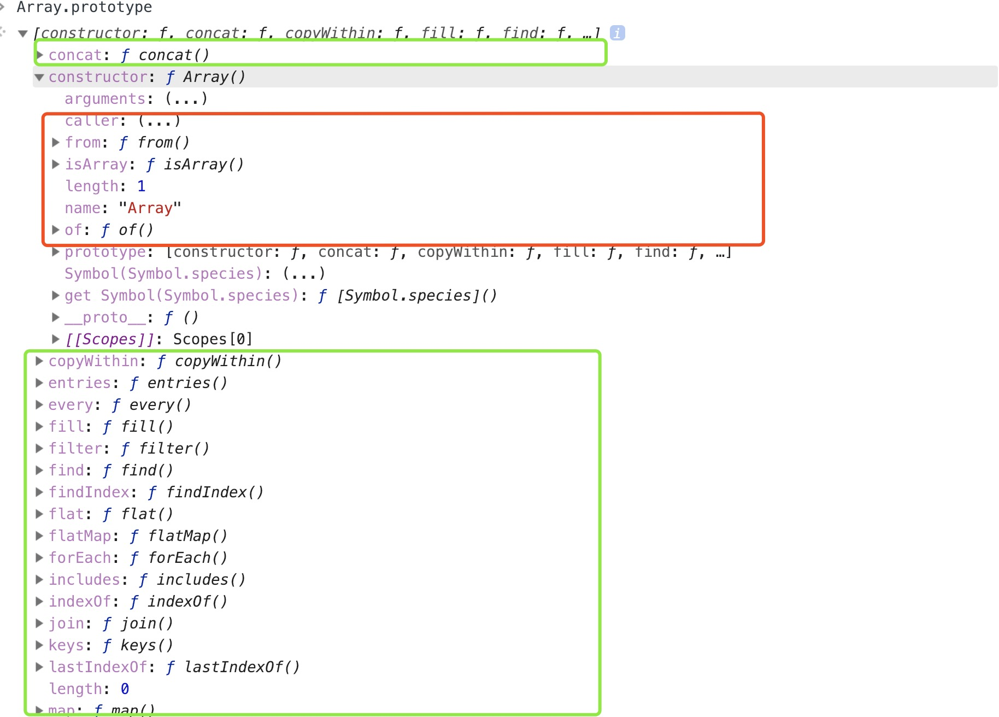 
红色里是prototype里的方法，绿色是`__proto__`里的方法

### 4. 我们在日常开发中如何通过原型对象提升开发效率

- 改变构造函数？
- 改变prototype

### 5. 全局函数对象Date Array String Object、全局对象Math JSON、全局函数isNan() encodeURI()直接的关系和区别

- Math 是一个 new Object() 只是名字是大写

我们放在下一篇[原型对象](./原型对象.md)里讲

