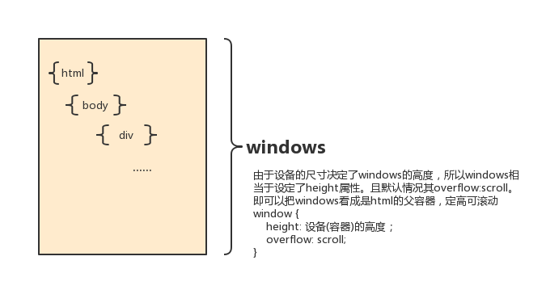

# Js中的位置滚动

## 位置

一个呈现给用户的界面，程序员能做的就是定位+交互。定位作为二分之一重要的部分，在开发中也经常用到，所以掌握以下概念对我们非常重要。

- 相对位置
  - offsetHeight
  - offsetLeft
  - offsetParent
  - offsetWidth
  - getBoundingClientRect()

- 滚动位置
  - scrollHeight
  - scrollTop
  - scrollWidth

- 元素本身
  - clientHeight
  - clientLeft
  - clientTop
  - clientWidth

[页面demo](http://www.wangyuanliang.com/programmer-demo/dist/part2/#/js/scroll)
滚动:在容器中的内容超出时的表现形式。

|值|描述|
|-|-|
|visible| 默认值，内容不会被修剪，会呈现在元素框之外
|hidden| 内容会被修剪，并且其余内容是不可见的
|scroll| 内容会被修剪，但是浏览器会显示滚动条以便查看其余的内容。
|auto| 如果内容被修剪，则浏览器会显示滚动条以便查看其余的内容。
|inherit| 规定应该从父元素继承overflow属性的值

默认情况下，内容不会被裁切，而是被撑开，容器的高度由子容器的高度决定。

## 什么时候滚动

- 只要设置了`overflow:hidden` 那么在这个<span style="color:red">容器内</span>就不可能发生滚动。即使这个容器本身的高度超出了可视区域。
- 如果超出视野范围的元素的父元素设置了`overflow: scroll`,那么在父容器内会发生滚动。
- 一般情况下，容器设置了`overflow:hidden` + `height`固定 容器内超出元素就会被修剪，但body除外！！！body 需要在`html`元素也设置了`overflow:hidden`的情况下，overflow属性才有效果。

---

## html的高度由

- `<html>`元素没有高度,当`<html>`没有设置颜色时.`<body>`的颜色覆盖`<html>`的颜色
- 哪怕`<html>`高度小于屏幕高度，如果给html设置了背景色，背景色仍然会填满整个屏幕

---

## body height:100% 起作用的条件

- html 100%

---

## scrollLeft  offsetLeft

- scrollTop/Left/Bottom/Right  滚动的而距离，想要获取这个值，Dom必须是设置了`overflow:scroll`的元素!!!而不是滚动内的元素

```html
   <div class="scroll-wrapper">
       <ul class="num-list">
           <li>1</li>
           <li>2</li>
           <li>3<li>
           ....
       </ul>
       <p class="bottom-tip"></p>
   </div>
```

```CSS
    .scroll-wrapper {
        height: 300px;
        overflow: scroll;
    }

    .num-list li{
        list-style: none;
        height:10px;
    }
```

- window 不同 $(window).scrollTop() 是`html`相对滚动的位置，无需设置`overflow:scroll`,

- `$(window).scrollTop()`  `$('html').scrollTop()` `$('body').scrollTop()` 的关系


