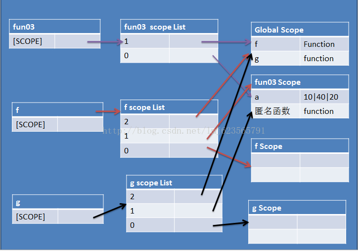

# 执行上下文、作用域、作用域链、变量对象的链

## 一、执行上下文：

生活中很常见的一个现象是，同样的文字放在不同的场合，会有不同甚至截然相反的意思，这个说话的场合，就是我们说话的语境。同样的，对程序语言进行“解读”的时候，也必须在特定的语境中，这个语境就是javascript中的执行上下文,遇到函数执行的时候，就会创建一个执行上小问。
以上是javascript上下文的通俗理解，标准的说法是:
> 执行上下文（Execution Context）是javascript代码执行的环境，js代码一定是在执行上下文中执行的。

### 在js中，执行上下文类型有三种：

1. #### 全局执行上下文

    全局执行上下文是JS代码最开始运行时的默认环境。如果是浏览器的话，就会创建一个全局的window对象，这也是当前页面所有js代码的基础环境，一个页面只会有一个全局执行上下文。

2. #### 函数执行上下文

    程序中有许多的函数，函数在被调用的时候就会创建对应的执行上下文，而且是每次调用都会创建新的执行环境。

3. #### eval函数执行上下文

    js的eval函数执行其内部的代码会创建属于自己的执行上下文，已不被推荐使用，所以在这里仅作了解，不再详细讨论它了。

综合起来，从执行上下文的角度来看js运作过程就是：当页面加载时，JavaScript运行时首先会进入全局环境，生成全局上下文（一个）。程序中各种函数的依次调用，就会进入函数执行环境，对应就会生成该函数的执行上下文。

### JS中管理多个执行上下文的方式

以上可知，js代码运行过程中除了最开始的全局执行上下文，还有有各种函数的调用产生的函数执行上下文，那么js是怎么管理这些上下文的呢？

首先，我们要知道的之前提到的一个知识，js是单线程的。意思是js不能同时干两件事情，必须是一个一个的执行。那么这么多的执行上下文是必然要按一定的顺序执行，这个顺序是怎么决定的呢？ 现实中解决这类问题的方法是叫号，摇号，但js中这么整就完全乱套了。因为js的函数调用是有逻辑关系的，那如何保证这种逻辑关系能够正确执行呢？

答案是：栈。

在JavaScript中，通过栈的存取方式来管理执行上下文，我们可称其为执行栈，或函数调用栈(Call Stack)。栈遵循"先进后出，后进先出"的规则来进行存放取出管理，也称LIFO ("Last In First Out") 规则。通俗的来说，栈就是只有一个开口的容器，往里放东西和往外拿东西都是通过这个出口，最新放进去的东西在最底部，所以要最后一个拿出来，最后放进去的东西（最靠近容容器开口）反而在最上面，第一个拿出来。


### 执行栈（函数调用栈）的工作过程

有了以上的知识准备，我们来模拟下页面从打开到关闭的整个过程中，js如何使用执行栈来管理众多执行上下文的。

整个过程的就是三个操作的不断重复：入栈、执行、出栈。入栈：程序执行进入一个执行环境时，它的执行上下文就会被创建，并被压入执行栈中；执行：被压入栈而处于"栈顶”的是当前正在执行函数的执行上下文，当函数调用完成后，它就会从栈顶被推出；出栈：程序执行完成时，它的执行上下文就会被销毁，并从栈顶被推出(出栈)，控制权交由下一个执行上下文。js就是通过这种方式从而完成一段又一段代码和功能的。

第一步，进入全局上下文环境，全局执行上下文入栈，因为是第一个，所以在栈底部；

第二步，执行代码，调用函数funA，创建函数funA的执行上下文，并入栈；

第三步，执行函数funA内部代码，调用函数funB，创建函数funB的执行上下文，并入栈；

第四步，执行函数funB内部代码，该执行上下文结束，funB执行上下文出栈；

第五步，执行执行函数funA内部代码调用funB函数之后代码，funA执行上下文出栈；

此时页面未关闭，执行栈中仅留下全局执行上下文在栈底。


这就是整个执行上下文的管理过程。

需要特殊说明的是：因为JS执行中页面加载就会进入全局环境，所以处于"栈底的永远是全局环境的执行上下文"，这个全局会在页面关闭的时候被取出。在出栈的过程中，正常情况下当函数调用完成后，它就会从栈顶被推出，但是如果有闭包就会阻止该操作，也就是执行上下文不会被释放。

## 二、作用域

作用域（scope），程序设计概念，通常来说，一段程序代码中所用到的名字并不总是有效/可用的，而限定这个名字的可用性的代码范围就是这个名字的作用域。

作用域的使用提高了程序逻辑的局部性，增强程序的可靠性，减少名字冲突。

## 三、作用域链

### 先回答几个问题

1. #### 一篇JS代码（eg:一个JS文件）只对应一个作用域链吗？

    答：并不绝对，每一段JavaScript代码（全局或函数）都有一个与之关联的作用域链。

2. #### 作用域链是什么，我们能通过代码调用输出到控制台，看到它吗？

    答：不能，作用域链（scope chain）是变量作用域的一种解读方式，是一个抽象的概念。其作用是方便理解，并不是一个真实存在的。在《JavaScript权威指南》犀牛书中的描述：
    > 如果将一个局部变量看做是自定义实现的对象的属性的话，那么可以换个角度来解读变量作用域。每一段JavaScript代码（全局代码或者函数）都有一个与之关联的作用域链（scope chain）。这个作用域链式一个对象列表或者链表，这组对象定义了这段代码“作用域中”的变量。

3. #### 作用域链的作用是什么，是如何工作的？

    答：作用域链是为了方便理解变量作用域的一个抽象概念，通过它我们可以方便理解作用域。举例说明(《JavaScript权威指南》)：
    > 当JavaScript需要查找变量x的值的时候（这个过程称做“变量解析”（variable resolution））,它会从链中的第一个对象开始查找，如果这个对象有一个名为x的属性，则会直接使用这个属性的值，如果第一个对象中不存在名为x的属性，JavaScript会继续查找链上的下一个对象。如果第二个对象依然没有名为x的属性，则会继续查找下一个对象，以此类推。如果作用域链上没有任何一个对象含有属性x，那么就认为这段代码的作用域链上不存在x,并最终抛出一个引用错误（ReferenceError）异常。

带着这几个问题的答案，我们来进一步了解作用域链

### 分析这一段代码

```js

    function fun03() {
        var a = 10;
        return function(){
            a*= 2 ;
            return a ;
        };
    }

    var f = fun03();
    f();
    var x = f();
    console.log(x);  //40

    var g = fun03();
    var y = g();
    console.log(y); //20

```

作用域链



例子中f() g()作用域链中都有fun03(),所以可以拿到fun03()的变量。

### 再看一段代码

```js
    function foo(i) {
        if (i < 0) return;
        console.log('begin:' + i);
        foo(i - 1);
        console.log('end:' + i);
    }
    foo(2);

    // 输出:

    // begin:2
    // begin:1
    // begin:0
    // end:0
    // end:1
    // end:2

```

此段代码主要是在说执行栈，没有涉及到太多作用域链的概念。它形象地说明了f(2)->f(1)->f(0)先后入栈，然后f(0)->f(1)->f(2)相继出栈的操作。

### 执行栈和作用域链的关系

其实这两个是相互独立的关系，执行栈影响顺序，而作用域链影响的是执行时的变量。

- 执行栈不同，但是作用域链相同的js段，结果可以是相同的
- 执行栈相同，但是作用域链不同的js段，结果可能是不同的
- 反正，大体上`执行栈`决定`结果顺序`，`作用域链`影响`具体结果`

下面这段代码可以形象说明这一点。

```js
    var scope = "global scope";
    function checkscope() {
        var scope = "local scope";
        function f() {return scope;}
        return f();
    }

    checkscope()
```

对比这段代码：

```js
    var scope = "global scope";
    function checkscope() {
        var scope = "local scope";
        function f() {return scope;}
        return f;
    }

    checkscope()();
```

两次返回的结果都是 `local scope`。为啥呢？？

犀牛书中是这样解释的：
> 回想一下词法作用域的基本规则：JavaScript 函数的执行用到了作用域链，这个作用域链是函数定义的时候创建的。嵌套的函数f()定义在这个作用域里，其中的变量scope一定是局部变量，不管在何时何地执行函数f(),这种绑定在执行f()时依然有效。因此最后一行代码返回“local scope”，而不是“global scope”。

总结一下就是：两段代码中f()执行上下文的作用域链是一样的。那两者的区别是什么呢？

答： 执行栈

用`EXStack`表示执行栈

让我们模拟第一段代码：

```js
EXStack.push(<checkscope> functionContext);
EXStack.push(<f> functionContext);
EXStack.pop();
EXStack.pop();
```

让我们模拟第二段代码：

```js
EXStack.push(<checkscope> functionContext);
EXStack.pop();
EXStack.push(<f> functionContext);
EXStack.pop();
```

这就是两者的关系

#### 总结

作用域链，有时候也被人称作【变量环境】，决定了执行函数的环境。

调用栈决定了函数的执行顺序，但是和变量的作用域无关。他们两个是并行的概念。

## reference

[Javascript 进阶 作用域 作用域链](https://blog.csdn.net/lmj623565791/article/details/25076713)  
[深入理解JavaScript执行上下文、函数堆栈、提升的概念](https://segmentfault.com/a/1190000009041008)  
[什么是执行上下文？什么是调用栈？](https://www.jianshu.com/p/778d7b926f53)  
[学好前端的基础与难点：js执行上下文及其运行原理](https://baijiahao.baidu.com/s?id=1628760652904264002&wfr=spider&for=pc)