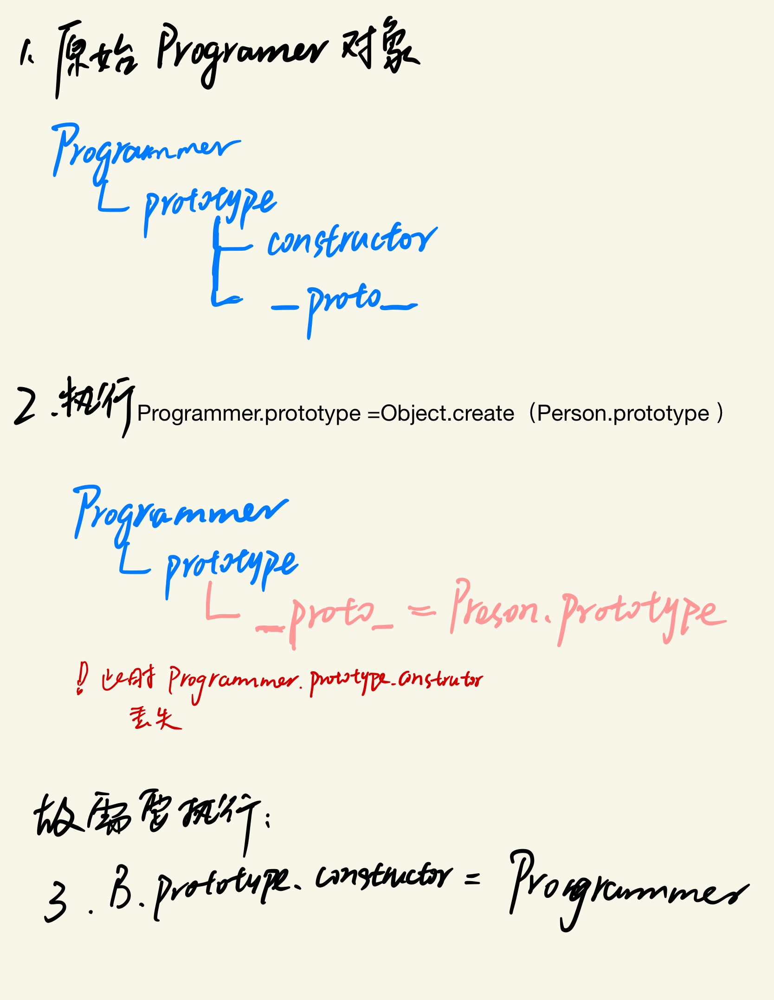
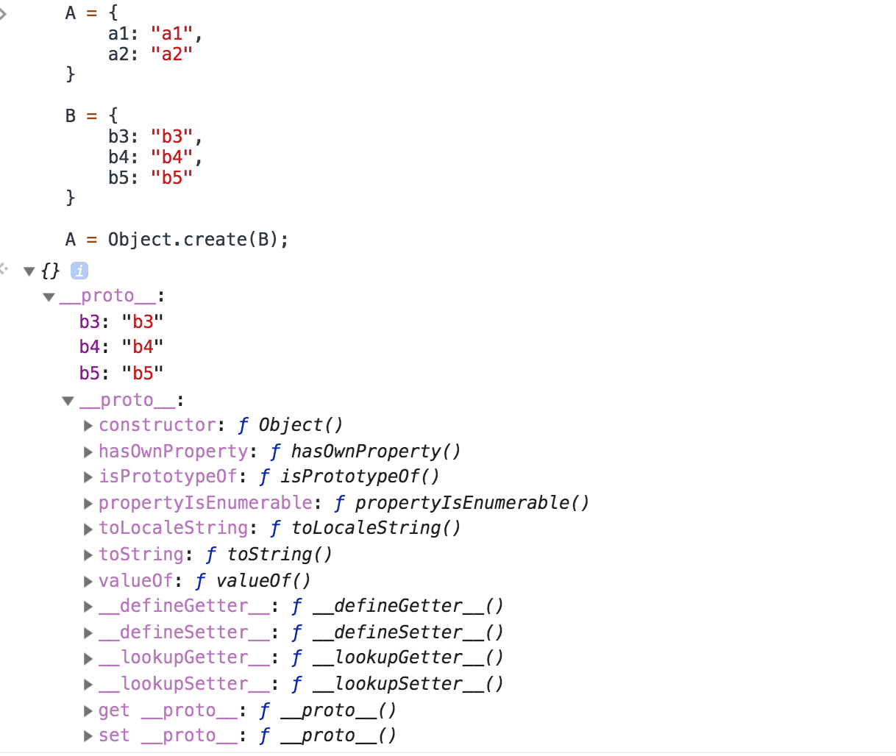
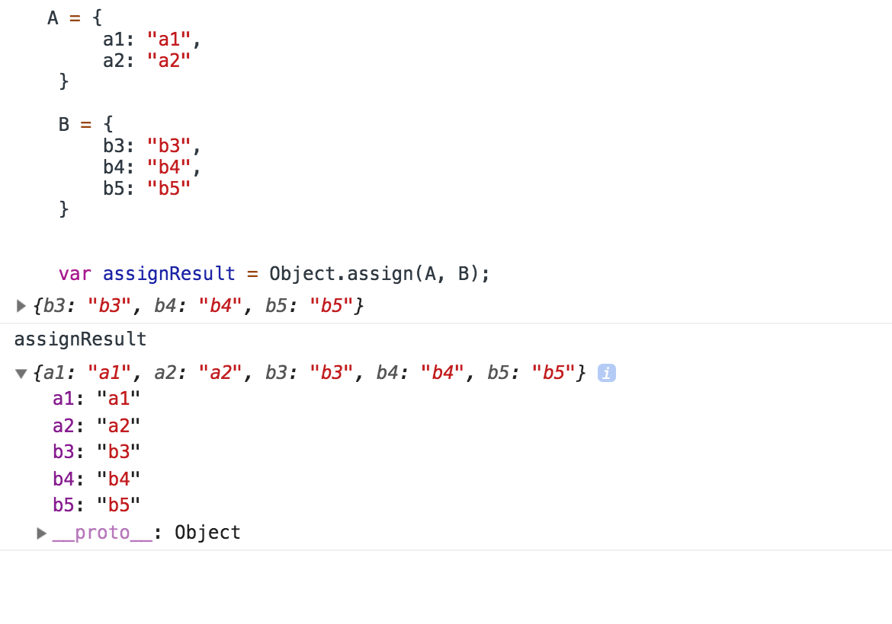

# js的继承

## 一、什么是继承

来自百度百科：  
>继承（英语：inheritance）是面向对象软件技术当中的一个概念。如果一个类别A“继承自”另一个类别B，就把这个A称为“B的子类别”，而把B称为“A的父类别”也可以称“B是A的超类”。继承可以使得子类别具有父类别的各种属性和方法，而不需要再次编写相同的代码。在令子类别继承父类别的同时，可以重新定义某些属性，并重写某些方法，即覆盖父类别的原有属性和方法，使其获得与父类别不同的功能。另外，为子类别追加新的属性和方法也是常见的做法。 一般静态的面向对象编程语言，继承属于静态的，意即在子类别的行为在编译期就已经决定，无法在执行期扩充。

Javascript里没有类的概念（ES6之前），所以更不会有“子类”和“父类”的概念，那JS有继承的概念吗？继承该如何实现呢？在讨论具体方法前，先尝试完成一次JS的继承，对它有一个粗略的认识。

从一个例子入手

``` javascript
    function Animal(name) {
        this.name = name;
        this.run = function() {
            return this.name + "  run";
        }
    }
```

要生成这个构造函数的一个实例对象的话，我们会这样做

```javascript
    var dog = new Animal("旺旺");
    console.log(dog.name); //旺旺
    dog.run();  //旺旺 run
```

但是用这种方式new出的对象，都是相互独立的。这对一些需要共享的方法无疑是浪费的。比如我需要再new一个对象。

```javascript
    var cat = new Animal("喵喵");
    // 如果我想要改变一个共享的run方法将run => race
    cat.run = function() {
        return this.name + " race";
    };
    console.log(cat.name); //喵喵 
    cat.run();     //喵喵 race （在喵对象上生效了）
    dog.run();     //旺旺 run    (旺对象没有变化)

```

可见，当修改一个实例对象的属性或方法时，对另一个实例对象的属性没有影响。如果是私有的属性当然没有问题，但是遇到一些公用的方法，我们希望它是公用的，为每个对象都新建一个方法，是浪费且冗余的。为了解决这个问题，JS用出了它最大的特性——prototype。

```javascript
    Animal.prototype.say = function() {
        return "my name is " + this.name;
    };

    dog.say();  // my name is 旺旺
    cat.say();  // my name is 喵喵


    Animal.prototype.say = function() {
        return "Call me " + this.name;
    };

    dog.say();   // Call me 旺旺
    cat.say();   // Call me 喵喵
```

这就实现了公用属性/方法的继承。

在面向对象且有“类”的语言中，继承是两个类之间的关系，前面的例子都是在讨论，构造函数与其new实例之间的关系，能算上是继承吗？

严格意义上讲，上面的例子并算不上继承，只是实现共有属性或方法的一种方案。在ES6之前，JS是没有类的语言（ES6之后也很难说），那也谈不上类与类之间的继承，所以我们所讨论的就是对象与对象之间的继承关系。只不过这里的对象有大对象和小对象之分。详见之前的博客[再说prototype](./__proto__&pototype&constructor.md);

以上述代码为例，如果Dog是Animal对象 `new`  出来的对象，则它就是大对象（Animal）与小对象(Dog)的继承。如果Dog也是一个构造函数，但是它需要一些Animal构造函数的属性和方法，那么这就是两个构造函数之间的继承——大对象和大对象之间的继承。这就是接下来要讲的内容。

## 二、如何实现继承

### 2.1 构造函数的继承——大对象之间的继承

还是以例子开始

```javascript
    //一个Person对象 拥有一些私有属性
    function Person(name, gender, age) {
        this.name = name;
        this.gender = sex;
        this.age = age;
    }

    // 它有一些公共方法
    Person.prototype.say = function() {
        console.log("Hi, I'm " + this.name);
    }

    /*我有一个Programmer 程序员对象*/
    function Programmer(field) {
        this.field = field;
    }

```

怎样才能使Programmer继承Person对象呢？直接上代码：  

#### STEP 1

```javascript
    function Programmer(name, gender, age,field) {
        Person.call(this, name, gender, age);
        // or Person.apply(this, arguments);
        this.field = field;
    }
```

关于calll 和 apply的用法，可以参考之前的文章[call&apply的用法](./call&apply.md)  

在这个例子里，我们很有效的在Programmer()构造函数里运行了Person()构造函数（见上文），得到了和在Programmer()里定义的一样的属性，但是用的是传送给Programmer()，而不是Person()的值（我们简单使用这里的this作为传给call()的this，意味着this指向Programmer()函数）。

在构造器里的最后一行代码简单地定义了一个新的field属性，这将是Programmer会有的，而Person没有的属性。

当然我们也可以简单粗暴地穷举一遍Programmer的所有属性。

``` javascript
    function Programmer(name, gender, age,field) {
        this.name = name;
        this.gender = sex;
        this.age = age;
        this.field = field;
    }
```

但这显然不是我们想要的，它没有和Person对象建立关系，而且需要写更多的代码。

#### STEP 2

到目前为止一切看起来都还行，但是我们遇到问题了。我们已经定义了一个新的构造器，但这个构造器默认是一个空的原型属性。当Programmer()需要从Person()的原型对象里继承方法（如上例中Person的 say()方法），我们要怎么做呢？

1. 首先需要将

``` javascript
    Programmer.prototype = Object.create(Person.prototype);     // 区分和 Programmer.prototype = person.prototype;的不同
```

首先，`A.prototype = B.prototype`;的方式只能让A拥有B原型上的方法，B构造函数里的属性和方法，A并不能获取。

其次,`A.prototype = B.prototype`之后，在修改A原型上的属性和方法时，会影响到B的属性和方法。`A.prototype = Object.create(B.prototype)` 使用此方式则不会，它等效于：`A.prototype.__proto__ = B.prototype` 就是说将B.prototype放于更上一层。

2. 将Programmer的构造函数指向 Programmer

``` javascript
    Programmer.prototype.constructor = Programmer;
```

执行完`Programmer.prototype = Object.create(Person.prototype)`之后，Programmer.prototype 原来有的 `__proto__`被修改为 `Person.prototype`;原来的`constructor`被覆盖，需要执行此步骤。  



至此，一个对象对另一个对象的继承已经完成。那么一个构造函数对象对多个构造函数对象的继承该如何做呢？这个我们放到后面讨论，我们先来看看继承的另一种形式。

### 2.2 非构造函数——对象语法糖——的继承，即对象merge

在日常开发中，我们用构造函数继承的情况其实很少。但是对象间属性的继承却用得非常多。例如：

```javascript
    var person = {
        origin: "china",
        age: "29"
    }

    var programmer = {
        skill: "javascript,C++,python"
    }

    /* what i want is ===== */

     programmer.origin  == "china";
     programmer.age == 29;
     programmer.skill == "javascript,C++,python";
```

代码中有两个对象`person`和`programmer`两个对象，我需要的效果是，让`person`对象上的属性合并到`programmegir`对象上。(虽然看起来这不像是继承，好像用merge描述更准确一些)。

实现这个需求有两种方式，第一种就是拷贝person的属性到programmer，直接让programmer.origin = china, 另一种方式是将被继承的对象放到继承者的原型链上。

#### 2.2.1 第一种方式 —— 属性的拷贝

属性的拷贝顾名思义，就是将person对象上的属性，copy到programmer对象上。由此又引申出两个概念，深拷贝和浅拷贝。

#### 浅拷贝

```javascript
    function extendCopy(p, c) {
        for(var i in p) {
            if (!!c[i])
                c[i] = p[i];
        }
        return c;
    }

    var programmer = extendCopy(person, programmer);
    programmer.skill = "javascript,C++,python";
```

浅拷贝存在问题，在修改programmer的非基本类型属性时，会影响到person的属性。这在继承里是致命的，会造成混乱。

```javascript
    var person = {
        origin: "china",
        age: 29,
        hobby: {
            sport: "basketball",
            food: "noodel"
        }
    }

    var programmer = {
        skill: "javascript,C++,python"
    }

    function extendCopy(p, c) {
        for(var i in p) {
            if (!c[i])
                c[i] = p[i];
        }
        return c;
    }

    extendCopy(person, programmer);
    programmer.hobby.sport = "football";
    programmer.age = 30;

    console.log(person.hobby.sport, person.age);  // football 29

```

#### 深拷贝

为了解决浅拷贝中的问题，我们就需要做深拷贝操作。深拷贝解决的问题就是通过递归，解决拷贝对象的属性时非基本类型时的问题。

```javascript
    function deepCopy(p, c) {
        var c = c || {};
        for(var i in p) {
            if (typeof p[i] == "object") {
                c[i] = p[i].constructor === "Array" ? [] : {};
                deepCopy(p[i], c[i]);
            } else {
                c[i] = p[i];
            }
        }
        return c;
    }
```

#### 2.2.2 第二种方式 —— 原型链继承

这种方式比较简单粗暴，就是将`想要被继承的对象`（父） 放到`继承者`（子）的原型链上。

```javascript
    var person = {
        origin: "china",
        age: "29"
    }

    var programmer = {
        skill: "javascript,C++,python"
    }

    programmer.__proto__ = person;  //注意思考为什么不是programmer.prototype

    // 由于 programmer不是构造函数，故无需做contructor的重新复制
    console.log(programmer.origin, programmer.age, programmer.skill); // "china" 29 "javascript C++ python"
    person.isPrototypeOf(programmer);  //true

```

#### 2.2.3 两种方式（属性拷贝和原型链继承）的区别

最大的区别就是可枚举性，

``` javascript
    // 接上例
    programmer.hasOwnProperty("skill"); // true

    programmer.hasOwnProperty("age");    //false

    Object.keys(programmer);   // ['skill']
```

此外属性拷贝的性能也要比原型链继承要好，当执行`programmer.origin`， 如果在programmer自身属性中没有相关属性，便会沿着原型链依次向上找，直到原型为空，这个过程是对性能有影响的，我们并不建议这么做。

### 2.3 一个大对象继承多个大对象的情况

接 2.1小节最后我们抛出的问题，如果一个构造函数需要继承多个构造函数的话，需要怎么做呢？

如果你希望能继承到多个对象，则可以使用混入的方式。

```javascript
    function MyClass() {
        SuperClass.call(this);
        OtherSuperClass.call(this);
    }

    // 继承一个类
    MyClass.prototype = Object.create(SuperClass.prototype);
    // 混合其它
    Object.assign(MyClass.prototype, OtherSuperClass.prototype);
    // 重新指定constructor
    MyClass.prototype.constructor = MyClass;

    MyClass.prototype.myMethod = function() {
        // do a thing
    };
```

和`Object.creat()`不同，`Objectt.assign()`是将源对象的属性merge到目标对象上。

``` javascript
    A = {
        a1: "a1",
        a2: "a2"
    }

    B = {
        b3: "b3",
        b4: "b4",
        b5: "b5"
    }

    A = Object.create(B);

    var assignResult = Object.assign(A, B);


```

 A = Object.create(B)结果：  
 

 var assignResult = Object.assign(A, B)结果：  
 

### 2.4 ES6 语法中的继承

最后我们来说说ES6中的继承。基本上，ES6 的class可以看作只是一个**语法糖**，它的绝大部分功能，ES5 都可以做到，新的class写法只是让对象原型的写法更加清晰、更像面向对象编程的语法而已。

```javascript
    class Parent {
        constructor() {
            this.parentProp = "pprop1";
            this.parentProp2 = "pprop2";
            this.commonProp = "pcommonp";
        }
        parentMethod1() {
            return "I am a method in parent";
        }
        static parentStaticMehod () {
            return "I am a static method in parent";
        }
    }

    class Child extends Parent {
        constructor() {
            super();   //要想实现继承，这个一定要有
            this.childProp = "cprop1";
            this.childProp2 = "cprop2";
        }

        childMethod1() {
            return "i am a children methods" + super.parentMethod1();
        }
    }

    var child = new Child();
    child.commonProp = "ccommonp";
    console.log(child.parentProp, child.childProp, child.commonProp); // pprop1 cprop1 pcommonp
    child.parentMethod1(); // I am a method in parent
    child.childMethod1();  // I am a children methodsI am a method in parent
    // Parent 的静态方法也将会被Parent继承
    Child.parentStaticMehod(); //I am a static method in parent
```

需要特别注意的是super的用法。

## reference

[Javascript继承机制的设计思想](http://www.ruanyifeng.com/blog/2011/06/designing_ideas_of_inheritance_mechanism_in_javascript.html)  
[Javascript面向对象编程（二）：构造函数的继承](http://www.ruanyifeng.com/blog/2010/05/object-oriented_javascript_inheritance.html)  
[Javascript面向对象编程（三）：非构造函数的继承](http://www.ruanyifeng.com/blog/2010/05/object-oriented_javascript_inheritance_continued.html)  
[Java​Script 中的继承](https://developer.mozilla.org/zh-CN/docs/Learn/JavaScript/Objects/Inheritance)  
[Object​.create()](https://developer.mozilla.org/zh-CN/docs/Web/JavaScript/Reference/Global_Objects/Object/create)
[阮一峰老师的ES6入门](http://es6.ruanyifeng.com)