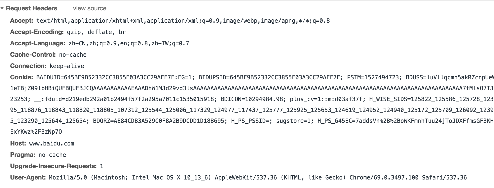
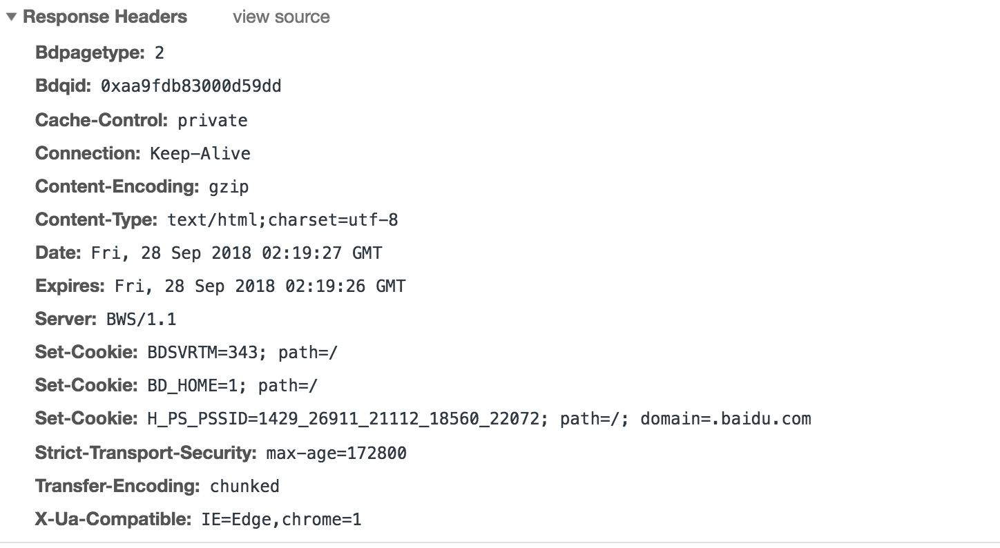

##HTTP & HTTPS

> HTTPS = HTTP + SSL

### 一、HTTP
1、HTTP遵循经典的 `客户端-服务端模型`
2、HTTP是`无协议状态`，意味着服务器不会在两个请求之间保留任何数据（状态）
    - 把Cookies添加到头部中，创建一个会话让每次请求都能共享相同的上下文信息，达成相同的状态。
    - HTTP本质是无状态的，使用Cookies可以创建有状态的会话,cookie的默认过期时间是一个session会话

### 二、UDP与TCP  


1、UDP
- 基于无连接
- 快，对资源要求较多
- 容易丢包，不保证顺序
- QQ视频 TFTP
- 一对多 多对一 多对多

2、TCP
- 基于连接
- 相对较慢，耗时对资源要求较少，因为需要三次握手
- 可靠、稳定，保证顺序
- 容易被攻击 DOS DDOS CC等攻击
- HTTP HTTPS SMTP 浏览器 邮件
- 点到点 一对一


### 三、HTTP缓存

### 3.1 缓存简介
>缓存是一种保存资源副本并在下次请求时直接使用该副本的技术。当 web 缓存发现请求的资源已经被存储，它会拦截请求，返回该资源的拷贝，而不会去源服务器重新下载。这样带来的好处有：缓解服务器端压力，提升性能(获取资源的耗时更短了)。  
缓存的种类有很多,其大致可归为两类：私有与共享缓存。共享缓存存储的响应能够被多个用户使用。私有缓存只能用于单独用户。本文将主要介绍浏览器与代理缓存，除此之外还有`网关缓存`、`CDN`、`反向代理缓存`和`负载均衡器`等部署在服务器上


### 3.2response 和 request头部信息  

    <br>

  

### 3.3 关于缓存的详解

### 3.3.1 常用的三个属性
当三者同时出现按优先级从高到低
 Pragma -> Cache-Control -> Expires
 > Cache-Control from HTTP1.1  
   Pragma from HTTP1.0  
   Expires from HTTP1.0

可以说Cache-Control 是Pragma和Expires的加强版本
### 3.3.1.1 Pragma
> 取值样式：`Pragma: no-cache`


当该字段为`no-cache`的时候。会告知客户端不要对该资源读缓存，即每次都得向服务器发一次请求。

### 3.3.1.2 Expires
>取值样式为：`Expires: Fri, 11 Jun 2021 11:33:01 GMT`

有了Pragma来禁用缓存，自然也需要有个东西来启用缓存和定义缓存时间，对http1.0而言，Expires就是做这件事的首部字段。 Expires的值对应一个GMT（格林尼治时间），比如`Mon, 22 Jul 2002 11:12:01 GMT`来告诉浏览器资源缓存过期时间，<span style="color;red">如果还没过该时间点则不发请求。</span>

### 3.3.1.3 Cache-Control
> 取值样式为：`"Cache-Control" ":" cache-directive`


### 3.3.2 缓存校验字段
上面三个属性只是控制客户端是否向服务器发送请求，那到了第二步，服务器收到客户端的请求之后，是否都需要重传？？  
我们希望的状态当然是，如果文件有修改，则重新返回，如果没有修改的话，希望告诉客户端你用你的缓存，也就是304状态。  
为了让客户端和服务器之间能够实现缓存文件是否更新的验证，提升缓存的复用率，Http1.1新增了几个首部字段来做这件事。

###3.3.2.1 Last-Modified
> 取值样式为：`Last-Modified: Fri, 22 Jul 2016 01:47:00 GMT`
务器将资源传递给客户端时，会将资源最后更改的时间以“Last-Modified: GMT”的形式加在实体首部上一起返回给客户端。
###3.3.2.2 Etag
> 取值样式为：`Etag: "5d8c72a5edda8d6a:3239"`
为了解决上述Last-Modified可能存在的不准确的问题，Http1.1还推出了 ETag 实体首部字段。 服务器会通过某种算法，给资源计算得出一个唯一标志符（比如md5标志），在把资源响应给客户端的时候，会在实体首部加上“ETag: 唯一标识符”一起返回给客户端。s
###3.3.3 缓存头部的对比

### 3.4 如何修改头部

- HTML页面可以直接添加meta标签头
```html
<meta http-equiv="Cache-Control" content="no-cache, no-store, must-revalidate" />
<meta http-equiv="Pragma" content="no-cache" />
<meta http-equiv="Expires" content="0" />
```
- 其他文件如js css就需要使用服务器设置文件控制header


## 
