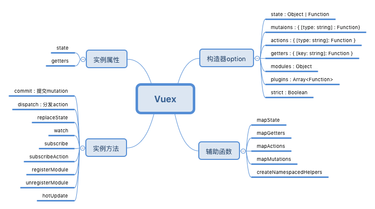

# vuex

## 一、Vuex和单纯的全局对象有以下两点不同：

1. Vuex的状态存储是响应式的。当Vue组件从Store中读取状态的时候，若store中的状态发生变化，那么相应的组件也会相应得到高效更新。
2. 你不能直接改变store中的状态。改变store中的状态的唯一途径是显式地提交（commit）mutation。这样使得我们可以方便地跟踪每一个状态的变化，从而让我们能够实现一些工具帮助我们更好地了解我们的应用。

## 二、组件仍然抱有局部变量
使用 Vuex 并不意味着你需要将所有的状态放入 Vuex。虽然将所有的状态放到 Vuex 会使状态变化更显式和易调试，但也会使代码变得冗长和不直观。如果有些状态严格属于单个组件，最好还是作为组件的局部状态。你应该根据你的应用开发需要进行权衡和确定。



## 三、State

### 1.作用

### 1. 声明state

### 2. 引用state
   - mapState


## 四、 Getter

### 1. 作用

### 2. 声明getter

### 3. 使用getter

- mapGetters


## 五、 Mutation

<span color="red">更改 Vuex 的 store 中的状态的唯一方法是提交 mutation </span>  


## 六、Action
- Action 提交的是muation,而不是直接变更状态。
- Action可以包含任意异步操作


## 七、常见问题

### 1、v-model直接绑定state中的属性，无法更新？！
由于改变store中的状态的唯一方法是提交mutation。所以当使用 `<input v-model="message">`,这种方式时，在严格模式下会抛出一个错误。
推荐的方式是，将`v-model`改为 `:value` 然后用`@input`去监听input或者change事件。

``` javascript
    <input :value="message" @input="updateMessage">

    //...
    computed: {
        message() {
            return this.$store.state.message
        }
    },
    methods: {
        updateMessage(e) {
            this.$store.commit('updateMessage', e.target.value);
        }
    }
```

这样做有失v-model的潇洒，官方给出了另一种方式：

```javascript
    <input v-model="message">

    //...
    computed: {
        message: {
            get() {
                return this.$store.state.obj.message
            },
            set(value) {
                this.$store.commit('updateMessage', value)
            }
        }
    }
```