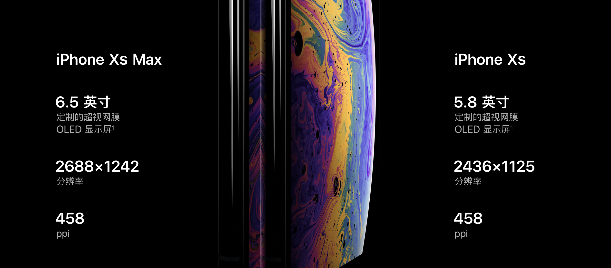
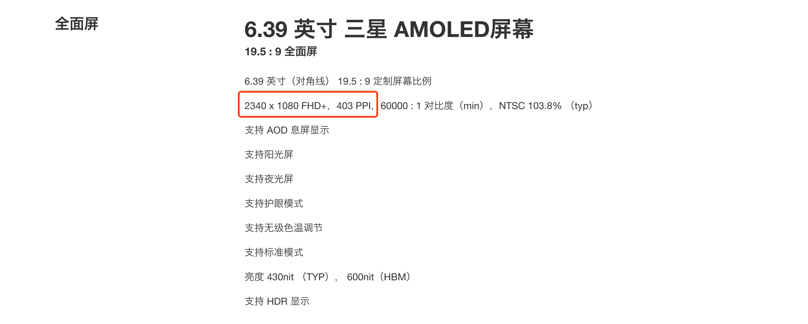
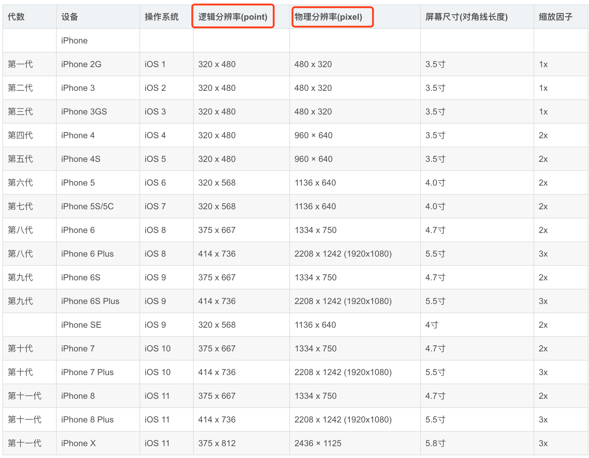
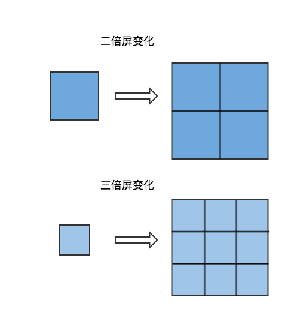
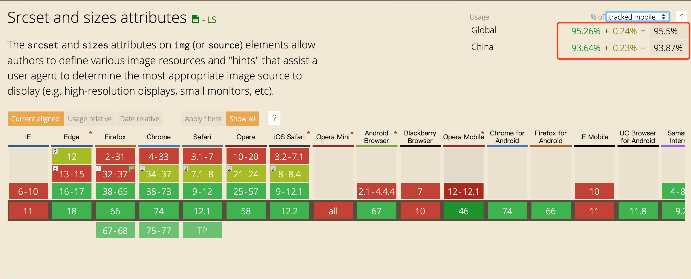
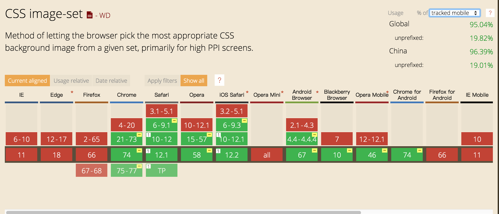

# 图像展示的一些内容

## 1、 像素

  像素一般说的是个数，比如200w像素，就是说有200w个像素点。像素这个东西，就像金箍，能变大能变小。如果像素块非常大的话，肉眼就会发现马赛克。所以一像素到底是多大，它不是一个度量单位，只是一个量词。和“匹”、“桶”一样。具体一桶有多少水要看这个桶有多大。

## 2、 分辨率

  分辨率是用来描述图片的像素信息的，比如我们常说的 1290`*`670，2250`*`1920,它描述的是一个图片2250像素`*`1920像素组成。

  注：分辨率仅表示图片的像素信息，不能表示任何关于图片清晰，清楚，质量高等的任何描述。

## 3、 PPI & DPI

不论是DPI还是PPI，实际都是一种换算的概念，即将图片承载的信息换算为现实中的图片（即人眼能实际看到的图像）。DPI和PPI的区别在于换算的途径不同，DPI面向的是印刷受体(狭义而言)，而PPI面向的是荧幕。

### 3.1、 PPI (Pixels Per Inch)

PPI是英文Pixels Per Inch的缩写，意为像素每英寸。英寸是常用的长度单位，大约相当于2.54厘米。而像素是专用于荧幕的概念，指的是荧幕可以解析的最小的点。因此，PPI值得是像素在荧幕上的密度，PPI越高图像就越清晰。

注意Inch是一个长度单位，表示面积单位，所以一英寸上的像素值，指的是一条长为一英寸的线上的长度值。

### 3.2、 DPI

DPI（Dots Per Inch，每英寸点数），一般理解是在打印时的参数，实际在显示器显示一张图片时，也会遇到这个参数。

#### 屏幕上的DPI

    分辨率只能用来描述图片的像素信息，不能描述图片清晰度  
    PPI只能用来描述屏幕的显示密度，也不能描述图片的清晰度  (表示屏幕能力)  
    DPI才能用来描述图片显示的清晰度，表示图片在屏幕上的显示效果。  （表示实际）  

    当图片分辨率与屏幕显示像素相同时， DPI与PPI值相等  
    当图片分辨率大于屏幕显示像素时（大图压缩）， DPI与PPI值相等，图片显示较差  
    当图片分辨率小于屏幕显示像素时（小图拉伸）， DPI值< PPI值相等，图片显示正常，屏幕未达到最佳显示效果。

## 4、 分辨率的分类及 DPR(devicePixelRatio)
  
  对这些基础词汇有了了解之后，我们再继续深入。随着硬件的不断发展，我们显示器的能力越来越大，其中有一个很重要的特征就是屏幕上所能呈现的像素点越来越高。也就是其物理分辨率越来越高。尤其是在移动端，以iphon6sp 为例：在小小的5.5寸屏幕下，分辨率达到2208*1242。这在几年前放到PC端都算是高分辨率了。那么在屏幕大小相对变化不大，分辨率直线上升的情况下会带来什么问题呢？  
    

  为了方便理解，我将小人做了旋转。也就是说在小屏幕下的图像被等比压缩。在这个实例图中电脑和手机的比例对比不是特别大，所以这种压缩貌似看起来可以接受，但实际情况是，如果按这种等比缩放而且用统一的分辨率的话，在电脑上的图像在手机端会被压缩到无法正常阅读（想象电脑上的文字图案随着电脑屏幕缩小到手机那么小的时候）。  

  **但是我们对清晰的追求从未停歇!!**

  为了使我们肉眼看到的图像更清晰，正如我们前面所讲，就是要想办法提高DPI。可以从两个方面入手：

  1. 提高PPI；也就是让屏幕有能力展示更多的像素。
  2. 提高图像本身质量；巧妇难为无米之炊，屏幕再好图像质量不行，展示效果也不会好。

### 4.1、 提高PPI

提高PPI，就是提高单位inch长度上的像素点。提高像素是一个方法。在硬件角度这个已经越来越不是问题。以iphone Xs 和小米 mix3为例：



旗舰机基本上都是在400以上的PPI。  
分辨率的提升带来了PPI提高，于此同时出现的问题就是，开始提到的，图片会被等比缩小的问题。PPI越高这个问题越严重。为了解决这个问题，移动端设备在系统层面上提出了解决方案：将分辨率分为`物理分辨率（屏幕分辨率）`和 `实际分辨率（显示分辨率）`。  
物理分辨率即设备实际的像素点; 实际分辨率就是逻辑分辨率，是通过软件的处理将屏幕分辨率做了一次换算。

  

图中展示了iphone历代机器的逻辑分辨率和物理分辨率。他们之间的关系即DPR

#### DPR(devicePixelRatio)

> DPR = 物理像素 / 逻辑像素


对应iphone历代设备的数据，DPR即缩放因子，也就是我们常说的两倍屏，三倍屏。像素都是用了长*宽的形式，逻辑像素长和宽分别缩小了DPR倍，那么对应一个像素点来说，就是之前的一个像素点，现在用 DPR <sup>2</sup> 个像素点来表示，这样带来的结果就是

1. 更清晰
2. 更大

在没有任何viewport设置的情况下，iphone虚拟视口宽度（window.innerWidht）为[980px](https://developer.apple.com/library/archive/documentation/AppleApplications/Reference/SafariWebContent/UsingtheViewport/UsingtheViewport.html),为了使逻辑像素(screen.width)生效,需要在html头部添加以下内容：

```html
    <meta name="viewport" content="width=device-width">
```

说完PPI我们继续聊聊提高图片质量。

### 4.2、 提高图像质量

提高图像质量就要提高图片的像素，同样的尺寸和内容，像素越丰富细节展示得就越多，图片看起来就越清晰。这就要求我们在提供素材的时候给到与DPR吻合的图片，也就是我们常说的2倍图，3倍图。

在实际开发中，我们很难为不同的DPR设备匹配完全一致的图像，这样会大大提升开发成本。这就需要处理好不同的倍图和倍屏的关系

### 4.3、 DPR 和 图片质量的关系

  ||正常DPR|高DPR|
  |-|-|-|
  |1倍图|正常|图片模糊，类似拉伸|
  |高倍图|正常|正常|

## 5、 如何根据不同的DPR选择不同的图像呢？

针对两种图片的使用方式，分别有各自的解决方案：

- ``对应了 srcset 属性
- `background-image`对应了 image-set属性

### 实际使用demo


具体如下：

### 1. 使用``标签 —— srcset  

#### 使用方式：

srcset使用参数对的方式，一个参数对有两个参数:  
srcset第一个参数：图片的url  
srcset第二个参数：

- 一个像素密度描述符，这是一个正浮点数，后面紧跟 'x' 符号
- 一个宽度描述符，这是一个正整数，后面紧跟 'w' 符号。该整数宽度除以sizes属性给出的资源（source）大小来计算得到有效的像素密度，即换算成和x描述符等价的值。

当情况和第二个参数描述一致时，则使用对应

#### 来看具体的例子

``` html
1、直接使用


2、搭配sizes一起使用  

- 在支持 srcset 的用户代理中，当使用 'w' 描述符时，src 属性会被忽略。当匹配了媒体条件 (min-width: 600px) 时，图像将宽 200px，否则宽 50vw（视图宽度的50%）。  


```

#### 兼容性



### 2. 使用`background-image` —— image-set

#### 使用方式 ：

```css
image-set() = image-set( <image-set-option># )

<image-set-option> = [ <image> | <string> ] <resolution>
```

#### demo：

``` html
background-image: image-set( "cat.png" 1x,
                             "cat-2x.png" 2x,
                             "cat-print.png" 600dpi);
```

#### 兼容性：


