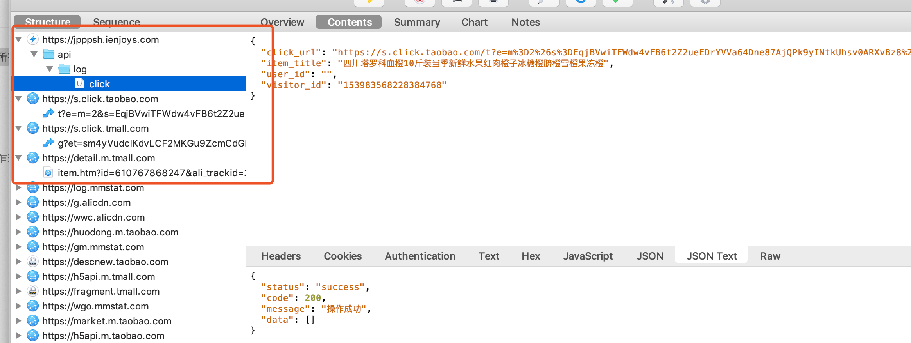

# 支付宝小程序打开H5的相关问题

## 官方答复
支付宝小程序目前支持通过web-view嵌套H5页面，但是有如下限制：
 - 组件目前仅支持企业小程序，不支持个人小程序使用。
 - 无法添加阿里域名（天猫、淘宝等）到白名单

## 关于金品拼拼
点击商品后的抓包情况：

## 参考链接
[web-view H5 页面承载](https://opendocs.alipay.com/mini/component/web-view)
[手把手教你支付宝小程序内嵌H5页面 ](https://docs.open.alipay.com/11162/otpsii)