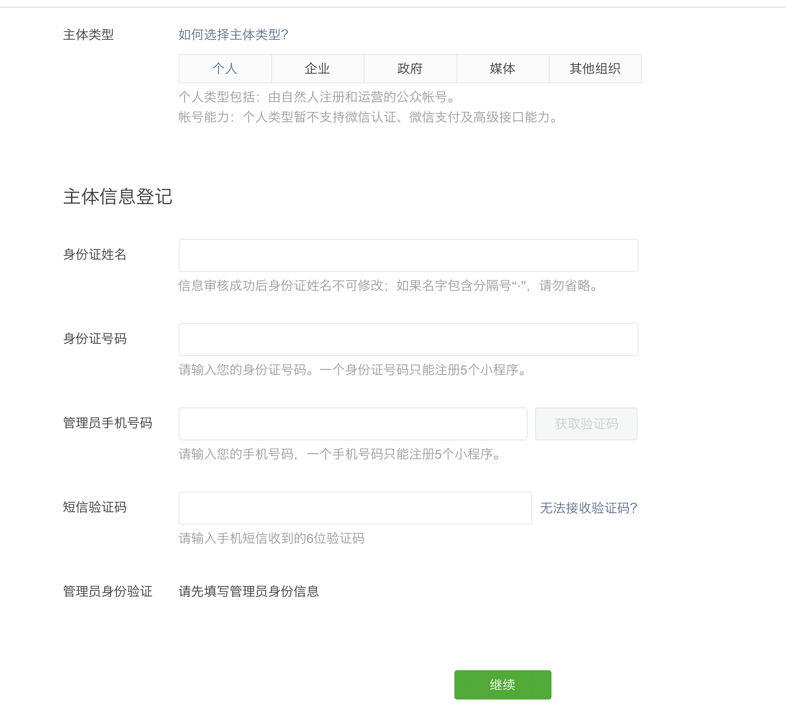

# 小程序

## 注册事项

### 入口是哪里？
 - [微信公众平台](https://mp.weixin.qq.com/)
 - [小程序官网](https://mp.weixin.qq.com/cgi-bin/wx?token=&lang=zh_CN)
 - [注册入口](https://mp.weixin.qq.com/wxopen/waregister?action=step1)

### 申请需要哪些信息？
 - 首先一个未注册过小程序的邮箱是必须的
 - 其次，不同的类型的账号，对信息的要求不同
    - 个人账号：身份证 手机
    - 组织账号：组织证件

 - 注册完成
### 注册要求
 - 一个手机号和一个身份证号只能注册最多5个小程序。

## 完成事项

### 绑定开发者
 - 必须由管理员或者有运营权限的人员确认/添加
 - 

