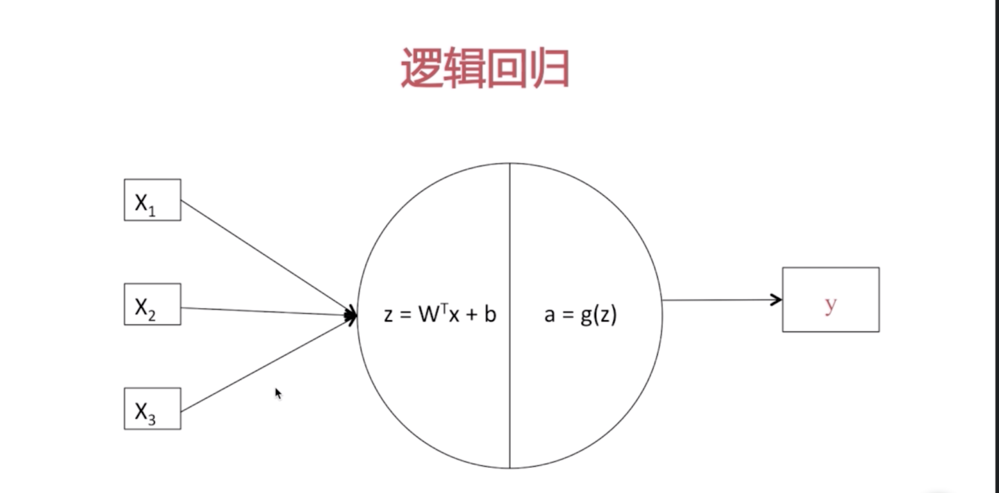

# 

## 兴起的原因
- 环境： 2进制创新
- 能力：软硬件
- 需求： 人的性价比

## 什么是神经网络

### 主要功能

 - 分类判断   输入 =>  f(x) => 结果
 - 

### 分类

- 图像
    - 密集矩阵
    - 图像识别
    - 自动驾驶
- 语音
    - 密集矩阵
    - 语音助手
- 文本
    - 稀疏矩阵
    - 新闻推送

### 学习路线
 - 网络结构
 - 激励函数
 - 损失函数
 - 梯度函数

 ## 网络结构

 ### 逻辑回归是最简化的网络结构
>

a = g(z)便是激励函数

## 激励函数

- 激励函数的作用是提供规模化的非线性能力
- 常用的激励函数 

## 损失函数

- 单词训练损失

- 全部训练损失

## 梯度下降
 

## 网络向量化
