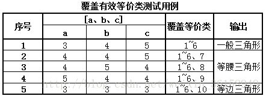

## 白盒测试

### 1.1 概念
- 白盒概念 （考点）

> 白盒测试又称结构测试，透明盒测试、逻辑驱动测试或者基于代码的测试。白盒测试是一种测试用例的设计方法，盒
子指的是被测试的软件，白盒指的是盒子是可视的，你清楚盒子内部的东西以及里面是如何运作的。

- 黑盒测试（考点）

> 黑盒测试又称为功能测试、数据驱动测试或基于规格说明书的测试，是一种从用户观点出发的测试。测试人员一般把被测程序当作一个黑盒子。

### 1.2 白盒测试

#### 1.2.1 要求

1. 保证一个模块中的所有独立路径至少被使用一次。
2. 对所有逻辑值均需测试 true 和 false。
3. 在上下边界及可操作范围内运行所有循环。
4. 检查内部数据结构以确保其有效性。

#### 1.2.2 白盒测试方法

白盒测试的测试方法有代码检查法、静态结构分析法、静态质量度量法、逻辑覆盖法、基本路径测试法、域测试、符号测试、路径覆盖和程序变异。

#### 1.2.3 基本路径测试法（考点）

1. 概念

> 基本路径测试法是在程序控制流图的基础上，通过分析控制构造的环路复杂性，导出基本可执行路径集合，从而设计测试用例的方法。设计出的测试用例要保证在测试中程序的每个可执行语句至少执行一次。

2. 步骤
#### 第一步：画出控制流图

流程图用来描述程序控制结构。可将流程图映射到一个相应的流图(假设流程图的菱形决定框中不包含复合条件)。在流图中，每一个圆，称为流图的结点，代表一个或多个语句。一个处理方框序列和一个菱形决测框可被映射为一个结点，流图中的箭头，称为边或连接，代表控制流，类似于流程图中的箭头。一条边必须终止于一个结点，即使该结点并不代表任何语句(例如：if-else-then结构)。由边和结点限定的范围称为区域。计算区域时应包括图外部的范围。  

画出其程序流程图和对应的控制流图如下   
 

#### 第二步：计算圈复杂度

圈复杂度是一种为程序逻辑复杂性提供定量测度的软件度量，将该度量用于计算程序的基本的独立路径数目，为确保所有语句至少执行一次的测试数量的上界。独立路径必须包含一条在定义之前不曾用到的边。

有以下三种方法计算圈复杂度：

流图中区域的数量对应于环型的复杂性;

给定流图G的圈复杂度V(G)，定义为`V(G)=E-N+2，E是流图中边的数量，N是流图中结点的数量`;

给定流图G的圈复杂度V(G)，定义为`V(G)=P+1，P是流图G中判定结点的数量`。

#### 第三步：导出测试用例 根据上面的计算方法，可得出四个独立的路径。(一条独立路径是指，和其他的独立路径相比，至少引入一个新处理语句或一个新判断的程序通路。V(G)值正好等于该程序的独立路径的条数。)

路径1：4-14

路径2：4-6-7-14

路径3：4-6-8-10-13-4-14

路径4：4-6-8-11-13-4-14

根据上面的独立路径，去设计输入数据，使程序分别执行到上面四条路径。

#### 第四步：准备测试用例

为了确保基本路径集中的每一条路径的执行，根据判断结点给出的条件，选择适当的数据以保证某一条路径可以被测试到，满足上面例子基本路径集的测试用例是：

### 1.3 黑盒测试

#### 1.3.1 目的

黑盒测试主要测到的错误类型有：不正确或遗漏的功能；接口、界面错误；性能错误；数据结构或外部数据访问错误；初始化或终止条件错误等等

#### 1.3.2 常用黑盒测试法

常用的黑盒测试方法有：等价类划分法；边界值分析法；因果图法；场景法；正交实验设计法；判定表驱动分析法；错误推测法；功能图分析法。

#### 1.3.3 等价类划分法 (考点)
1. 概念

等价类分为有效等价类和无效等价类，其中，有效等价类是指对于程序的规格说明来说是合理的，有意义的输入数据构成的集合；而无效等价类是指对于程序的规格说明来说是不合理的，没有意义的输入数据构成的集合。

确定等价类的原则是：
a. 在输入条件规定了取值范围或值的个数的情况下，则可以确定一个有效等价类和两个无效等价类，比如若规定的输入范围是`1<x<10`的所有数，则有效的是1~10内的任意数，而无效的是 -∞~0.9999 和 10.00001~+∞; 
b. 在输入条件规定了输入值的集合或者规定了“必须如何”的条件的情况下，则可以确立一个有效等价类和一个无效等价类；
c.在输入条件是一个布尔量的情况下，可以确定一个有效的等价类和一个无效的等价类；
d. 在规定了输入数据的一组值（假定n个），并且程序要对每一个输入值分别处理的情况下，可以确立n个有效等价类和一个无效等价类；
e. 在规定了输入数据必须遵守的规则的情况下，可以确立一个有效等价类（符合规则）和若干个无效等价类（从不同角度违反规则）；f.在确知已划分的等价类中各元素在程序处理中的方式不同的情况下，则应再将该等价类进一步的划分为更小的等价类。

2. 步骤
- 划分等价类后，建立等价类表，并为每一个等价类规定一个唯一的编号； 
- 设计一个测试用例，使其尽可能多地覆盖尚未被覆盖地有效等价类，重复这一步骤，直到所有的有效等价类都被覆盖为止
- 设计一个新的测试用例，使其仅覆盖一个尚未被覆盖的无效等价类，重复这一步骤，直到所有的无效等价类都被覆盖为止。（因为用单个测试用例覆盖无效等价类，是因为某些特定的输入错误会屏蔽或取代其他输入错误检查）

### 以例题的形式说明

#### 程序要求：输入三个整数 a 、 b 、 c 分别作为三角形的三边长度，通过程序判定所构成的三角形的类型；当三角形为一般三角形、等腰三角形或等边三角形时，分别作 …处理 。

- <问题分析> 
(1) 输入值域的显/隐式要求：A 整数、B 三个、C 正数、D 两边之和大于第三边、E 三边均不相等、F 两边相等但不等于第三边、G 三边相等；（D~G由输出值域的等价类隐性确定） 
(2) 输出值域的等价类：R1={不构成三角形}、R2={一般三角形}、R3={等腰三角形}、R4={等边三角形}； 
- <问题解答> 
(1) 列出等价类表并编号   
  
(2) 设计覆盖有效等价类的测试用例   
  
(3) 设计覆盖无效等价类的测试用例  

