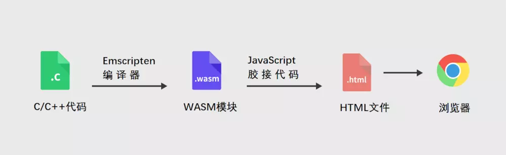
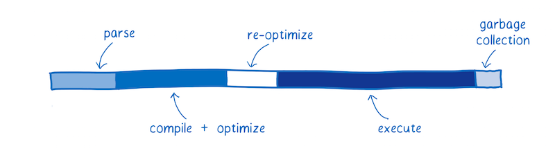
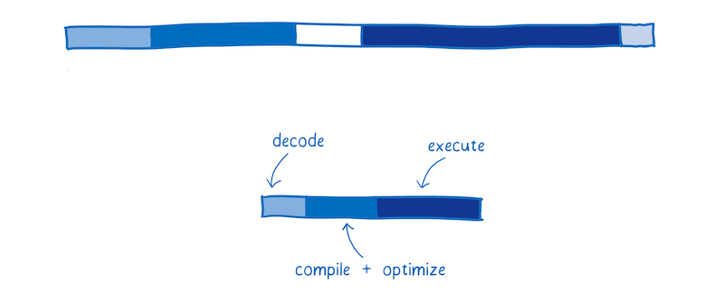
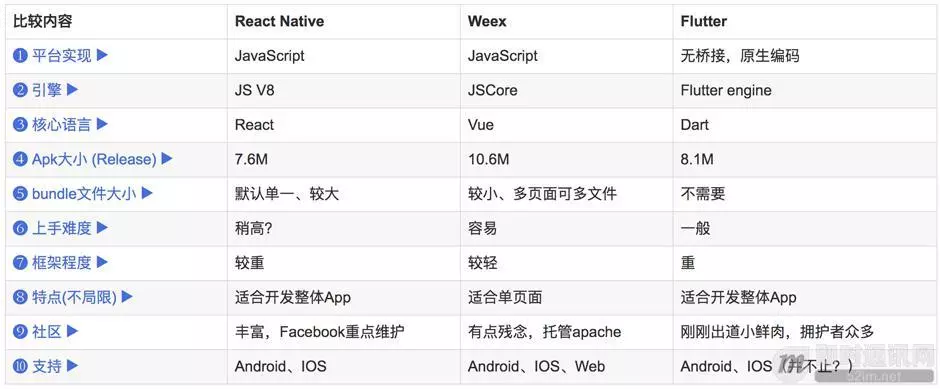
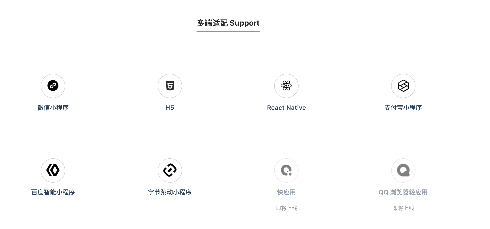

## 词
- WebAssembly
- Flutter
- Taro
- spritejs
- WebWorker
- WebGL2
- GraphQL


这还不是最可怕的，最可怕的是，当你一头雾水的时候，旁边的人还在若有所思点着头。


未来的前端很可能会向两个大方向细分，一个是视觉（HTML+CSS+...），一个是逻辑(JS+...)。

### 一、性能
### 执行的效率
#### 1. WebAssembly
#### 是什么？  

- WebAssembly 是一种可以使用`非JavaScript` 编程语言编写代码并且能在浏览器上运行的技术方案
- 编写语言可以是C、C++
- 编译工作在服务器端完成,直接下载.wasm文件
- WebAssembly is designed to be a complement to, not replacement of, JavaScript.
- It is also designed to run alongside JavaScript, allowing both to work together.
- 

#### 为什么？
- 更小  
>下载执行与 JavaScript 等效的 WebAssembly 文件需要更少的时间，因为它的体积更小。WebAssembly 设计的体积更小，可以以二进制形式表示。  
即使使用 gzip 压缩的 JavaScript文件很小，但 WebAssembly 中的等效代码可能更小。  
所以说，下载资源的时间会更少。在网速慢的情况下更能显示出效果来。
- 更快 涉及编译和解释的过程




#### 怎么做？
- 使用C/C++/Rust编写代码并编译为`.wasm`文件
- 下载.js和.wasm文件
- 在js文件中调用.wasm
```javascript
function fetchAndInstantiate(url, importObject) {
  return fetch(url).then(response =>
    response.arrayBuffer()
  ).then(bytes =>
    WebAssembly.instantiate(bytes, importObject)
  ).then(results =>
    results.instance
  );
}
```


reference: [图说 WebAssembly](https://www.zcfy.cc/article/an-abridged-cartoon-introduction-to-webassembly-ndash-smashing-magazine)
[WebAssembly-MDN](https://developer.mozilla.org/en-US/docs/WebAssembly)

#### 我的看法
随着网络普及，大量的软件从C/S向B/S过渡（游戏、ERP...），需求决定大量程序员开始杀入"前端"领域。前端越来越不像传统意义的前端，之前的前端要求你学习JavaScript+CSS+HTML去解决问题，在此基础上可以发展一些框架，比如React、Jquery、Vue、Angular,webpack,nodeJS...。而对于现在的前端，JavaScript只是一种解决问题的一种方式（浏览器决定），当遇到问题后，人们不在局限于挖掘JS的潜力，而是尝试去创造一种新的语言层面的解决方案，但是由于学习成本，兼容性等等原因，能够创造这样一种语言，有一定的难度，WebAssembly只是其中探索的一种。后续的替代方案一定会来，当好的执行效率+良好的学习友好度+好的兼容性，处理好这三者的关系一门语言就会将它的优势最大化。

个人认为，目前我司项目对该语言需求度不高，只做简单了解即可。

#### 2. WebWorker
> Web Worker 的作用，就是为 JavaScript 创造多线程环境，允许主线程创建 Worker 线程，将一些任务分配给后者运行。在主线程运行的同时，Worker 线程在后台运行，两者互不干扰。等到 Worker 线程完成计算任务，再把结果返回给主线程。这样的好处是，一些计算密集型或高延迟的任务，被 Worker 线程负担了，主线程（通常负责 UI 交互）就会很流畅，不会被阻塞或拖慢。

Worker 线程一旦新建成功，就会始终运行，不会被主线程上的活动（比如用户点击按钮、提交表单）打断。这样有利于随时响应主线程的通信。但是，这也造成了 Worker 比较耗费资源，不应该过度使用，而且一旦使用完毕，就应该关闭。

### 开发的效率
#### 一码多端
#### 1. Flutter ()
> Flutter是谷歌的移动UI框架，可以快速在iOS和Android上构建高质量的原生用户界面。 Flutter可以与现有的代码一起工作。在全世界，Flutter正在被越来越多的开发者和组织使用，并且Flutter是完全免费、开源的。



#### 2. Taro (偏向于小程序)
> 一套遵循 React 语法规范的多端统一开发框架


### 二、 渲染
- OpenGL(Open Graphics Library —— 开放图形库或者“开放式图形库”)
> 是用于渲染2D、3D矢量图形的跨语言、跨平台的应用程序编程接口（API）。这个接口由近350个不同的函数调用组成，用来从简单的图形比特绘制复杂的三维景象。而另一种程序接口系统是仅用于Microsoft Windows上的Direct3D。OpenGL常用于CAD、虚拟实境、科学可视化程序和电子游戏开发。
- WebGL2
> WebGL（全写Web Graphics Library）是一种3D绘图协议，这种绘图技术标准允许把JavaScript和OpenGL ES 2.0结合在一起，通过增加OpenGL ES 2.0的一个JavaScript绑定，WebGL可以为HTML5 Canvas提供硬件3D加速渲染，这样Web开发人员就可以借助系统显卡来在浏览器里更流畅地展示3D场景和模型了，还能创建复杂的导航和数据视觉化。显然，WebGL技术标准免去了开发网页专用渲染插件的麻烦，可被用于创建具有复杂3D结构的网站页面，甚至可以用来设计3D网页游戏等等。


- GraphQL 
> GraphQL 既是一种用于 API 的查询语言也是一个满足你数据查询的运行时。 GraphQL 对你的 API 中的数据提供了一套易于理解的完整描述，使得客户端能够准确地获得它需要的数据，而且没有任何冗余，也让 API 更容易地随着时间推移而演进，还能用于构建强大的开发者工具。

- spritejs
> SpriteJS 是一款由 360 奇舞团开源的跨终端 canvas 绘图框架，可以基于 canvas 快速绘制结构化 UI、动画和交互效果，并发布到任何拥有 canvas 环境的平台上（比如浏览器、小程序和 node ）。

### UI 系统的分层
||||
|-|-|-|
|语言层|提供界面描述语言和编程范式|HTML、XAML、**ML|
|模型层|提供布局、层级关系和概念模型|DOM、Controls|
|图形层|提供点、线、面、阴影、渐变等的绘制能力|Skia、Quartz|
|渲染层|逐像素生成位图的能力、通常借助于GPU|DirectX、OpenGL、Vulkan、Metal|
|物理绘制层|调用显卡驱动、实际把位图画到屏幕|ATI、Nvidia|

