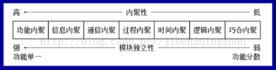
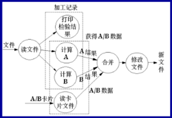
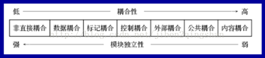
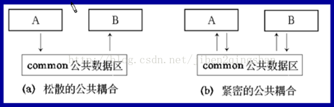
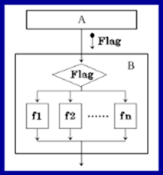

### 内聚和耦合的概念
模块的划分是软件结构化方法中提出来的想法，结构化方法的思想是，一个大问题分解成多个中问题，每个中问题再分解为多个子问题，直至可以容易的解决为止，这些划分出来的块就是我们说的模块，模块有大有小，大到系统的架构，小到一个类一个方法，换句话说，我们学过的系统三层架构中的每一层都可以称为一个模块，三层架构是基于结构化思想得来的，我们编写的每一个函数，也可以说是一个模块，至于下面描述的模块，我们不要将其定死在一个实体上，应该怎么好理解，就把其当成什么。

在划分模块的时候，根据模块和模块之间的关系(耦合)，以及模块内部之间的关系(内聚)，我们来判断划分的模块是否为优。下面来具体说耦合和内聚的具体分类
#### 1.2 内聚
> 模块内部各个元素彼此结合的紧密程度的度量
#### 1.3 耦合
>模块之间互相连接的紧密程度的度量。各个模块之间的复杂程度、调用模块的方式以及哪些信息通过接口
### 常见的内聚和耦合类型

#### 2.1 内聚类型

#### 偶然(巧合)内聚
         当几个模块内凑巧有一些程序段代码相同，又没有明确变现出独立的功能，把这些代码独立出来建立的模块即为偶然内聚模块，模块的各成分之间毫无关系，也就是说模块完成一组任务，这些任务之间没有关系

         缺点：模块的内容不易理解，不易修改和维护

#### 逻辑内聚
         这种模块把几种相关的功能组合在一起，每次被调用时，由传送给模块的控制型参数来确定该模块应执行哪一种功能。

          逻辑内聚表明了各部分之间在功能上的相关关系
#### 时间内聚
         如果一个模块完成的功能必须在同一时间内执行(系统初始化)，但这些功能只是因为时间因素关联在一起

#### 过程内聚
         使用流程图作为工具设计程序的时候，常常通过流程图来确定模块划分。把流程图中的某一部分划分出组成模块，就得到过程内聚模块

#### 通信内聚
         如果一个模块内各功能部分都使用了相同的输入数据，或产生了相同的输出数据，则称之为通信内聚模块。通常，通信内聚模块时通过数据流图来定义的。如果一个模块的所有成分都操作同一数据集或生成同一数据集

##### 顺序(信息)内聚
    这种模块完成多个功能，各个功能都在同一数据结构上操作，每一项能有一个唯一的入口点。如果一个模块的各个成分和同一个功能密切相关，而且一个成分的输出作为另一个成分的输入，则称为顺序内聚

    信息内聚模块可以看成是多个功能内聚模块的组合，并且达到信息的隐蔽。即把某个数据结构、资源或设备隐蔽在一个模块内，不为别的模块所知晓，当把程序某些方面细节隐藏在一个模块中时，就增加了模块的独立性     

####功能内聚
         一个模块中各个部分都是为完成一项具体功能而协同工作，紧密联系，不可分割的，则称该模块为功能内聚模块。功能内聚模块时内聚性最强的模块
#### 2.2 耦合类型

#### 内容耦合
如果一个模块直接访问另一个模块的内部数据，或者一个模块不通过正常入口转到另一模块内部，或者两个模块有一部分程序代码重叠，或者一个模块有多个入口，则两个模块之间就发生了内容耦合。

#### 公共耦合
若一组模块都访问同一个公共数据环境，则他们之间的耦合就称为公共耦合。公共的数据环境可以是全局数据结构、共享的通信区、内存的公共覆盖区等  
  
#### 外部耦合
一组模块都访问统一全局简单变量而不是统一全局数据结构，而且不是通过参数表传递该全局变量的信息

外部耦合和公共耦合的区别

外部耦合不存在依赖于一个数据结构内部各项的物理安排    

#### 控制耦合
如果一个模块通过传送开关、标志、名字等控制信息，明显地控制选择另一模块的功能，就是控制耦合

#### 标记耦合
如果一组模块通过参数表传递记录信息，就是标记耦合。共享某一数据结构的子结构

#### 数据耦合      
如果一个模块访问另一个模块时，彼此之间是通过数据参数(不是控制参数、公共数据结构或外部变量)来交换输入、输出信息的，则称这种耦合为数据耦合

#### 非直接耦合
如果两个模块之间没有直接关系，它们之间的联系完全是通过主模块的控制和调用来实现的，这就是非直接耦合