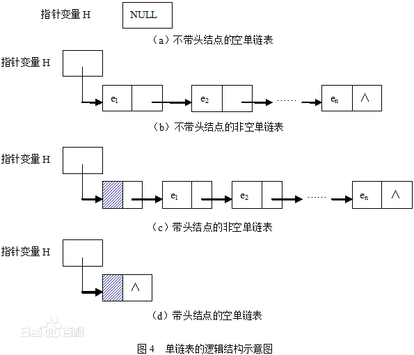
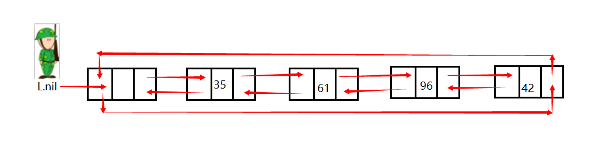

## 1.单链表
> 单链表是一种链式存储的数据结构，用一组地址任意的存储单元存放线性表中的数据元素。链表中的数据是以结点来表示的，每个结点的构成：元素（数据元素的映像）+ 指针（指示后继元素存储位置），元素就是存储数据的存储单元，指针是连接每个结点的地址数据。  


## 2.双向链表
> 双向链表也叫双链表，是链表的一种，它的每个数据结点中都有两个指针，分别指向直接后继和直接前驱。所以，从双向链表中的任意一个结点开始，都可以很方便地访问它的前驱结点和后继结点。一般我们都构造双向循环链表。

## 3.环形链表 
> 循环链表是另一种形式的链式存贮结构。它的特点是表中最后一个结点的指针域指向头结点，整个链表形成一个环。

## 4.带哨兵节点的链表
> 哨兵节点（sentinel）是一个哑元节点（dummy node），可以简化边界条件。是一个附加的链表节点，该节点作为第一个节点，它的值域中并不存储任何东西，只是为了操作的方便而引入的。如果一个链表有哨兵节点的话，那么线性表的第一个元素应该是链表的第二个节点。 
很多情况下，需要处理当前节点的前驱节点，如果是没有哨兵节点的链表，对第一个节点，即头节点，没有前驱节点。如果不作特殊处理，就可能出错（<span style="color:red">因为表头的地址是变量指向的地址</span>）；如果对它特别对待，就会增加代码复杂性，还会降低程序效率。而如果有哨兵节点的话， 线性表的每个位置的节点都有前驱节点，因此可以统一处理。 
当链表为空时，没有哨兵节点的链表的头节点为NULL，处理起来也和其他情况不同。带哨兵节点的链表，当其为一个空链表时，仅含哨兵节点，哨兵节点的指针域为空，和其他情况的表尾是一样的。

### 4.1二者对比
- 图形理解
普通的链表  

带哨兵的链表  


- 代码对比
普通链表的删除操作

``` java
LIST-DELETE'(L,x)
    if x.prev != NIL 
        x.prev.next = x.next
    else 
        L.head = x.next
    if  x.next != NIL
        x.next.prev = x.prev

```

带哨兵的删除操作

```java
LIST_DELETE'(L,x)
    x.prev.next = x.next
    x.next.prev = x.prev
```

少了一次非空判断

总结
- 优：
  常常用哨兵节点来代替null，这样的好处有以下3点：  
    1）增加操作的速度   
    2）降低算法的复杂性和代码的大小   
    3）增加数据结构的鲁棒性  

- 缺：
因为哨兵要占用额外的存储空间，而短小的链表很多时，就造成了严重的浪费。
