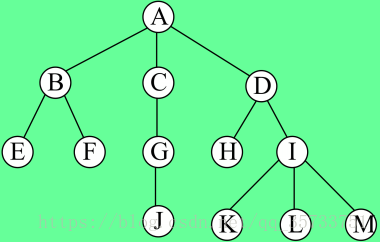
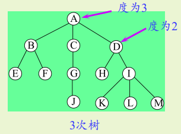
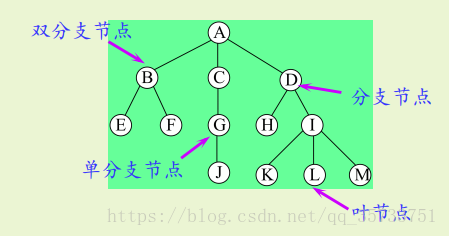
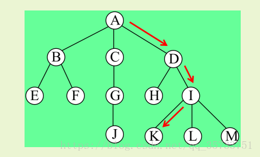
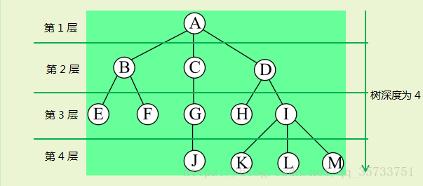
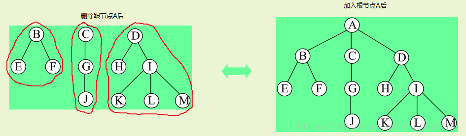

## 1. 树的基本概念和术语 

### 1.1 定义

``` 
T={D,R}

D={A,B,C,D,E,F,G,H,I,J,K,L,M}

R={r}

r={<A,B>,<A,C>,<A,D>,<B,E>,<B,F>,<C,G>,<D,H>,<D,I>,<G,J>,<I,K>,<I,L>,<I,M>}
```
在这个二元组中，D是包含n个节点的有穷集合（n ≥ 0），当n=0时为空树

当n > 0时，关系R满足以下一对多条件：

  1.有且仅有一个节点d0∈Dd0∈D没有前驱节点，节点d0称作树的根节点

  2.除节点d0外，D中的每个节点有且仅有一个前驱节点

  3.D中每个节点可以有零个或多个后继节点 


### 1.2 术语
1. 具有同一双亲的孩子节点互为兄弟节点
2. 每个节点的所有子树中的节点称为子孙节点
3. 从树根节点到达节点的路径上经过的所有节点被称作该节点的祖先节点
4. 每个节点的后继，被称作该节点的孩子节点（或子女节点）。相应地，该节点被称作孩子节点的双亲节点（或父母节点）。

### 1.2.1 节点的度和树的度
节点的度与树的度： 
1. 树中某个节点的子树的个数称为该节点的度 
2. 树中各节点的度的最大值称为树的度 
3. 通常将度为m的树称为m次树    


### 1.2.2 分支节点和叶节点
分支节点与叶节点： 
1. 度不为零的节点称为非终端节点，又叫分支节点 
2. 度为零的节点称为终端节点或叶节点   


### 1.2.3 路径与路径长度
对于任意两个节点di和dj，若树中存在一个节点序列di，di1，di2，…，din，dj，使得序列中除di外的任一节点都是其在序列中的`前一个节点的后继`，则称该节点序列为由di到dj的一条路径。  


### 1.2.4 节点的层次和树的高度
节点的层次从树根开始定义，根节点为第1层，它的孩子节点为第2层,以此类推，一个节点所在的层次为其双亲节点所在的层次加1，比如对于C节点来说，C节点所在层次是C节点的双亲节点A所在层次+1得到的。  

 树中节点的最大层次称为树的高度（或树的深度)   



## 1.2.5 森林

n（n＞0）个互不相交的树的集合称为森林，只要把树的根节点删去就成了森林。只要给n棵独立的树加上一个节点，并把这n棵树作为该节点的子树，则森林就变成了树。   




## 2. 树的前序、中序、后序、层次序遍历 （见二叉树）