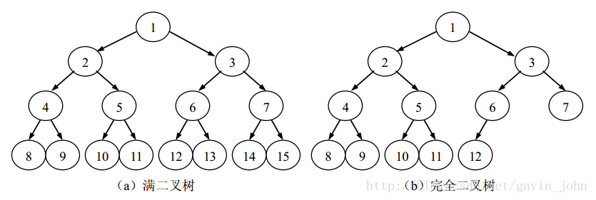
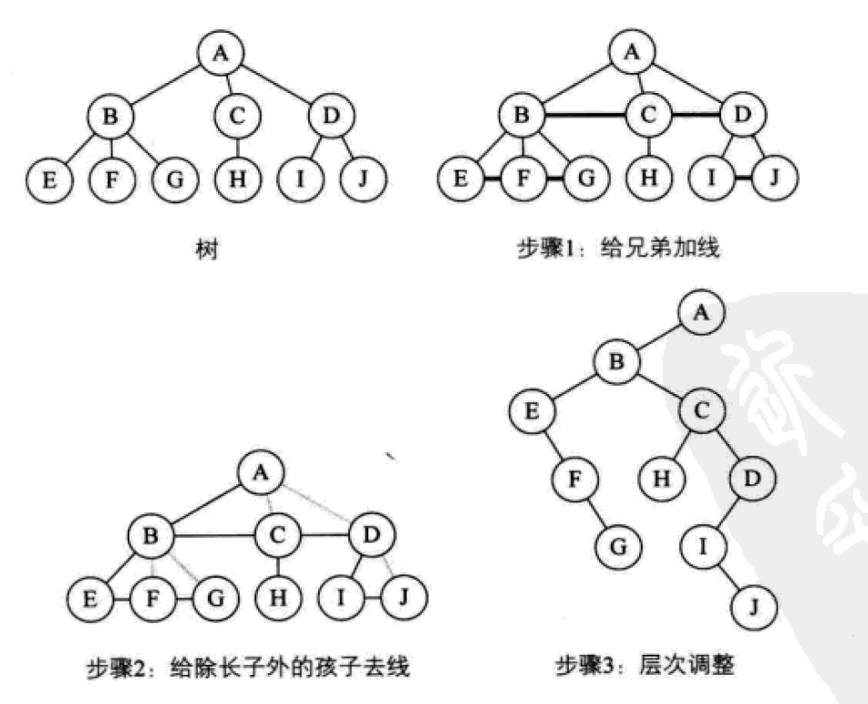

## 1. 二叉树及其性质
> 二叉树（Binary Tree） 是另外一种树型结构，它的特点是每个节点<span style="color:red">至多</span>只有两棵子树（即二叉树中不存在度大于2的结点），并且，二叉树的子树有左右之分，其次序不能任意颠倒。

### 1.1 二叉树的性质
- 性质1： 在二叉树的第i层上至多有2<sup>i-1</sup>个结点（i>=1）
- 性质2： 深度为k的二叉树至多有2<sup>k</sup>-1个结点，（k>=1）.
- 性质3： 对任何一棵二叉树T，如果其终端结点数位n<sub>0</sub>，度为2的结点数为n<sub>2</sub>，则 n<sub>0</sub> = n<sub>2</sub> + 1

### 1.2 满二叉树
棵深度为k且有 2k-1 个结点的二叉树称为满二叉树。满二叉树的特点是，每一层上的结点数都是最大结点数。

### 1.3 完全二叉树
可以对满二叉树的结点进行连续编号，约定编号从根结点起，自上而下，自左至右。由此可以引出完全二叉树的定义。深度为k的，有n个结点的二叉树，当且仅当其每一个结点都与深度为k的满二叉树中编号从1至n的结点一一对应，称之为完全二叉树。

完全二叉树的特点是：  
（1）叶子结点只可能在层次最大的两层上出现；  
（2）对任一结点，若其右分支下的子孙的最大层次为l，则其左分支下的子孙的最大层次必为l或l+1。



### 1.4 完全二叉树的性质
- 性质4：具有n个结点的完全二叉树的深度为 ⌊log<sub>2</sub>n⌋+1
- 性质5： 如果对一棵有n个结点的完全二叉树（其深度为 ⌊log2n⌋+1 ）的结点按层序编号（从第1层到第 ⌊log2n⌋+1 层，每层从左到右），则对任一结点i(1<=i<=n)，有：

  - 如果i=1，则结点i是二叉树的根，无双亲；如果i>1，则其双亲PARENT(i)是结点⌊i/2⌋。

  - 如果2i>n，则结点i无左孩子（结点i为叶子结点）；否则其左孩子LCHILD(i)是结点2i。

  - 如果2i+1>n，则结点i无右孩子；否则其右孩子RCHILD(i)是结点2i+1。


## 2. 二叉树和普通树的转换

### 2.1 普通树->二叉树
孩子表示法表示的树很容易转化成二叉树，所以只需把树先转为孩子兄弟表示法的样子，再调整层次结构就可以得到二叉树。
- 加线。在所有兄弟结点之间加一条线。
- 去线。只保留父结点与第一个孩子（左孩子）的连线，与其他孩子的连线删掉。
- 调整层次，<span style="color:red">结点的左孩子依然为左孩子，左孩子的兄弟全变成了结点右孩子</span>  



### 2.2 森林->二叉树

- 把森林的每一棵树转成二叉树
- 以某一棵树作为起始树，下一棵树的根结点作为右孩子连接到上一课树的根结点。直到处理完最后一棵树。  


### 2.3 二叉树到普通
- 加线。如果某个结点存在左孩子，则将左孩子的右结点，其右结点的右孩子...也就是一直深入到没有右孩子，将这些结点与父结点连线。
- 去线。删除所有结点与其右孩子的连线。
- 调整结构，让原本某结点的右孩子与该结点处于一个水平线，则他们成为了兄弟。  

  

### 2.4 二叉树到森林
从根结点开始，如果存在右孩子，断开与右孩子的连线。接着处理上分离后的二叉树的根结点，如果存在右孩子，断开连线....如此反复，直到某结点无右孩子。然后将得到的若干二叉树转为普通树。  

  


## 3. 二叉树的遍历

### 3.1 前序遍历
> 前序遍历按照`“根结点-左孩子-右孩子”`的顺序进行访问。

- 递归实现

```java
void PreOrder(TreeNode *root)
{
    if(root == NULL)
    {
        return;
    }

    cout <<root->val;
    PreOrder(root->left);
    PreOrder(root->right);

}
```

- 非递归实现
对于任一结点P：

1. 访问结点P，并将结点P入栈;

2. 判断结点P的左孩子是否为空，若为空，则取栈顶结点并进行出栈操作，并将栈顶结点的右孩子置为当前的结点P，循环至1);若不为空，则将P的左孩子置为当前的结点P;

3. 直到P为NULL并且栈为空，则遍历结束。

```java
void PreOrderDev(TreeNode *root) {
    if(root == NULL)
    {
        debug <<"The tree is NULL..." <<endl;
    }

    stack<TreeNode *> nstack;
    TreeNode *node = root;

    //  开始遍历整个二叉树
    while(node != NULL || nstack.empty( ) != true)
    {
        //  输出当前子树的根节点，然后递归直至最左
        while(node != NULL)
        {
            cout <<node->val;
            nstack.push(node);
            node = node->left;
        }

        //  此时循环结束时，当前栈顶节点已经是最左节点
        //  此时递归开始返回，开始出栈，并输出节点的右节点
        if(nstack.empty() != true)
        {
            node = nstack.top( );
            nstack.pop( );
            node = node->right;
        }
    }
}
```
### 3.2 中序遍历
> 中序遍历按照`“左孩子-根结点-右孩子”`的顺序进行访问。

递归实现
```java
void InOrder(TreeNode *root)
{

    if(root == NULL)
    {
        return;
    }

    InOrder(root->left);
    cout <<root->val;
    InOrder(root->right);

}
```
### 3.3 后序遍历
> 后序遍历按照`“左孩子-右孩子-根结点”`的顺序进行访问。

递归实现
```java
void PostOrder(TreeNode *root)
{
    if(root == NULL)
    {
        return;
    }

    PostOrder(root->left);
    PostOrder(root->right);
    cout <<root->val;

}
```
### 3.4 层次遍历
> 顾名思义就是按照一层层的顺序进行访问。

递归答应第n层的代码
```java
/*
    打印当前树的第n层

    root  树的根
    n     希望打印的层次
    level 当前递归层次
*/
int PrintLevel(TreeNode *root, int n, int level)
{
    if(root == NULL || level < 0)
    {
        return 0;
    }
    else if(level == n)
    {
        cout <<root->val;
        return 1;
    }
    else
    {
        return PrintLevel(root->left, n, level + 1) + PrintLevel(root->right, n, level + 1);
    }
}
```

能够打印第n层的节点，那么我们实现层次遍历就简单了，循环调用递归每一层的节点即可  

```java
void LevelOrder(TreeNode *root) {
    for(int level = 0; ; level++)
    {
        if(PrintLevel(root, level) == 0)
        {
            break;
        }
        cout <<endl;
    }
}
```