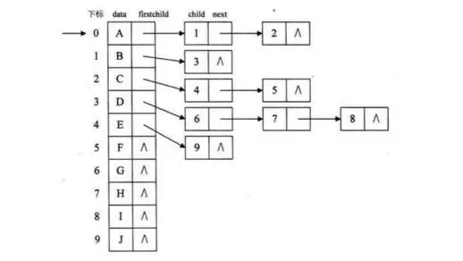

## 1. 树的存储

### 1.1 双亲表示法

#### 双亲表示法定义
假设以一组连续空间存储树的结点，同时在每个结点中，附设一个指示器指示其双亲结点到链表中的位置。

#### 双亲表示的结点结构
|data（数据域）|parent 指针|
|---|---|
|存储结点的数据信息|存储该结点的双亲所在数组中的下标|

#### 代码实现
``` c++
/* 树的双亲表法结点结构定义*/
#define MAX_TREE_SIZE 100
typedef int  ElemeType;

typedef struct PTNode{ // 结点结构
    ElemeType data; //结点数据
    int parent;    // 双亲位置
}PTNode;

typedef struct { // 树结构
    PTNode nodes[MAX_TREE_SIZE];   // 结点数组
    int r; // 根的位置
    int n; // 结点数
}PTree;

```

  

#### 双亲表示法的特点

- 由于根结点是没有双亲的，约定根结点的位置位置域为-1.
- 根据结点的parent指针很容易找到它的双亲结点。所用时间复杂度为O(1)，直到parent为-1时，表示找到了树结点的根。
- 缺点：如果要找到孩子结点，需要遍历整个结构才行。

### 1.2 孩子表示法
> 把每个结点的孩子结点排列起来，以单链表作为存储结构，则n个结点有n个孩子链表，如果是叶子结点则此单链表为空。然后n个头指针又组成一个线性表，采用顺序存储结构，存放进一个一维数组中。

#### 孩子表示的结点结构
孩子表示法有两种结点结构：`孩子链表的孩子结点`和`表头数组的表头结点`

- 孩子列表的孩子结点
|child （数据域）| next （指针域）|
|--|--|
|存储某个结点在表头数组中的下标|存储指向某结点的下一个孩子结点的指针|

- 表头数组的表头结点
|data （数据域）| firstchild （头指针域）|
|--|--|
|存储某个结点的数据信息|存储该结点的孩子链表的头指针|



#### 孩子表示法的代码实现

```c++
/* 树的孩子表示法结构定义*/
#define MAX_TREE_SIZE 100
typedef int  ElemeType;

typedef struct CTNode{  // 孩子结点
    int child; // 孩子结点的下标
    struct CTNode * next; // 指向下一结点的指针
}*ChildPtr;

typedef struct {  // 表头结构
    ElemeType data; // 存放在数中的结点数据
    ChildPtr firstchild; // 指向第一个孩子的指针
}CTBox;

typedef struct {  // 树结构
    CTBox nodes[MAX_TREE_SIZE]; // 结点数组
    int r;  // 根的位置
    int n;  // 结点树
}CTree;

```

#### 插播一个 双亲孩子表示法
> 对于孩子表示法，查找某个结点的某个孩子，或者找某个结点的兄弟，只需要查找这个结点的孩子单链表即可。但是当要寻找某个结点的双亲时，就不是那么方便了。所以可以将双亲表示法和孩子表示法结合，形成双亲孩子表示法。


#### 代码表示

```c++
/* 树的双亲孩子表示法结构定义*/
#define MAX_TREE_SIZE 100
typedef int  ElemeType;

typedef struct CTNode{  // 孩子结点
    int child;  // 孩子结点的下标
    struct CTNode * next;  // 指向下一结点的指针
}*ChildPtr;

typedef struct {  // 表头结构
    ElemeType data;  // 存放在数中的结点数据
    int parent;      // 存放双亲的下标
    ChildPtr firstchild;  // 指向第一个孩子的指针
}CTBox;

typedef struct {  // 树结构
    CTBox nodes[MAX_TREE_SIZE]; // 结点数组
    int r;  // 根的位置
    int n;  // 结点树
}CTree;
```
### 1.3 孩子兄弟表示法

> 任意一棵树，它的结点的第一个孩子如果存在就是唯一的，它的右兄弟存在也是唯一的。因此，设置两个指针，分别指向该结点的第一个孩子和此结点的右兄弟。

#### 孩子兄弟表示法的结点结构
|data（数据域）|firstchild （指针域）| rightssib (指针域)|
|--|--|--|
|存储结点的数据信息|存储该结点的第一个孩子的存储地址|存储该结点的右兄弟结点的存储地址|

#### 代码实现孩子兄弟表示法
```c++
/* 树的孩子兄弟表示法结构定义*/
#define MAX_TREE_SIZE 100
typedef int  ElemeType;

typedef struct CSNode{
    ElemeType data;
    struct CSNode * firstchild;
    struct CSNode * rightsib;
    
}CSNode, *CSTree;

```
## 2.完全树(complete tree)的数组形式存储


#### reference: [【数据结构】树的定义和树的三种存储结构](https://www.jianshu.com/p/6ba5743f41f7)