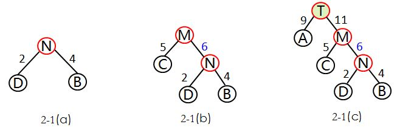

## 1. 树的应用


## 2. Huffman树的定义和应用
> 给定n个权值作为n个叶子结点，构造一棵二叉树，若该树的带权路径长度达到最小，称这样的二叉树为最优二叉树，也称为哈夫曼树(Huffman Tree)。哈夫曼树是带权路径长度最短的树，权值较大的结点离根较近。

#### 1.2 几个前提概念
- “路径”就是从树中的一个结点到另一个结点之间的分支构成的部分，而分支的数目就是路径长度。

- 树的路径长度：就是从树根到每一结点的路径长度之和。

- 考虑带权的结点，结点的带权路径长度为：从该结点到树根之间的路径长度与结点上权的乘积。

- 树的带权路径长度WPL(weighted path length)：树中所有叶子结点的带权路径长度之和。


#### 1.3 哈夫曼树的构造方法
- 1）先把有权值的叶子结点按照从小到大的顺序排列成一个有序序列，即D2,B4,C5,A9.

- 2）取头两个最小权值的结点作为一个新结点N的两个孩子结点，最好相对较小的是左孩子，这里D为N的左孩子，B为N的右孩子。

如下图2-1（a）所示，新的结点N的权值为两个叶子结点权值的和2+4=6.

- 3）将N1替换D和B，插入有序序列中，保持从小到大排列。即C5，N6，A9.

- 4）重复步骤2），将N与C作为一个新结点M的两个孩子结点。如图2-1（b）所示，M的权值=5+6=11.

- 5）将M替换C和N，插入有序序列中，为A9，M11.

- 6）重复步骤2），将A和M作为一个新结点T的两个孩子结点，由于T是根结点，完成哈夫曼树的构造。




#### 1.4 实现代码
这样构造的二叉树才是最优的哈夫曼树，通过刚才的步骤，可以得出构造哈夫曼树的哈夫曼算法描述：

-- 1）根据给定的n个叶子结点的权值{w1,w2,...wn}构成n棵二叉树的集合F={T1,T2,...Tn}，其中每棵二叉树Ti中只有一个带权为wi的

根结点，其左右子树均为空。

-- 2）在F中选取两棵根结点的权值最小的树作为左右子树构造一棵新的二叉树，且置新的二叉树的根结点的权值为左右子树上根结点

的权值之和。

-- 3）在F中删除这两棵树，同时将新得到的二叉树加入F中。

-- 4）重复步骤2）3），直到F只含一棵树为止。这棵树便是哈夫曼树。

```c++
//哈夫曼树的结点类型
typedef struct HTreeNode
{
	char data[5]; //每个结点是字符类型,最多5个字符
	int weight; //字符所占的权重
	int parent; //双亲结点所在下标
	int left; //左孩子结点所在下标
	int right; //右孩子结点所在下标
}HTNode;
//哈夫曼树的构造,n个结点，最后生成的树有2n-1个结点
void CreateHTree(HTNode ht[],int n)
{
	int lchild,rchild;
	int min1,min2;
	for(int i = 0;i < 2*n-1;i++)
	{
		ht[i].parent = ht[i].left = ht[i].right = -1;
	}
	for(int j = n;j < 2 * n-1;j++) //前n个结点是已知的叶子结点，构造n之后的结点
	{
		min1 = min2 = 32767;
		lchild = rchild = -1;
		for(int k = 0;k<j-1;k++)
		{
			if(ht[k].parent == -1) //只在尚未构造二叉树的结点中查找
			{
				if(ht[k].weight<min1)
				{
					min2 = min1;rchild = lchild;
					min1 = ht[k].weight;
					lchild = k;
				}
				else if(ht[k].weight<min2)
				{
					min2 = ht[k].weight;
					rchild = k;
				}
			}
		}
		ht[lchild].parent = j;
		ht[rchild].parent = j;
		ht[j].weight = ht[lchild].weight + ht[rchild].weight;
		ht[j].left = lchild;
		ht[j].right = rchild;
	}
}
```

#### 1.5 huffman树的应用
#### 哈夫曼编码
---- 哈夫曼编码是哈夫曼树的一个应用。在数字通信中，经常需要将传送的文字转换成由二进制字符0、1组成的二进制串，这一过程被

称为编码。在传送电文时，总是希望电文代码尽可能短，采用哈夫曼编码构造的电文的总长最短。

---- 由常识可知，电文中每个字符出现的概率是不同的。假定在一份电文中，A，B，C，D四种字符出现的概率是4/10，1/10，3/10，

2/10，若采用不等长编码，让出现频率低的字符具有较长的编码，这样就有可能缩短传送电文的总长度。

---- 采用不等长编码时要避免译码的二义性和多义性。假设用0表示C，用01表示D，则当接收到编码串01，并译码到0时，是立即译出

C，还是接着下一个字符1一起译为对应的字符D，这样就产生了二义性。 因此，若对某一字符集进行不等长编码，则要求字符集中任

一字符的编码都不能是其他字符编码的前缀，符合此要求的编码叫做前缀编码。

---- 为了使不等长编码也是前缀编码，可以用字符集中的每个字符作为叶子结点生成一棵编码二叉树，为了获得最短的电文长度，可将

每个字符出现的频率作为字符的权值赋予对应的叶子结点，求出此树的最小带权路径长度就是电文的最短编码。

---- 可以根据哈夫曼算法构造哈夫曼树T。设需要编码的上述电文字符集d={A,B,C,D},在电文中出现的频率集合p={4/10,1/10,3/10,2/10}

我们以字符集中的字符作为叶子结点、频率作为权值，构造一棵哈夫曼树。

                     

其中，每个结点分别对应一个字符，对T中的边做标记，把左分支记为“0”，右分支标记为“1”。定义字符的编码是从根结点到该字符所对

应的叶子结点的路径上，各条边上的标记所组成的序列就是哈夫曼编码。

---- A的编码：0，C的编码：10，D的编码：110，B的编码：111.

显然对于任意字符集，总能构造出这样的编码二叉树。由于在任何一条从根结点到一个叶子结点的路径上一定不会出现其他叶子结点，

所以通过这种方法得到的编码一定是前缀编码，通过遍历二叉树，可以求出每个字符的编码。
