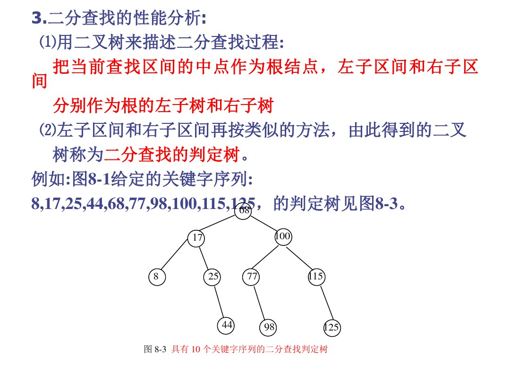
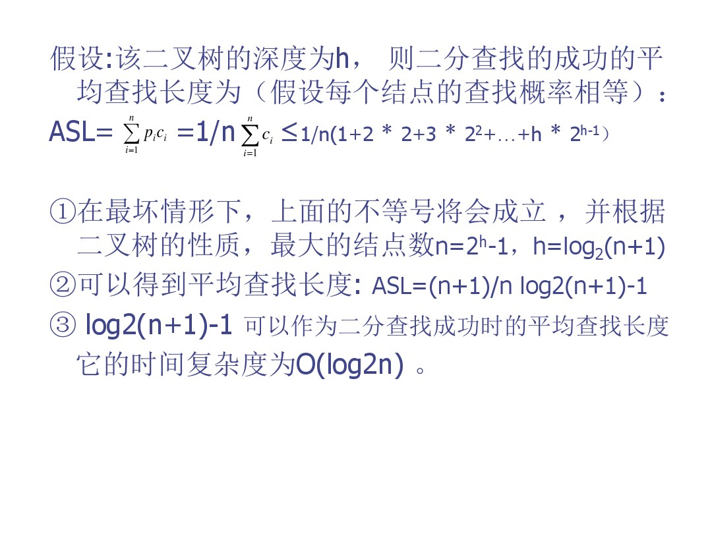

## 1.查找的基本概念
#### 1.1 查找 也称为检索
- 查找是按关键字进行的
  - 关键字是数据元素中某个数据项的值，用它可以标识一个数据元素
  - 有些关键字不能唯一标识一个元素，有些可以
  - 能唯一标识一个数据元素的关键字称为主关键字，而其它关键字称为辅助关键字或从关键字
- 查找就是根据给定的值，在一个表中查找出其关键字等于给定值的数据元素。
  - 若查找成功则返回整个数据元素或指出该元素在表中的位置
  - 若不存在，则返回查找不成功

#### 1.2 采用何种查找方式，首先取决于使用哪种数据结构来表示“表”：即表中结点是按何种方式组织的

#### 1.3 为了提高查找速度，经常使用某些特殊的数据结构来组织表

#### 1.4 研究各种查找算法时，首先必须弄清这些算法所要求的数据结构，特别是存储结构

#### 1.5 查找有内查找和外查找之分
- 若整个查找过程全部在内存进行，则称这样的查找为内查找
- 若在查找过程中还需要访问外存，则称之为外查找。
#### 1.6 将找到一个给定值与关键字的比较次数的平均值来作为衡量一个查找算法好坏的标准

- 对于一个含有n个元素的表，查找成功时的平均查找长度表示为ASL = (i->n)∑p<sub>i</sub>c<sub>i</sub>
  - Pi为查找第i个元素的概率  (i->n)∑Pi = 1;
  - 一般情况下我们认为查找每个元素的概率相等
  - Ci为查找第i个元素所用到的比较次数

## 2. 对线性关系结构的查找,顺序查找,二分查找;

### 2.1 顺序查找
#### 1. 顺序查找的基本思想
- 从表的一端开始，顺序扫描线性表，依次将扫描到的结点关键字和待找的值K相比较
- 顺序查找即适用于顺序表，也适用于链表

#### 2. 算法实现
```c++
const int n = maxn
struct node
{...
    elemtype key;
};

int seqsearch (node R(n+1), elemtype k) {
    R[0].key = k; int i=n;
    while(R[i].key!=k) i--;
    return i;
}
```

#### 3.性能分析
- ASL = (n+1)/2
- 时间复杂度为O(n)
- 当n较大时，ASL值较大，查找的效率较低

#### 4. 顺序查找的特点
-  算法简单，对表结构无任何要求：无论是用向量还是用链表来存放结点，也无论结点之间是否按关键字有序或无序，它都同样适用。
- 缺点，查找效率低，当n较大时，不宜采用顺序查找，而必须寻求更好的查找方法。

### 2.2 二分查找

#### 1. 基本思想
- 二分查找也称折半查找，它是一种高效率的查找方法
 - 二分查找有条件限制：要求表必须用向量作为存储结构，且表中元素必须按关键字有序（升序和降序均可）
 - 二分查找的基本思想是：首先将待查值K与有序表R[1]到R[n]中的中点mid上的关键字R[mid].key进行比较  
   a:若相等则成功
   b:否则，若R[mid].key>k,则在R[1]到R[mid-1]中继续查找，若有R[mid].key < k ，则在R[mid+1]到R[n]中继续查找
- 没通过一次关键字比较，区间的长度就缩小一半，区间的个数就增加一倍，如此，如找到关键字则成功，若当前区间为空，表示查找失败。

#### 2.二分查找算法实现

```c++
    int binsearch (node R[n+1], elemtype k) {
        int  low = 1, high = n;
        while (low < high) {
            int mid=(low+high)/2;
            if (R[mid].key == k) return mid; 
            else if (R[mid].key>k) 
                high = mid - 1;
                else
                  low = mid+1;
        }
        return 0; //查找失败
    }
```

#### 3.二分树性能
   


#### 4.二分查找的优缺点

- 优点： 比较次数较顺序查找少，查找速度快，执行效率高。
- 缺点：表的存储结构只能是顺序存储，不能是链式存储，且表中元素必须是有序的