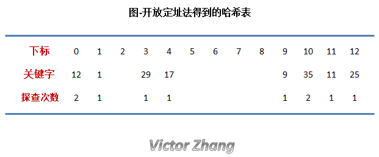

## Hash 查找法
散列(Hashing)是一种重要的查找算法。它的基本思想是：以数据对象的关键词 key 为自变量，通过一个确定的函数关系 `h`,计算出对应的函数值 `h(key)` ，把这个值解释为数据对象的存储地址，并按此存放，即“`存储位置=h(key)`”。

在查找某数据对象时，有函数 `h` (也称为哈希函数)对给定值 key 计算出地址，将 key 与该地址单元中数据对象关键字进行比较，确定查找是否成功。因此散列法又称为“关键字-地址转换法”


## 2. 常见的Hash函数
一个“好”的散列函数一般应考虑下列两个因素：
>1.计算简单，以便提高转换速度    
>
>2.关键词对应的地址空间分布均匀，以尽量减少冲突。

关键词可分为**数字型关键词**和**字符串型关键词**这两种类型

### 2.1 直接定址发
`h(key)=a × key+b(a、b为常数) `

这类函数计算简单，分布均匀，不会产生冲突，但要求地址集合与关键词集合大小相同，因此对于较大的关键词集合不适用。

### 2.2 随机数发
选择一个随机函数，取关键字的随机函数值为它的哈希地址，即H(key)=random(key) ,其中random为随机函数。通常用于关键字长度不等时采用此法。

## 3. Hash 冲突的概念
>如果有两个（或更多）关键词通过某散列函数计算出相同的存储位置，那又该怎么办？总不能把多个多个关键词对应的信息都存放在相同的位置吧？若 key1 ≠ key2 ，而 f(key1) = f(key2)，我们把这种情况叫做冲突。

## 4.解决冲突的方法

#### 4.1 闭散列方法/开址定址法

如果两个数据元素的哈希值相同，则在哈希表中为后插入的数据元素另外选择一个表项。

当程序查找哈希表时，如果没有在第一个对应的哈希表项中找到符合查找要求的数据元素，程序就会继续往后查找，直到找到一个符合查找要求的数据元素，或者遇到一个空的表项。

#### 例子

若要将一组关键字序列 {1, 9, 25, 11, 12, 35, 17, 29} 存放到哈希表中。
采用除留余数法构造哈希表；采用开放定址法处理冲突。
不妨设选取的p和m为13，由 f(key) = key % 13 可以得到下表。  
  

需要注意的是，在上图中有两个关键字的探查次数为 2 ，其他都是1。

这个过程是这样的：
- a. 12 % 13 结果是12，而它的前面有个 25 ，25 % 13 也是12，存在冲突。  
我们使用开放定址法 (12 + 1) % 13 = 0，没有冲突，完成。
- b. 35 % 13 结果是 9，而它的前面有个 9，9 % 13也是 9，存在冲突。
我们使用开放定址法 (9 + 1) % 13 = 10，没有冲突，完成。

#### 4.1 开散列方法/拉链法

将哈希值相同的数据元素存放在一个链表中，在查找哈希表的过程中，当查找到这个链表时，必须采用线性查找方法。
在这种方法中，哈希表中每个单元存放的不再是记录本身，而是相应同义词单链表的头指针。
####例子
如果对开放定址法例子中提到的序列使用拉链法，得到的结果如下图所示：  
  

## 5. 二次聚集现象
当采用`闭散列方法/开址定址法` 时，很容易出现一个地址会累计多个数据的情况，
数据 = [47,7,29,11,9,84,54,20,30],采用 `除留余数法`,p取11，则会出现下图的情况
比如下图 


## 6实现一个哈希表
假设要实现一个哈希表，要求

- a. 哈希函数采用除留余数法，即 f(key) = key % p (p ≤ m)
- b. 解决冲突采用开放定址法，即 f2(key) = (f(key)+i) % size (p ≤ m)  

####（1）定义哈希表的数据结构
```java
class HashTable {
    public int key = 0; // 关键字
    public int data = 0; // 数值
    public int count = 0; // 探查次数
}
```
####（2）在哈希表中查找关键字key
根据设定的哈希函数，计算哈希地址。如果出现地址冲突，则按设定的处理冲突的方法寻找下一个地址。  

如此反复，直到不冲突为止（查找成功）或某个地址为空（查找失败）。


```java
/**

* 查找哈希表

* 构造哈希表采用除留取余法，即f(key) = key mod p (p ≤ size)

* 解决冲突采用开放定址法，即f2(key) = (f(key) + i) mod p (1 ≤ i ≤ size-1)

* ha为哈希表，p为模，size为哈希表大小，key为要查找的关键字

*/

public int searchHashTable(HashTable[] ha, int p, int size, int key) {

    int addr = key % p; // 采用除留取余法找哈希地址

    // 若发生冲突，用开放定址法找下一个哈希地址

    while (ha[addr].key != NULLKEY && ha[addr].key != key) {
        addr = (addr + 1) % size;
    }


    if (ha[addr].key == key) {
        return addr; // 查找成功
    } else {
        return FAILED; // 查找失败
    }

}
```


####（3）删除关键字为key的记录
在采用开放定址法处理冲突的哈希表上执行删除操作，只能在被删记录上做删除标记，而不能真正删除记录。  

找到要删除的记录，将关键字置为删除标记DELKEY。

```java

public int deleteHashTable(HashTable[] ha, int p, int size, int key) {
    int addr = 0;
    addr = searchHashTable(ha, p, size, key);
    if (FAILED != addr) { // 找到记录
        ha[addr].key = DELKEY; // 将该位置的关键字置为DELKEY
        return SUCCESS;
    } else {
        return NULLKEY; // 查找不到记录，直接返回NULLKEY
    }
}
```
####（4）插入关键字为key的记录
将待插入的关键字key插入哈希表
先调用查找算法，若在表中找到待插入的关键字，则插入失败；
若在表中找到一个开放地址，则将待插入的结点插入到其中，则插入成功。 

```java

public void insertHashTable(HashTable[] ha, int p, int size, int key) {
    int i = 1;
    int addr = 0;
    addr = key % p; // 通过哈希函数获取哈希地址
    if (ha[addr].key == NULLKEY || ha[addr].key == DELKEY) { // 如果没有冲突，直接插入
        ha[addr].key = key;
        ha[addr].count = 1;
    } else { // 如果有冲突，使用开放定址法处理冲突
        do {
            addr = (addr + 1) % size; // 寻找下一个哈希地址
            i++;
        } while (ha[addr].key != NULLKEY && ha[addr].key != DELKEY);
        ha[addr].key = key;
        ha[addr].count = i;
    }

}

```

####（5）建立哈希表

先将哈希表中各关键字清空，使其地址为开放的，然后调用插入算法将给定的关键字序列依次插入。


```java
public void createHashTable(HashTable[] ha, int[] list, int p, int size) {

    int i = 0;
    // 将哈希表中的所有关键字清空
    for (i = 0; i < ha.length; i++) {
        ha[i].key = NULLKEY;
        ha[i].count = 0;
    }
    // 将关键字序列依次插入哈希表中
    for (i = 0; i < list.length; i++) {
        this.insertHashTable(ha, p, size, list[i]);
    }
}
```

