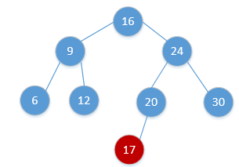
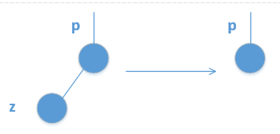
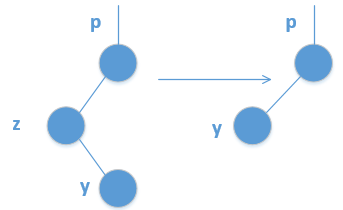
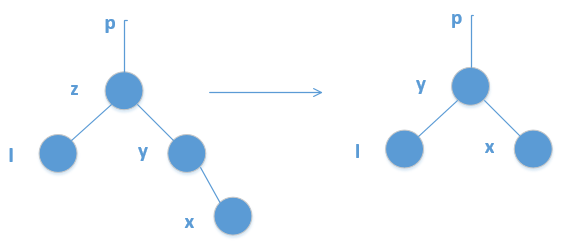
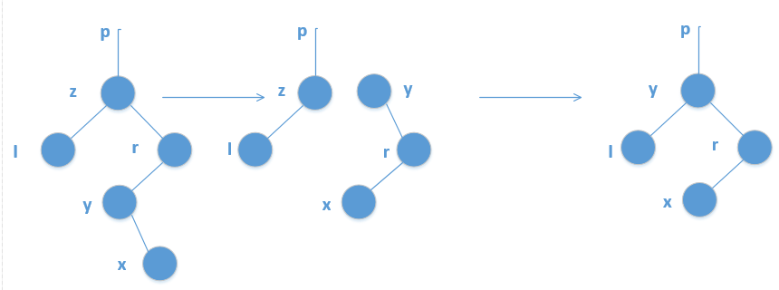

## 1.BST树的定义，性质
> BST 二叉搜索树 是以一棵二叉树来组织的，可以用链表数据结构来表示，其中，每一个结点就是一个对象，一般地，包含数据内容key和指向孩子（也可能是父母）的指针属性。如果某个孩子结点不存在，其指针属性值为空（NIL）。

#### 性质

设x是二叉搜索树中的一个结点。如果y是x左子树中的一个结点，那么会有y.key<=x.key；如果y是x右子树中的一个节点，那么有y.key>=x.key

## 2.ADT及其实现


## 3.BST树查找，插入，删除算法

#### 二叉搜索树查找

顾名思义，二叉搜索树很多时候用来进行数据查找。这个过程从树的根结点开始，沿着一条简单路径一直向下，直到找到数据或者得到NIL值。  
如下图所示：  
  

由图可以看出，对于遇到的每个结点x，都会比较x.key与k的大小，如果相等，就终止查找，否则，决定是继续往左子树还是右子树查找。因此，整个查找过程就是从根节点开始一直向下的一条路径，若假设树的高度是h，那么查找过程的时间复杂度就是O(h)。  

伪代码实现：
- 递归
``` java
//递归实现
Tree_Search(x, k):
if x == NIL or x.key == k :
	return x
if k < x.key
	return Tree_Search(x.left, k)
```
- 非递归
``` java
    //非递归迭代实现
Tree_Search(x, k) :
while x!=NIL and k!=x.key:
	if k < x.key
		x = x.left
	else x = x.right
return x
```


#### 二叉搜索树插入
BST的插入过程非常简单，很类似与二叉树搜索树的查找过程。当需要插入一个新结点时，从根节点开始，迭代或者递归向下移动，直到遇到一个空的指针NIL，需要插入的值即被存储在该结点位置。这里给出迭代插入算法，递归方式的比较简单。

下图给出了插入结点17的示意图。  
  


同其他搜索树类似于，二叉搜索树（BST）的插入操作的时间复杂度为O(h).  

#### 二叉搜索树删除
二叉搜索树的结点删除比插入较为复杂，总体来说，结点的删除可归结为三种情况：

- 1、 如果结点z没有孩子节点，那么只需简单地将其删除，并修改父节点，用NIL来替换z；
- 2、 如果结点z只有一个孩子，那么将这个孩子节点提升到z的位置，并修改z的父节点，用z的孩子替换z；
- 3、 如果结点z有2个孩子，那么查找z的后继y，此外后继一定在z的右子树中，然后让y替换z。
这三种情况中，1和2比较简单，3相对棘手。  
我们通过示意图，描述这几种情况：  
情况1：  
  
情况2：  
  
情况3：  
可分为两种类型，一种是z的后继y位于其右子树中，但没有左孩子，也就是说，右孩子y是其后继。如下：
    
另外一种类型是，z的后继y位于z的右子树中，但并不是z的右孩子，此时，用y的右孩子替换y，然后再用y替换z。如下：  
  

[深入理解二叉搜索树（BST）-雨的微笑](https://blog.csdn.net/u013405574/article/details/51058133)