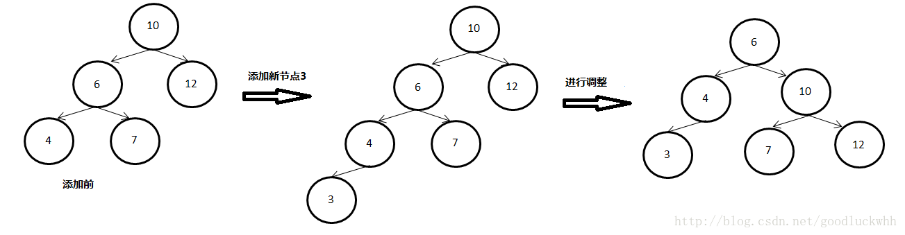
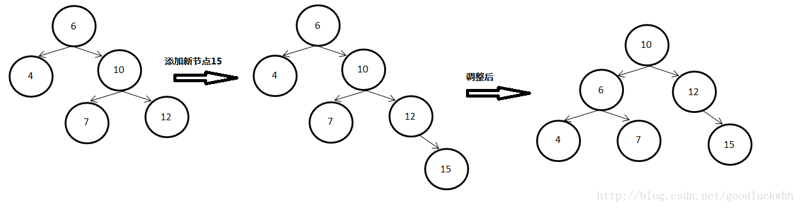
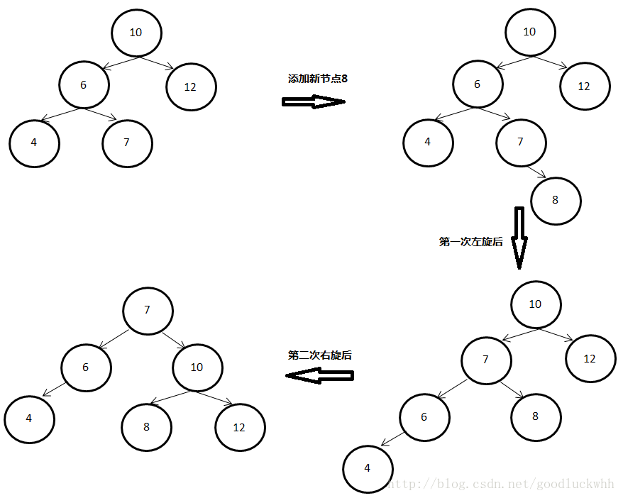
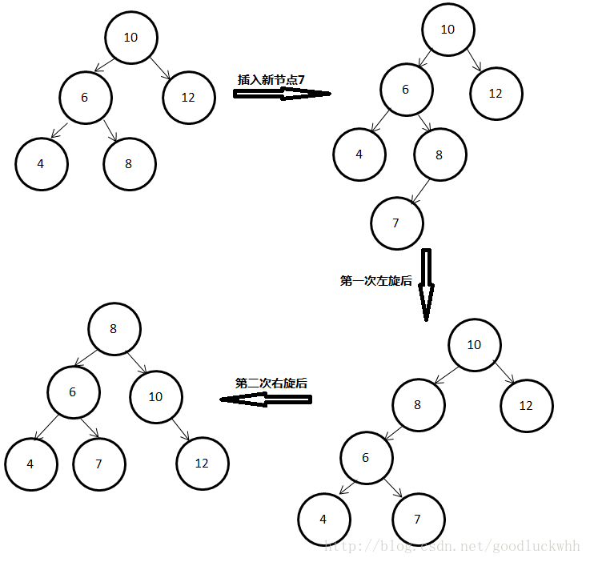
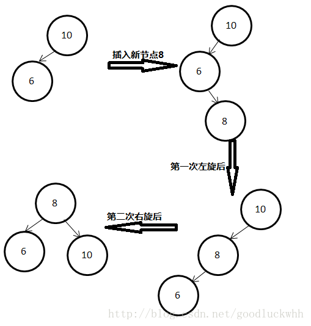
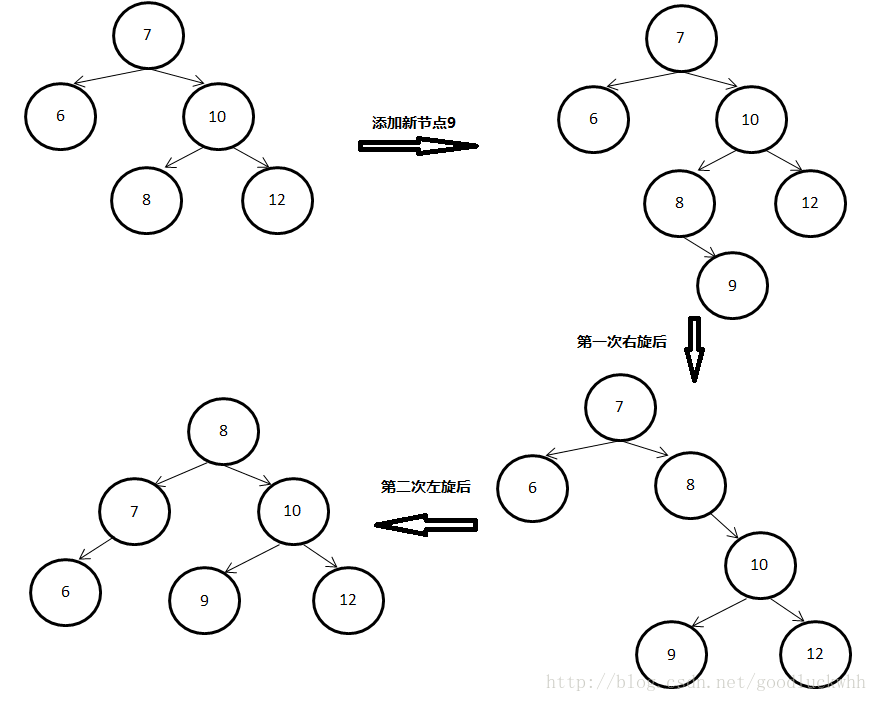

## 1.平衡树的定义和性质
> 平衡二叉树(AVL)：它或者是一颗空树，或者具有以下性质的二叉树：它的左子树和右子树的深度之差（平衡因子）的绝对值不超过1，且它的左子树和右子树都是一颗平衡二叉树。

这个方案很好的解决了二叉查找树退化成链表的问题，把插入，查找，删除的时间复杂度最好情况和最坏情况都维持在O(logN)。但是频繁旋转会使插入和删除牺牲掉O(logN)左右的时间，不过相对二叉查找树来说，时间上稳定了很多。

## 2.ADT及其实现

## 3.平衡树查找和插入算法

#### 3.1 查找

平衡二叉树一般是一个有序树，它具有二叉树的所有性质，其遍历操作和二叉树的遍历操作相同。但是由于其对二叉树施加了额外限制，因而其添加、删除操作都必须保证平衡二叉树的性子被保持。查找算法基本和BST树无异，可参考上一节的查找，我们着重介绍一下插入算法。

#### 3.2 插入
平衡二叉树的添加操作是比较复杂的，因为添加后，平衡二叉树的平衡性质可能要被打破，此时就要对树进行调整以保证平衡二叉树的性质被保持住。平衡二叉树的插入操作基本分为以下两部步：

- 找到插入点  
   这一步和BST之前的插入操作无异。

- 找到需要调整的子树进行最多两次调整
  >在平衡二叉树的插入中，最繁琐的、最难的就是在找到某个节点，以该节点为根节点的子树不满足平衡二叉树的要求，使得调整后的以该节点为根节点的子树满足平衡二叉树的要求。树的调整分以下几种情况（假设以a为根节点的子树在插入新节点后不满足平衡二叉树的要求了
  - LL型 => 右旋  
     >左子树的根节点的右子树添加了节点 （可左可右）
     在添加完一个节点后，沿着”树的根节点（假设为root）到p的路径“的`反向路径`依次处理各个节点，直到找到了一个由于添加动作而导致其左右子树高度差不满足平衡二叉树的节点（在该例子中即为节点10），然后`对以该节点为根的子树`进行调整。
     
  - RR型 => 左旋  
     >右子树的根节点的右子树添加了节点（可左可右）
     该类型实际上是和LL型对称的，因而不再具体分析
       
  - LR型 => 先左旋（针对被添加孩子结点的结点）后右旋（上一个被旋转的结点）
  分为三类
    - 左子树的根节点的右子树添加了节点-右  
    
    - 左子树的根节点的右子树添加了节点-左  
    
    - 左子树的根结点直接添加了节点  
    
  - RL型 => 先右旋后左旋
     

因此平衡二叉树的插入分为两步，第一步找到插入点，时间复杂度为O(logn)，第二步找到需要调整的子树进行最多两次调整，时间复杂度也为O(logn)，因而它的插入操作的时间复杂度为O(logn)。

## 4.平衡因子的概念
平衡因子：结点的左子树的深度减去右子树的深度，那么显然-1<=bf<=1

###Reference: [平衡二叉树之一（基本性质、查询、添加）](https://yq.aliyun.com/ziliao/352865)