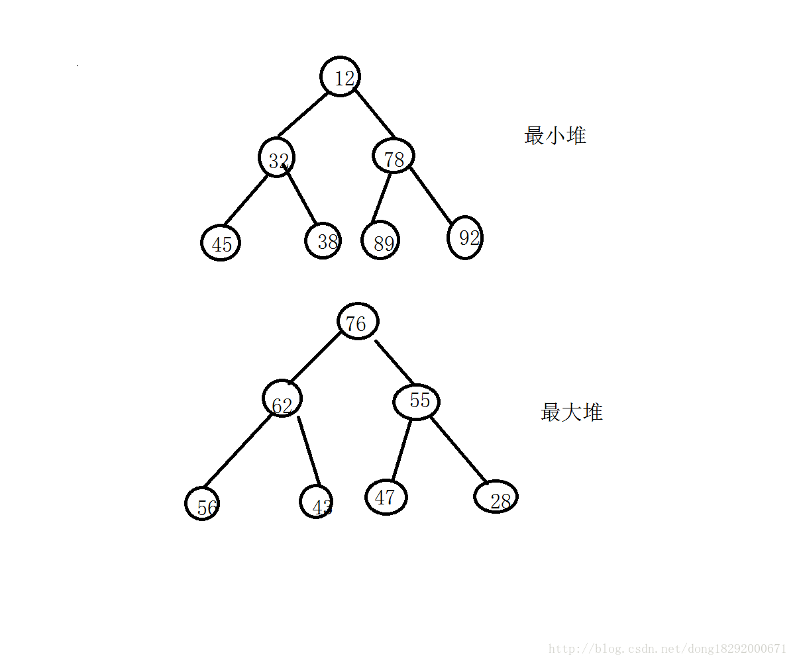
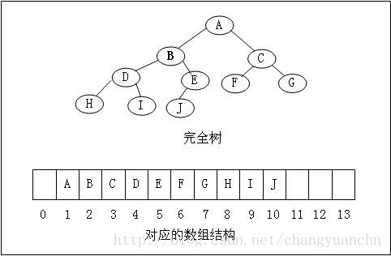
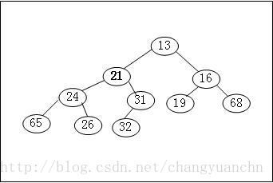
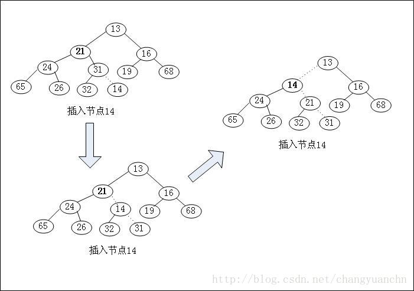
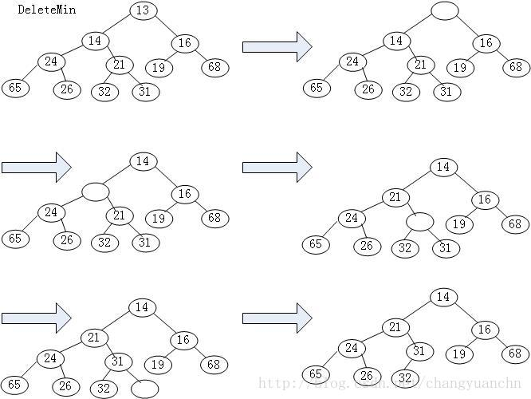
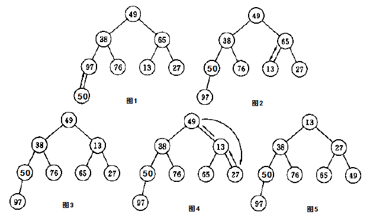

## 1.优先队列与堆
### 1.1 优先队列
在开始说明其具体概念之前，我们先来看看两个例子。
1. 需要从十亿个元素中选出最大的十个，你真的想把一个10亿规模的数组排序吗？但有了优先队列，你只用一个能存储十个元素的队列即可。具体做法是让元素一个个输入，只要优先队列的个数大于10，就不断删除最小元素，最后优先队列长度不大于10时停止删除，只剩10个自然就是所有元素中最大的10个了
2. 有一个打印机，但是有很多的文件需要打印，那么这些任务必然要排队等候打印机逐步的处理。这里就产生了一个问题。原则上说先来的先处理，但是有一个文件100页，它排在另一个1页的文件的前面，那么可能我们要先打印这个1页的文件比较合理。因此为了解决这一类的问题，提出了优先队列的模型。

ok 那么什么是优先队列呢，我们首先想到了之前学习的先进先出的队列，要区分清楚这两个不是一样的概念，先进先出的队列是一个数据结构，而现在提到的`优先`队列则是一个算法。

### 1.2 优先级队列与堆的关系。
优先队列是一个<span style="color:red">算法</span>，堆是实现这种算法用的一种<span style="color:red">数据结构</span>，这里很有迷惑性，让人以为这是两个数据结构之间的关系，其实并不是。

## 2.堆的定义

堆分为：`最小堆和最大堆`。 
- 最小堆： 
  > 将数据按照二叉树的方式进行排列，其中每个节点的根节点的值小于其左子树和右子树，与左、右孩子的大小无关，称为最小堆。 
- 最大堆： 
  > 将数据按照二叉树的方式进行排列，其中每个节点的根节点的值大于其左子树和右子树，与左、右孩子的大小无关，称为最大堆。

  > 

## 3.堆的生成
Heap有两个性质：结构性质（structure property），堆的顺序性（heap order property）
- 结构性，它是一个完全二叉树  

  

- 顺序性，是最小堆或者最大堆  

  

#### 堆的声明
``` c
    typedef struct HeapStruct;
    typedef struct HeapStruct *Heap;
    
    struct HeapStruct
    {
        int Capacity;
        int Size;
        ElementType *Element;
    }
```
元素存放在数组中Element，Capacity是指堆的容量，SIze是指堆的实际元素个数。
#### 堆的初始化
```java
Heap Initialize(int MaxNum)
{
	if(MaxNum<MiniHeapSize)
		error("The Heap Size is too small");
	Heap H;
	H = malloc(sizeof(struct HeapStruct));
	if(H==NULL)
		Error("Out of Space!!!");
	H->Element = malloc(sizeof(ElementType)*(MaxNum+1));
	if(H->Element == NULL)
		Error("Out of Space!!!");
	H->Capacity = MaxNum;
	H->Size = 0;
	H->Element[0] = MinData;
	return H;
}
```
堆的数组的位置0的值是一个游标哨兵，这个会用到，对元素是从1开始存放的。

### 插入结点  

  

### 删除结点  


## 4.调整算法

时间复杂度: o(logn)  
空间复杂度: o(1)  

#### 应用

- 获取最大值或最小值
- top K

#### 代码实现

- 初始化
```java
void Initialize(T a[], int size, int ArraySize)  
{
    delete []heap;  
    isExist = false;  
    heap = a;  
    CurrentSize = size;  
    MaxSize = ArraySize;  
    //产生一个最大堆  
    for(int i = CurrentSize / 2; i >= 1; i --)  
    {  
        T y = heap[i];          //子树的根  
        //寻找放置y的位置  
        int c = 2 * i; //c的父节点是y的目标位置  
        while(c <= CurrentSize)  
        {  
            //heap[c］应是较大的同胞节点  
            if(c < CurrentSize && heap[c] < heap[c + 1])  
                c ++;  
            //能把y放入heap[c / 2]吗？  
            if(y >= heap[c])  
                break;          //能               
            else            //不能  
            {  
                heap[c / 2] = heap[c];      //将孩子上移  
                c *= 2;  
            }           //下移一层  
        }  
        heap[c / 2] = y;  
    }  
}
```

- 插入

```java
MaxHeap<T> &Insert(const T&x)  
    {     
        if(CurrentSize == MaxSize)  
            exit(1);        //没有足够空间  
  
        //为x寻找应插入位置  
        //i从新的叶节点开始，并沿着树上升  
        int i = ++ CurrentSize;  
        while(i != 1 && x > heap[i/2])  
        {  
            //不把x放进heap[i]  
            heap[i] = heap[i/2];        //元素下移  
            i /= 2;     //移向父节点  
        }  
        heap[i] = x;        //这时候才把x放进去  
        return *this;  
    }
```

- 删除

```java
MaxHeap<T> &DeleteMax(T &x)  
    {  
        //检查堆是否为空  
        if(CurrentSize == 0)  
            exit(1);        //队列空  
  
        x = heap[1];        //最大元素  
        T y = heap[CurrentSize--];      //最后一个元素  
        //从根开始，重构大堆  
        int i = 1, ci = 2;      //ci为i的儿子  
        while(ci < CurrentSize)  
        {  
            if(ci < CurrentSize && heap[ci] < heap[ci + 1])           //比较两个子节点大小，取其大  
                ci ++;  
            //能否放y  
            if(heap[ci] > y)     //不能  
            {  
                heap[i] = heap[ci];     //孩子上移  
                i = ci;                 //下移一层  
                ci *= 2;  
            }  
            else            //能  
                break;  
        }  
        heap[i] = y;  
        return *this;  
    }
```

## 5.范围查询

### reference [优先级队列与堆的关系-董丹丹第100号](https://blog.csdn.net/dong18292000671/article/details/71635506 )
### reference [堆——最大堆/最小堆的初始化、增加、删除等基本操作](https://www.i3geek.com/archives/682 )