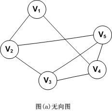
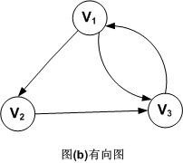
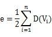
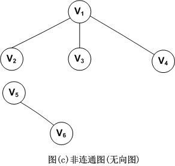

## 1. 图的定义
> 图是一种复杂的非线性结构。
>
>在线性结构中，数据元素之间满足唯一的线性关系，每个数据元素(除第一个和最后一个外)只有一个直接前趋和一个直接后继；
>
>在树形结构中，数据元素之间有着明显的层次关系，并且每个数据元素只与上一层中的一个元素(双亲节点)及下一层的多个元素(孩子节点)相关；
>
>而在图形结构中，节点之间的关系是任意的，图中任意两个数据元素之间都有可能相关。
>
>图G由两个集合V(顶点Vertex)和E(边Edge)组成，定义为G=(V，E)

## 2. 图的相关概念和术语

#### 2.1 无向图和有向图
对于一个图，若每条边都是没有方向的，则称该图为无向图。图示如下：  
     
因此，(Vi，Vj)和(Vj，Vi)表示的是同一条边。注意，无向图是用小括号，而下面介绍的有向图是用尖括号。  
无向图的顶点集和边集分别表示为：  
V(G)={V1，V2，V3，V4，V5}  
E(G)={(V1，V2)，(V1，V4)，(V2，V3)，(V2，V5)，(V3，V4)，(V3，V5)，(V4，V5)}   

对于一个图G，若每条边都是有方向的，则称该图为有向图。图示如下。  
    
因此，<Vi，Vj>和<Vj，Vi>是两条不同的有向边。注意，有向边又称为弧。  
有向图的顶点集和边集分别表示为：  
V(G)={V1，V2，V3}   
E(G)={<V1，V2>，<V2，V3>，<V3，V1>，<V1，V3>}  

#### 2.2 无向完全图和有向完全图
我们将具有n(n-1)/2条边的无向图称为无向完全图。同理，将具有n(n-1)条边的有向图称为有向完全图。

#### 2.3 顶点的度
对于无向图，顶点的度表示以该顶点作为一个端点的边的数目。比如，图(a)无向图中顶点V3的度D(V3)=3  

对于有向图，顶点的度分为入度和出度。入度表示以该顶点为终点的入边数目，出度是以该顶点为起点的出边数目，该顶点的度等于其入度和出度之和。比如，顶点V1的入度ID(V1)=1，出度OD(V1)=2，所以D(V1)=ID(V1)+OD(V1)=1+2=3

记住，不管是无向图还是有向图，顶点数n，边数e和顶点的度数有如下关系：  

  
因此，就拿有向图(b)来举例，由公式可以得到图G的边数e=(D(V1)+D(V2)+D(V3))/2=(3+2+3)/2=4

#### 2.4 子图
 
故名思义，这个就不解释了。  

#### 2.5 路径，路径长度和回路  

路径，比如在无向图G中，存在一个顶点序列Vp,Vi1,Vi2,Vi3…，Vim，Vq，使得(Vp,Vi1)，(Vi1,Vi2)，…,(Vim,Vq)均属于边集E(G)，则称顶点Vp到Vq存在一条路径。

路径长度，是指一条路径上经过的边的数量。

回路，指一条路径的起点和终点为同一个顶点。

#### 2.6 连通图（无向图）

连通图是指图G中任意两个顶点Vi和Vj都连通，则称为连通图。比如图(b)就是连通图。下面是一个非连通图的例子。  

上图中，因为V5和V6是单独的，所以是非连通图。

#### 2.7 强连通图（有向图）

强连通图是对于有向图而言的，与无向图的连通图类似。 

#### 2.8 网
带”权值”的连通图称为网。如图所示。  

### reference : [数据结构和算法系列17 图-鲁宁](http://www.cnblogs.com/mcgrady/archive/2013/09/23/3335847.html)