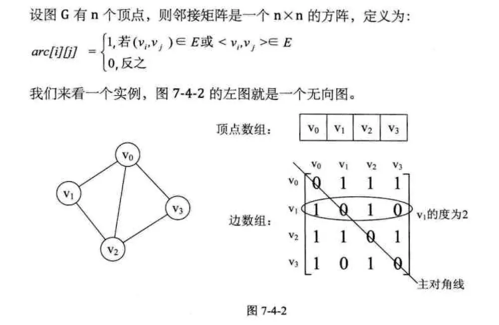
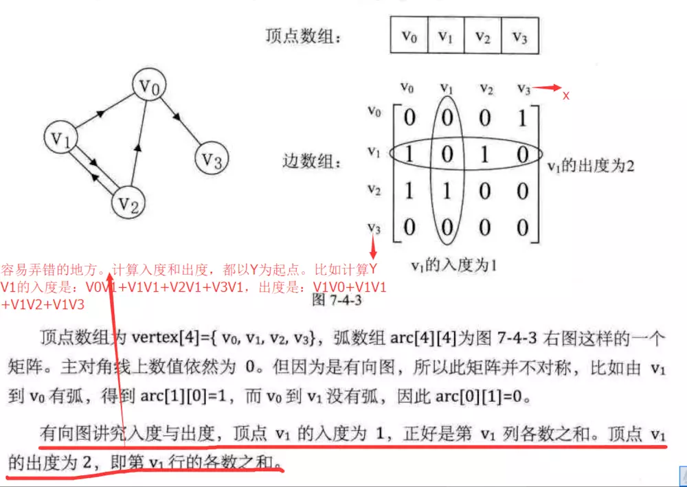
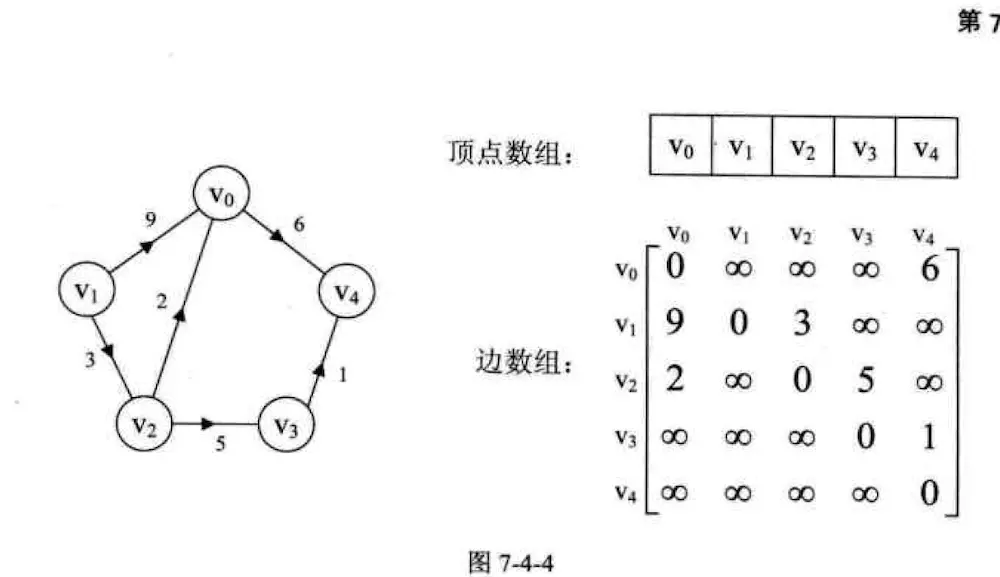
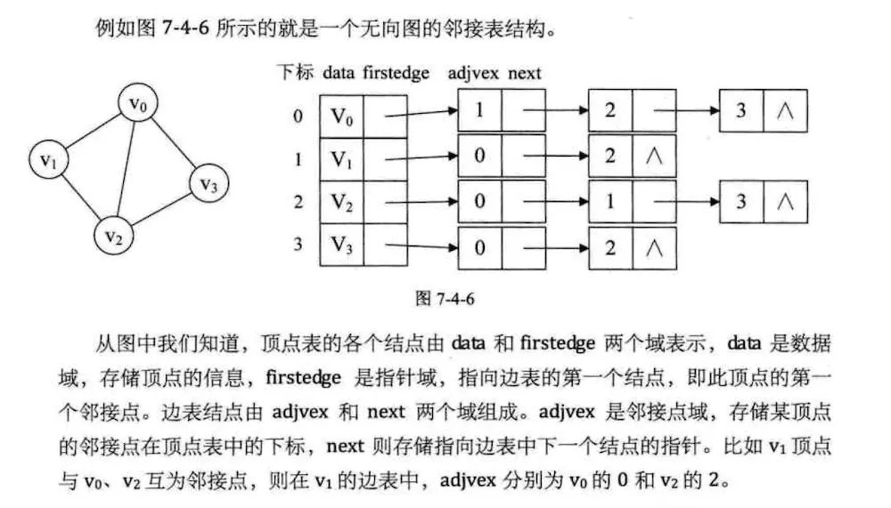
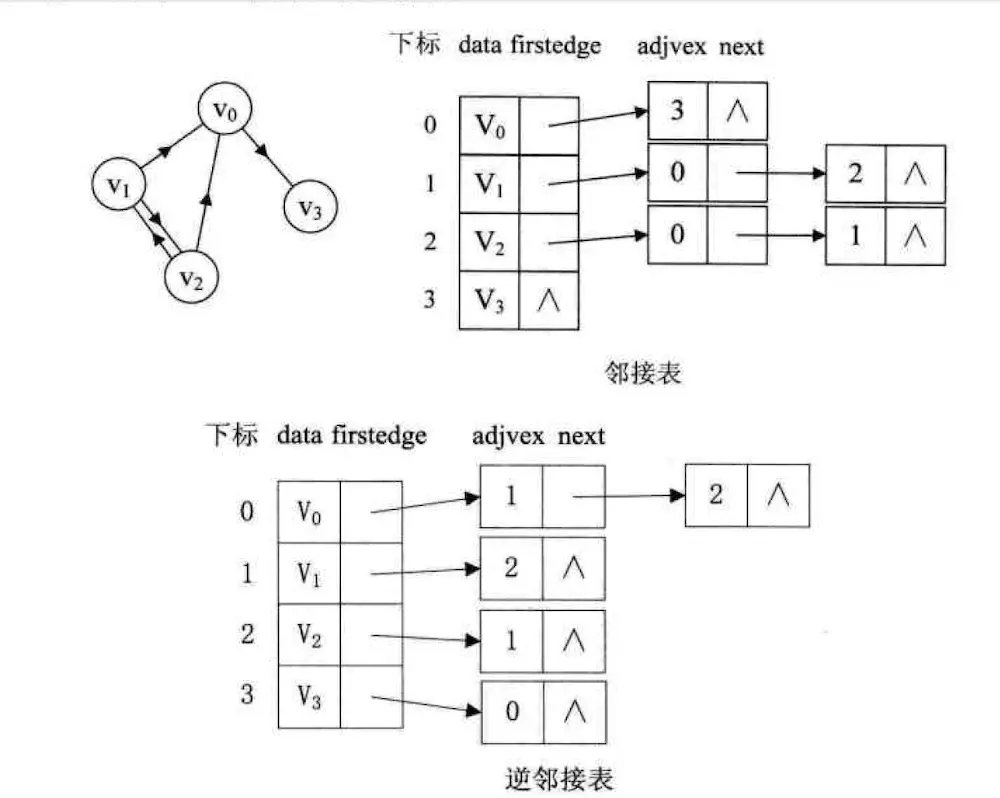
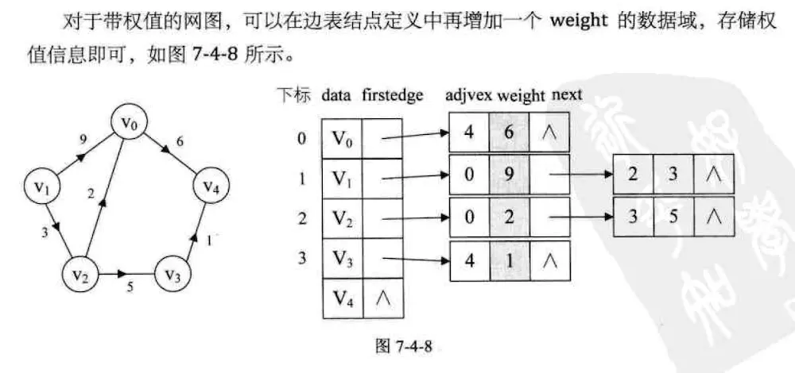

## 1. 存储结构
 > 图有两种存储结构，邻接矩阵和邻接表

## 2. 邻接矩阵，邻接表

#### 2.1 邻接矩阵
> 图的邻接矩阵（Adjacency Matrix）存储方式是用两个数组表示图。一个一维数组存储图中顶点信息，一个
二维数组（称为邻接矩阵）存储图中的边或弧信息

- 无向图实例
  
- 有向图实例
  
- 网实例
  

#### 2.2 邻接表
> 数组与链表相结合的方法称为邻接表（Adjacency List）。  
  图中顶点用一个一维数组存储。该数组存储两部分内容：顶点信息和指针。  
该指针指向该顶点的第一个邻接点。  
图中的每个顶点 v_i 的所有邻接点构成一个线性表，用单链表存储。  
这个线性表可能叫 边表，也可能叫 出边表。  
当图为无向图的时候，这个线性表叫做顶点 v_i 的边表。  
当图为有向图的时候，这个线性表叫做顶点 v_i 作为弧尾的出边表。  

- 无向图邻接表
  
- 有向图邻接表
    
    
- 网图链接表
  

### reference  [数据结构学习笔记之图-刚刚悟道](https://www.jianshu.com/p/6cace353141d)

