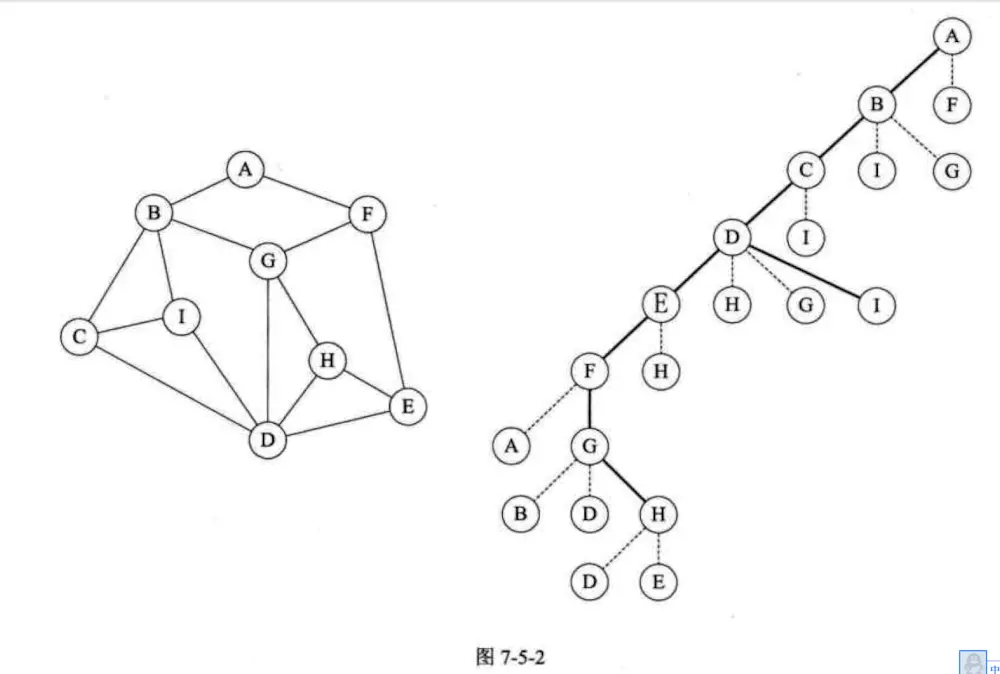
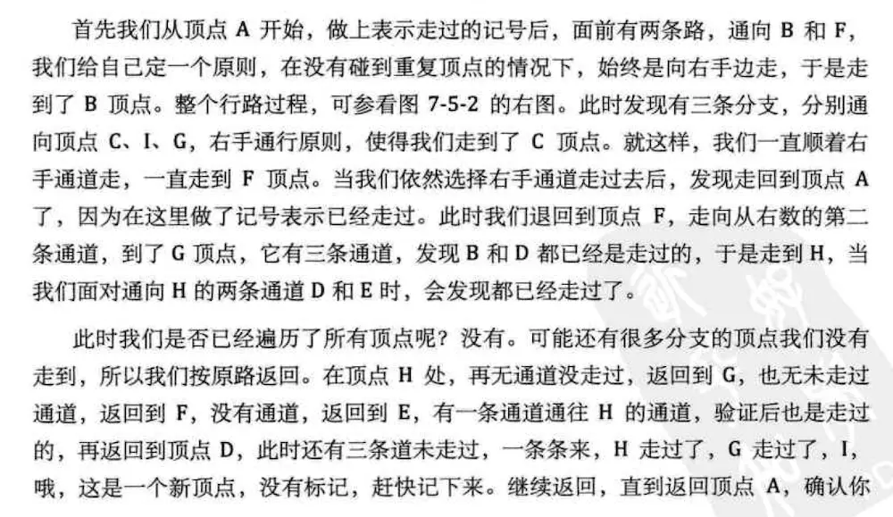
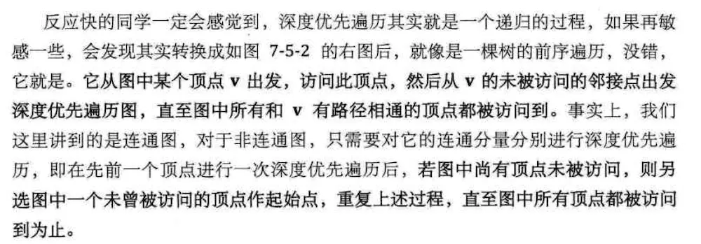
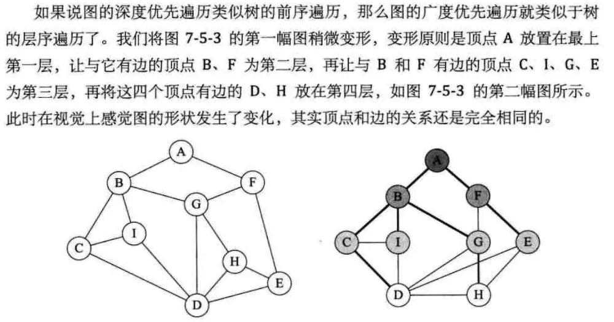
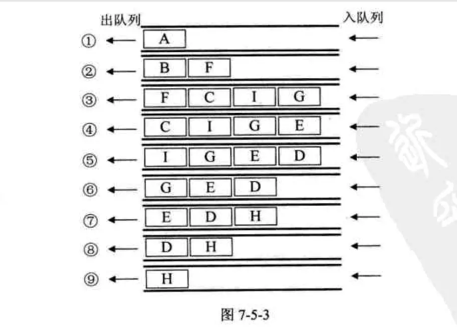

## 1. 图的遍历
> 从图中某一个顶点出发遍访图的其余所有顶点，且使所有顶点被访问且只访问一次。
这个过程，就叫做图的遍历（Traversing Graph）

## 2.广度优先遍历和深度优先遍历

#### 深度优先遍历

类比树的前序遍历   

#### 广度优先

类比树的层次遍历  

### reference  [数据结构学习笔记之图-刚刚悟道](https://www.jianshu.com/p/6cace353141d)