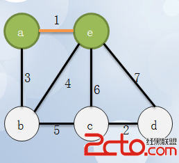

## 1. 最小生产树
什么是最小生成树呢？在弄清什么是最小生成树之前，我们需要弄清什么是生成树？  
用一句语简单概括生成树就是：生成树是将图中所有顶点以最少的边连通的子图。  
比如图(g)可以同时得到两个生成树图(h)和图(i)  


知道了什么是生成树之后，我们就很容易理解什么是最小生成树了。所谓最小生成树，用一句话总结就是：权值和最小的生成树就是最小生成树。

比如上图中的两个生成树，生成树1和生成树2，生成树1的权值和为：12，生成树2的权值为：14，我们可以证明图(h)生成树1就是图(g)的最小生成树。

## 2. 最小生产树的实践
有一块木板，板上钉上了一些钉子，这些钉子可以由一些细绳连接起来。假设每个钉子可以通过一根或者多根细绳连接起来，那么一定存在这样的情况，即用最少的细绳把所有钉子连接起来。
更为实际的情景是这样的情况，在某地分布着N个村庄，现在需要在N个村庄之间修路，每个村庄之前的距离不同，问怎么修最短的路，将各个村庄连接起来。

上这些问题都可以归纳为最小生成树问题，用正式的表述方法描述为：给定一个无方向的带权图G=(V, E)，最小生成树为集合T, T是以最小代价连接V中所有顶点所用边E的最小集合。 集合T中的边能够形成一颗树，这是因为每个节点（除了根节点）都能向上找到它的一个父节点。

那么如何构造最小生成树呢？可以使用普里姆算法和Kruskal算法。

## 2. Prim算法 （从点出发）
- #### 算法描述：
  1. 在一个加权连通图中，顶点集合V，边集合为E
  2. 任意选出一个点作为初始顶点,标记为visit,计算所有与之相连接的点的距离，选择距离最短的，标记visit.
  3. 重复以下操作，直到所有点都被标记为visit：  
      在剩下的点钟，计算与已标记visit点距离最小的点，标记visit,证明加入了最小生成树。
- #### 过程
  1. 起初，从顶点a开始生成最小生成树  
  

  2. 选择顶点a后，顶点啊置成visit（涂黑）,计算周围与它连接的点的距离：  
  

  3. 与之相连的点距离分别为7,6,4，选择C点距离最短，涂黑C，同时将这条边高亮加入最小生成树：  
  

  4. 计算与a,c相连的点的距离（已经涂黑的点不计算），因为与a相连的已经计算过了，只需要计算与c相连的点，如果一个点与a,c都相连，那么它与a的距离之前已经计算过了，如果它与c的距离更近，则更新距离值，这里计算的是未涂黑的点距离涂黑的点的最近距离，很明显，b和a为7，b和c的距离为6，更新b和已访问的点集距离为6，而f,e和c的距离分别是8,9，所以还是涂黑b,高亮边bc：  
  

  5. 接下来很明显，d距离b最短，将d涂黑，bd高亮：  
  

  6. f距离d为7，距离b为4，更新它的最短距离值是4，所以涂黑f，高亮bf：  
  

  7. 最后只有e了：  
  

针对如上的图,代码实例如下：
- #### 代码
``` java
void MiniSpanTree_Prim(MGraph G)
{
    int min, i, j, k;
    int adjvex[MAXVEX];     // 保存相关顶点下标
    int lowcost[MAXVEX];    // 保存相关顶点间边的权值
    // 初始化第一个权值为0，即v0加入生成树
    // lowcost的值为0，在这里就是此下标的顶点已经加入生成树
    lowcost[0] = 0;     
    adjvex[0] = 0;  // 初始化第一个顶点下标为0
    for(i = 1; i < G.numVertexes; i++){
        lowcost[i] = G.arc[0][i];   // 将v0顶点与之有边的权值存入数组
        adjvex[i] = 0;  // 初始化都为v0的下标
    }
    for(i = 1; i < G.numVertexes; i++){
        min = INFINITY; //  初始化最小权值为 INFINITY
        j = 1; k = 0;
        while(j < G.numVertexes){
            if(lowcost[j] != 0 && lowcost[j] < min){
                min = lowcost[j];   // 让当前权值成为最小值
                k = j;      // 将当前最小值的下标存入k
            }
            j++;
        }
        printf("(%d, %d)", adjvex[k], k);   //打印当前顶点边中权值最小的边
        lowcost[k] = 0;     // 将当前顶点的权值设置为0，表示此顶点已经完成任务
        for(j = 1; j < G.numVertexes; j++){
            if(lowcost[j] != 0 && G.arc[k][j] < lowcost[j]){
                lowcost[j] = G.arc[k][j];   // 将较小权值存入lowcost
                adjvex[j] = k;      // 将下标为k的顶点存入adjvex
            }
        }
    }
}

```
## 3. Kruskal算法 （从边出发）
 > Kruskal是另一个计算最小生成树的算法，其算法原理如下。首先，将每个顶点放入其自身的数据集合中。然后，按照权值的升序来选择边。当选择每条边时，判断定义边的顶点是否在不同的数据集中。如果是，将此边插入最小生成树的集合中，同时，将集合中包含每个顶点的联合体取出，如果不是，就移动到下一条边。重复这个过程直到所有的边都探查过。

 - #### 过程
  1. 初始情况，一个联通图，定义针对边的数据结构，包括起点，终点，边长度：  
      
  2. 找到所有边中的最短边，并将其端点放入一个集合中  
      
  3. 继续找到第二短的边，将c,d再放入同一个集合里  
      
  4. 继续找，找到第三短的边ab，因为a,e已经在一个集合里，再将b加入：  
      
  5. 继续找，找到b,e，因为b,e已经同属于一个集合，连起来的话就形成环了，所以边be不加入最小生成树：  
      
  6. 再找，找到bc，因为c,d是一个集合的，a,b,e是一个集合，所以再合并这两个集合：  
      

- #### 代码
```c
typedef struct 
{
    int begin;
    int end;
    int weight;
}Edge;

void MiniSpanTree_Kruskal(MGraph G)
{
    int i, n, m;
    Edge edges[MAXEDGE];    // 定义边集数组
    int parent[MAXVEX];     // 定义一数组用来判断边与边是否形成环路
    for(i = 0; i < G.numVertexes; i++){
        parent[i] = 0;      // 初始化数组值为0
    }
    for(i = 0; i < G.numVertexes; i++){
        n = Find(parent, edges[i].begin);
        m = Find(parent, edges[i].end);
        if(n != m){     // 假如n与m不等，说明此边没有与现有生成树形成环路
            // 将此边的结尾顶点放入下标为起点的parent中
            // 表示此顶点已经在生成树集合中
            parent[n] = m;      
            printf("(%d, %d) %d", edges[i].begin, edges[i].end, edges[i].weight);
        }
    }
}

int Find(int *parent, int f)    // 查找连线顶点的尾部下标
{
    while(parent[f] > 0){
        f = parent[f];
    }
    
    return f;
}

```


### reference  [数据结构学习笔记之图-刚刚悟道](https://www.jianshu.com/p/6cace353141d)
###            [图的基本算法解析（最小生成树）-刚刚悟道](https://www.2cto.com/kf/201603/496259.html#)