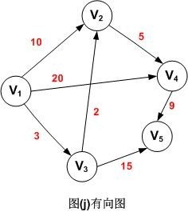
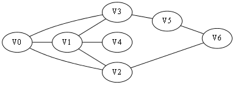
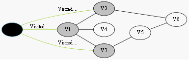
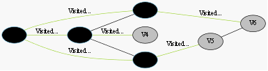
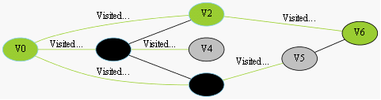

## 1. 最短路径
> 求最短路径也就是求最短路径长度。下面是一个带权值的有向图，表格中分别列出了顶点V1其它各顶点的最短路径长度。

   

|源点|最短路径|终点||路径长度|
|--|--|--|--|--|
|V1|V1，V3，V2    |V2|中转|5|
|V1|V1，V3        |V3|直达|3|
|V1|V1，V3，V2，V4 |V4|中转|10|
|V1|V1，V3，V5     |V5|中转|18|
表：顶点V1到其它各顶点的最短路径表

从图中可以看出，顶点V1到V4的路径有3条(V1，V2，V4)，(V1，V4)，(V1，V3，V2，V4)，其路径长度分别为15，20和10，因此，V1到V4的最短路径为(V1，V3，V2，V4)。

除了个数，当是有向图中，最短路径是指两顶点之间经历的边上权值之和最短的路径。 

#### 最短路径的应用
假期中，你将在两个星期的时间里游历10个旅游城市，去那里最富盛名的景点（1 个），你希望通过最短路径算法，找出开车游历10个城市行驶的最小历程数。
另一个最短路径问题涉及创建一个计算机网络时的开销，其中包括两台电脑之间传递数据的时间，或者两台电脑建立和维护连接的成本。 


那么如何求带权有向图的最短路径长度呢？可以使用迪杰斯特拉(Dijkstra)算法。
## 2. 广度优先搜索算法
- #### 实现思路
类似于广度优先，优先从头结点遍历，一层层进行，直到发现目的结点。
  - 初始全部都是白色（未访问）
    
  - 即将搜索起点V0（灰色）
    
  - 已搜索V0，即将搜索V1、V2、V3
    
  - ……终点V6被染灰色，终止
    
  - 找到最短路径
    

- #### 代码
```java
/**
 * 广度优先搜索
 * @param Vs 起点
 * @param Vd 终点
 */
bool BFS(Node& Vs, Node& Vd){
	queue<Node> Q;
	Node Vn, Vw;
	int i;
 
	//用于标记颜色当visit[i][j]==true时，说明节点访问过，也就是黑色
	bool visit[MAXL][MAXL];
 
	//四个方向
	int dir[][2] = {
		{0, 1}, {1, 0},
		{0, -1}, {-1, 0}
	};
 
	//初始状态将起点放进队列Q
	Q.push(Vs);
	visit[Vs.x][Vs.y] = true;//设置节点已经访问过了！
 
	while (!Q.empty()){//队列不为空，继续搜索！
		//取出队列的头Vn
		Vn = Q.front();
		Q.pop();
 
		for(i = 0; i < 4; ++i){
			Vw = Node(Vn.x+dir[i][0], Vn.y+dir[i][1]);//计算相邻节点
 
			if (Vw == Vd){//找到终点了！
				//把路径记录，这里没给出解法
				return true;//返回
			}
 
			if (isValid(Vw) && !visit[Vw.x][Vw.y]){
				//Vw是一个合法的节点并且为白色节点
				Q.push(Vw);//加入队列Q
				visit[Vw.x][Vw.y] = true;//设置节点颜色
			}
		}
	}
	return false;//无解
}
```

## 3. Dijkstra算法 O(n2)
#### 基本思想：
   设置一个集合S存放已经找到最短路径的顶点，S的初始状态只包含源点v，对vi∈V-S，假设从源点v到vi的有向边为最短路径。以后每求得一条最短路径v, …, vk，就将vk加入集合S中，并将路径v, …, vk , vi与原来的假设相比较，取路径长度较小者为最短路径。重复上述过程，直到集合V中全部顶点加入到集合S中。

#### 设计数据结构 :
　　1、图的存储结构：带权的邻接矩阵存储结构 。  

　　2、数组dist[n]：每个分量dist[i]表示当前所找到的从始点v到终点vi的最短路径的长度。初态为：若从v到vi有弧，则dist[i]为弧上权值；否则置dist[i]为∞。  

　　3、数组path[n]：path[i]是一个字符串，表示当前所找到的从始点v到终点vi的最短路径。初态为：若从v到vi有弧，则path[i]为vvi；否则置path[i]空串。  

　　4、数组s[n]：存放源点和已经生成的终点，其初态为只有一个源点v。

#### Dijkstra算法——伪代码
```c
 初始化数组dist、path和s；
 while (s中的元素个数<n)
     在dist[n]中求最小值，其下标为k；
     输出dist[j]和path[j]；
     修改数组dist和path；
     将顶点vk添加到数组s中；
```
[算法详解](https://blog.csdn.net/qq_35644234/article/details/60870719)

## 4. [Floyad算法 O(n3)](https://blog.csdn.net/qq_35644234/article/details/60875818)
