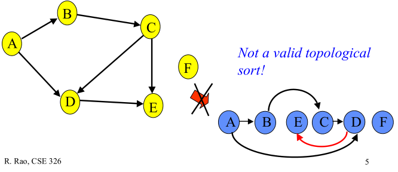
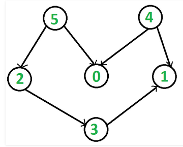

## 拓扑排序

### 1. 拓扑排序的定义

#### 1.1 有向无环图
有向无环图（Directed Acyclic Graph, DAG）是有向图的一种，字面意思的理解就是图中没有环。常常被用来表示事件之间的驱动依赖关系，管理任务之间的调度。拓扑排序是对DAG的顶点进行排序，使得对每一条有向边(u, v)，均有u（在排序记录中）比v先出现。亦可理解为对某点v而言，只有当v的所有源点均出现了，v才能出现。

下图给出有向无环图的拓扑排序：  

  

下图给出的顶点排序不是拓扑排序，因为顶点D的邻接点E比其先出现：  

  

### 2. 拓扑排序的作用
不禁有人就问了，有很多排序算法啊，快速排序，插值排序，这个排序到底有什么优点呢？平常这种排序又用于哪种场景呢？

我们说快速排序是不稳定的，这是因为最后的快排结果中相同元素的出现顺序和排序前不一致了。如果用偏序的概念可以这样解释这一现象：相同值的元素之间的关系是无法确定的。因此它们在最终的结果中的出现顺序可以是任意的。而对于诸如插入排序这种稳定性排序，它们对于值相同的元素，还有一个潜在的比较方式，即比较它们的出现顺序，出现靠前的元素大于出现后出现的元素。因此通过这一潜在的比较，将偏序关系转换为了全序关系，从而保证了结果的唯一性。而拓扑排序就是一种将偏序转换为全序的一种算法。

这里要补充两个概念，偏序和全序？

偏序：有向图中两个顶点之间不存在环路，至于连通与否，是无所谓的。

全序：就是在偏序的基础之上，有向无环图中的任意一对顶点还需要有明确的关系(反映在图中，就是单向连通的关系，注意不能双向连通，那就成环了)。

意思就是讲，一个不确定的偏序关系经全序后就有一种确定的先后顺序了。

### 3. 拓扑排序算法
拓扑排序的实现算法有两种：入度表、DFS，其时间复杂度均为O(V+E)。

#### 3.1 入度表
对于DAG的拓扑排序，显而易见的办法：
 - 找出图中0入度的顶点；
 - 依次在图中删除这些顶点，删除后再找出0入度的顶点；
 - 然后再删除……再找出……
 - 直至删除所有顶点，即完成拓扑排序
为了保存0入度的顶点，我们采用数据结构栈（亦可用队列）；算法的可视化可参看[这里](https://www.cs.usfca.edu/~galles/visualization/TopoSortIndegree.html)。

图用邻接表（adjacency list）表示，用数组inDegreeArray[]记录结点的入度变化情况
#### 3.2 DFS
在DFS中，依次打印所遍历到的顶点；而在拓扑排序时，顶点必须比其邻接点先出现。在下图中，顶点5比顶点0先出现，顶点4比顶点1先出现。  
  
在DFS实现拓扑排序时，用栈来保存拓扑排序的顶点序列；并且保证在某顶点入栈前，其所有邻接点已入栈。DFS版拓扑排序的可视化参看[这里](https://www.cs.usfca.edu/~galles/visualization/TopoSortDFS.html)。
#### 