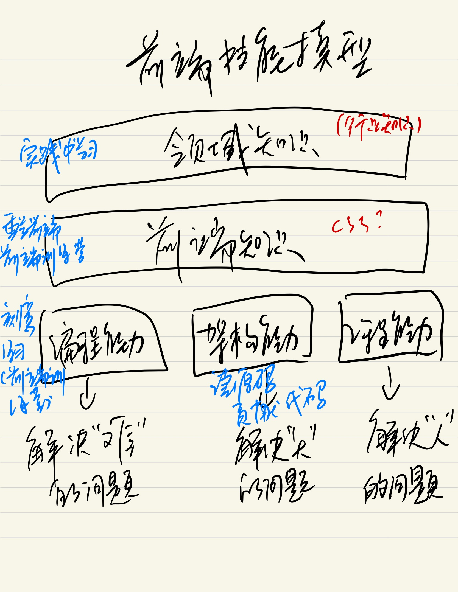

# 学习方法与构建知识体系

## 首先思考的两个问题

- 关于前端你都会什么
- 关于前端你不会什么

## 学习方法

- 整理法  (借助脑图)
- 追溯法
  - 源头
  - 官方
        - https://www.w3.org/
        - http://w3school.com/
        - https://whatwg.org/
        - https://scholar.google.com/
        - https://developer.mozilla.org/
        - https://docs.microsoft.com/
        - https://developer.apple.com/
  - 大师

## 前端技能模型

  