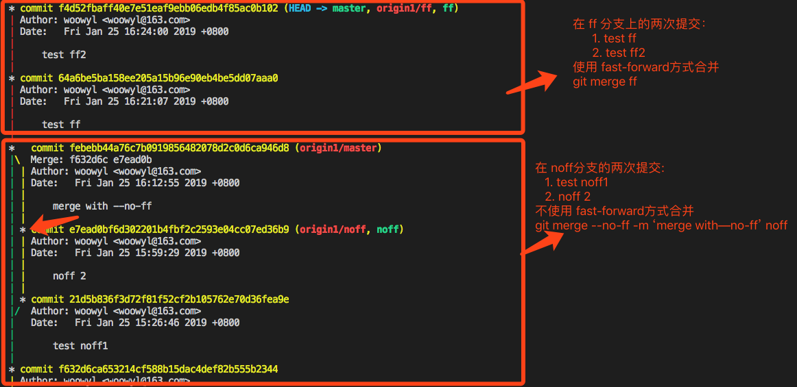
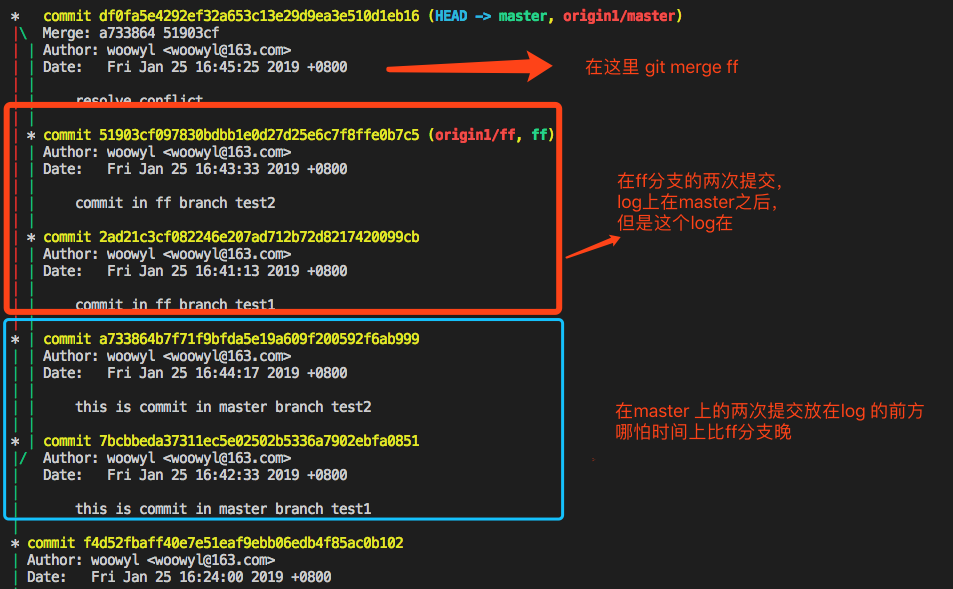
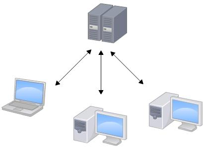
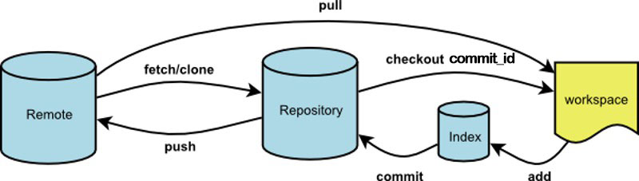

# GIT 笔记

## 一. 已掌握的

### 1.1 日常操作

``` javascript
    $ git status            //查看当前目录下的文件状态，是否被修改，是否已被添加至缓存区
    $ git diff              //查看工作区文件与版本中文件的差异
    $ git add               //将修改从工作区添加至缓存区
    $ git commit -m 'log'   //将修改从缓存区提交至本地版本库 
    $ git pull              //获取远程服务器上的修改
    $ git push              //将修改从本地版本库提交至远程版本库
```
### 1.2 撤销回退相关
- ### `$ git checkout [版本号] -- <文件名>…​`
    用于恢复工作区的文件。如果版本号不填的话，默认是取缓存区的对应文件去替换工作区的内容。所以当你在本地修改了一个文件，但是想丢弃本次修改，在未commit的情况下，你可以使用这条命令，如果已经提交，需要使用git reset。
    - 未add  直接: `$ git checkout -- filename`
    - 已add  使用: `$ git checkout [version] -- filename`   
     version填你想要恢复至的版本号，如果想从最新的版本恢复可直接使用HEAD  ` $ git checkout Head -- filename`
- ### `$ git reset`
    如果代码已被commit至本地仓库，但是还没提交到远程，而且你不想让远程看到哪些没有用的提交，那么就可以通过reset来撤销本地提交，HEAD指针将直接倒退到你所想回退的版本，在git log里指针之前的提交将看不到，也不会被提交到远程。
    git reset命令是**将本地仓库的HEAD指针指向对象的版本**，并通过参数去控制是否用重新定位版本的代码对工作区和暂存区进行修改。
    - `$ git reset --sort <版本号>`   
        表示只对本地仓库进行修改。
    - `$ git reset [--mixed] <版本号>`  
        表示将本地仓库HEAD指向对应版本号 + 将两次切换的差异放入缓存区
    - `$ git reset --hard <版本号>`
        表示将本地仓库HEAD指向对应版本号 + 并将工作区的代码修改为对应版本
- ### `$ git revert`  
    如果你的代码已经被push盗远程，这时候回退就需要使用revert,和reset不同的是，它不会舍弃任何log记录，而是会**添加**一个新的commit 去记录这次舍弃的操作。


关于撤销的总结: <label style="color:red">可能造成对工作区的直接修改是不安全的！！</label>  
下面的速查表列出了命令对树的影响。 “HEAD” 一列中的 “REF” 表示该命令移动了 HEAD 指向的分支引用，而“HEAD” 则表示只移动了 HEAD 自身。 特别注意 WD Safe? 一列 - 如果它标记为 NO，那么运行该命令之前请考虑一下。  

|  |HEAD|Index|Workdir|WD Safe?|
|-|-|-|-|-|
|Commit Level|  |  |  |  |
|reset --soft [commit]|REF|NO|NO|YES
|reset [commit]|REF|YES|NO|YES|
|reset --hard [commit]|REF|YES|YES|**NO**|
|checkout [commit]|HEAD|YES|YES|YES|
|File Level|||||
|reset (commit) [file]|NO|YES|NO|YES|
|checkout (commit) [file]|NO|YES|YES|**NO**|
从功能上看：
``` HTML
    $ git reset --hard [commit] file
    
    等效于:

    $ git chekcout (commit) file
    
    等效于:

    $ git reset (commit) file  + $ git chekcout -- file
```
### 1.3 分支和合并相关
- ### `$ git merge [--no-ff <-m> 'mergelog']  <要合并的分支名>`
    - fast-forward: 默认是fast-forward, 在没有冲突的前提下，被合并分支的提交会直接并入合并分支，在log里无法跟随到。

    - --no-ff : 表示不使用fast-forward，会在log里显示在被合并分支的操作

    没有冲突的情况下：
    
    有冲突的情况下，使用fast-forward仍然会保留分支上的信息
    

    会在master上多加一个提交，但是如果是没有冲突的情况下，这次提交就会被消除掉。

    > 综上，只有在使用了fast-forward模式且在没有冲突的情况下，master会少一个合并的记录，其他情况下都会保留

### 1.4 远程相关
- ### `$ git clone @git .....` 获取远程分支上的代码 和 分支

    命令执行之后，默认只会将master分支拉取到本地，如果想要仍想获取远程上的某个分支可以这么做
    ```
        $ git checkout <origin>/远程分支名
        $ git chekcout 远程分支名

        或者你不想每次都checkout 两次你可以使用
        $ git pull --all    //一次将所有origin 分支放入stash状态
        $ git chekcout 远程分支名1
        $ git chekcout 远程分支名2

    ```
- ### `$ git push --set-upstream origin [branchname]` 将本地分支推送到远程 
      
    此命令是将远程服务器上没有的分支推送上去，如果远程分支已经存在此分支，也就是名字相同，则会推送失败。添加`--set-upstream`是为了和远程分支建立关联，默认情况不加这个参数，虽然你向服务器推送了这个分支，但在执行 pull 和 push操作时会提示你没有关联远程分支。

- ### 删除本地和远程 
    分两步：
  - ### `$ git push --delete <远程名> <分支名>`  删除远程分支
  - ### `$ git branch -d <分支名>`  删除本地分支

### 1.5 其他

- ### git stash
    经常有这样的事情发生，当你正在进行项目中某一部分的工作，里面的东西处于一个比较杂乱的状态，而你想转到其他分支上进行一些工作，或者想要获取一下远程最新的代码。问题是，你不想提交进行了一半的工作，但不提交的话以后你无法回到这个工作点。解决这个问题的办法就是`git stash`命令。
    - git stash : 保存 
    - git stash list : 查看已保存的列表
    - git stash apply <stash@{index}> :应用保存，但是不删除
    - git stash drop <stash@{index}>  :删除对应保存
    - (git stash pop <stash@{index}> (= apply + drop))  :应用+删除保存


- ### git fetch
    fetch 是和 pull类似的，我再平时使用的时候基本都用了pull,这两者的区别可以用两张图直观的反应。  
      
      
    fetch：只会把修改更新到本地的版本库repository;    
    pull: 把修改更新到本地，而且同时修改工作区，workspace.

    fetch到本地版本库的代码，需要使用merge来将修改合并到工作区。  
    `git pull = git fetch + git merge.`。  
    #### 什么时候用fetch??  
    z
- ### git rebase
    首先要知道我们为什么要使用rebase才能知道在什么时候使用rebase。
    > 我们使用rebase可以使提交的历史记录显得更简洁。
      不要在远程分支上做rebase操作，因为rebase会改写历史。因此你应该只使用 rebase 来清理你的本地工作，千万不要尝试着对那些已经被发布的提交进行这个操作。

    综上，为了安全起见，不要对远程分支（或者说是）做rebase操作，那么rebase的使用场景就放在了，本地开发分支上。

    使用rebase可以让合并操作少一次合并的提交，并且在log --graph上保持单线上前。  
    使用`$ git merge `的情况  
    

    使用`$ git rebase `  
    


    rebase操作：
    ``` javascript
        // 在experiment分支上 
        $ git checkout experiment
        $ git rebase master

        // 切换到mater分支上
        $ git checkout master
        $ git merge experiment
    ```
    另外一种情况是在开发的时候有好多多余的commit,那在push之前，我不希望把一些多余的commit也推送到仓库，那么我就可以使用rebase来[合并多个 Commit](https://www.jianshu.com/p/964de879904a)

## 二、理解git 需要掌握的几个概念

- ### 2.1 集中式和分布式

    先说集中式版本控制系统，版本库是集中存放在中央服务器的，而干活的时候，用的都是自己的电脑，所以要先从中央服务器取得最新的版本，然后开始干活，干完活了，再把自己的活推送给中央服务器。中央服务器就好比是一个图书馆，你要改一本书，必须先从图书馆借出来，然后回到家自己改，改完了，再放回图书馆。

    

    集中式版本控制系统最大的毛病就是必须联网才能工作，如果在局域网内还好，带宽够大，速度够快，可如果在互联网上，遇到网速慢的话，可能提交一个10M的文件就需要5分钟，这还不得把人给憋死啊。

    那分布式版本控制系统与集中式版本控制系统有何不同呢？首先，分布式版本控制系统根本没有“中央服务器”，每个人的电脑上都是一个完整的版本库，这样，你工作的时候，就不需要联网了，因为版本库就在你自己的电脑上。既然每个人电脑上都有一个完整的版本库，那多个人如何协作呢？比方说你在自己电脑上改了文件A，你的同事也在他的电脑上改了文件A，这时，你们俩之间只需把各自的修改推送给对方，就可以互相看到对方的修改了。

    和集中式版本控制系统相比，分布式版本控制系统的安全性要高很多，因为每个人电脑里都有完整的版本库，某一个人的电脑坏掉了不要紧，随便从其他人那里复制一个就可以了。而集中式版本控制系统的中央服务器要是出了问题，所有人都没法干活了。

    在实际使用分布式版本控制系统的时候，其实很少在两人之间的电脑上推送版本库的修改，因为可能你们俩不在一个局域网内，两台电脑互相访问不了，也可能今天你的同事病了，他的电脑压根没有开机。因此，分布式版本控制系统通常也有一台充当“中央服务器”的电脑，但这个服务器的作用仅仅是用来方便“交换”大家的修改，没有它大家也一样干活，只是交换修改不方便而已。 

     

#### 常见的SVN路径
```
        $ svn checkout [path] (server address)            //获取服务器上项目
        $ svn add [file]                                  //要添加的文件
        $ svn update -r [version] [certain paht or file]  //提交前更新 可简化为 svn up
        $ svn commit -m “LogMessage“ [-N] [--no-unlock] PATH //提交 可简化为svn ci
``` 
#### 常见的Git路径

```
        $ git clone [path] (server address)            //获取服务器上项目
        $ git status                                   //获取服务器上项目
        $ git add [file]                               //要添加的文件
        $ git commit -m “LogMessage“                   //提交至本地repository
        $ git pull                                     //获取远程Repository更新
        $ git push                                     //将更新推送至远程Repository
``` 
 注意区分两者在commit前（svn:update）后(git:pull)的操作，这是两者集中和分布差异的体现。


- ### 2.2 工作区和暂存区
    一张图理解清晰明了
    

    工作区（workspace）即本地工作的目录，不在git控制范围，不会被跟踪。index即暂存区，这里的修改没有提交到仓库，它是未了对代码进行版本的管理如回溯等等，又避免了多次琐碎的commit提交。
    三棵树

    Git 作为一个系统，是以它的一般操作来管理并操纵这三棵树的：

    |树|用途|
    |-|-|
    |HEAD|上一次提交的快照，下一次提交的父结点|
    |Index|预期的下一次提交的快照|
    |Working Directory| 沙盒(当前工作目录)|


    HEAD INDEX 以一种高效但并不直观的方式，将它们的内容存储在 .git 文件夹中。 工作目录会将它们解包为实际的文件以便编辑。 你可以把工作目录当做 沙盒。在你将修改提交到暂存区并记录到历史之前，可以随意更改。


- ### 2.3 HEAD
    HEAD 是当前分支引用的指针，它总是指向该分支上的最后一次提交。 这表示 HEAD 将是下一次提交的父结点。 通常，理解 HEAD 的最简方式，就是将它看做 你的上一次提交 的快照。

    HEAD 是一个指针，指向某一个分支，通常你可以把 HEAD 當做「目前所在分支」看待。在 .git 目錄裡有一個檔名為 HEAD 的檔案，就是記錄著 HEAD 的內容，來看一下這東西長什麼樣子：
    ```
    $ cat .git/HEAD
      ref: refs/heads/master
    ```
    從這個檔案看起來，HEAD 目前正指向著 master 分支。如果有興趣再深入看一下 refs/heads/master 的內容就會發現，其實所謂的 Master 分支也不過就是一個 40的字符串，这正是master上的一次 commit id：
    ```
    $ cat .git/refs/heads/master
      df0fa5e4292ef32a653c13e29d9ea3e510d1eb16
    ```
    所以HEAD就是某个分支上的某次提交。  
    `git chekcout commit_id`,会直接修改.git/HEAD里的内容，直接改为某次提交。  
    `git reset commit_id`不会修改.git/HEAD里的内容，只修改了 .git/refs/heads/\<branch\>的内容。


- ### 2.4 origin
    origin只是约定俗成，最常用的一个远程的名字，并不是必须的。正如我们前面所讲，git是分布式的，所以它的远程仓库可以有多个。但为了让多人开发能够保持统一，我们一般选定一个中央服务器，当做枢纽这个枢纽的名字就可以叫做`origin`。你可以通过：
        `$ git remote add <远程分支名> <仓库地址>`
    去给仓库添加一个关联的远程，

## reference
 - [廖雪峰git教程](https://www.liaoxuefeng.com/wiki/0013739516305929606dd18361248578c67b8067c8c017b000)
 - [Git-工具-重置揭密](https://git-scm.com/book/zh/v2/Git-%E5%B7%A5%E5%85%B7-%E9%87%8D%E7%BD%AE%E6%8F%AD%E5%AF%86)
 - [What's the difference between Git Revert, Checkout and Reset?
](https://stackoverflow.com/questions/8358035/whats-the-difference-between-git-revert-checkout-and-reset)
