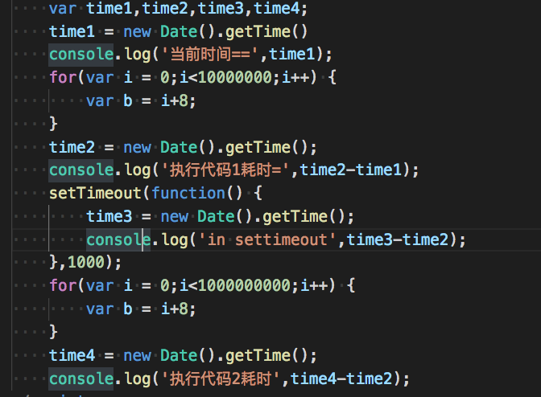

## JS的单线程和异步

由于Java的名气，提到JavaScript，多数人都会以为他们有着很大的关系。但就像雷峰塔就是一个叫雷锋的塔——JavaScript也仅仅是一个叫Java的Script。Script即脚本。  
所以说，JavaScipt（JS） 是一个脚本语言、解释性语言； (关于是脚本语言的理解，可以[戳这里](编译型语言_解释性语言_脚本语言.md) )  
他弱类型、单线程、异步。  
我们先从它的出生以及这几年的变化来了解一下他,文章最后用一个例子说明单线程和异步。

## 一、JS的诞生
　JavaScript诞生于1995年。起初它的主要目的是处理以前由服务器端负责的一些表单验证。在那个绝大多数用户都在使用调制解调器上网的时代，用户填写完一个表单点击提交，需要等待几十秒，完了服务器反馈给你说某个地方填错了......在当时如果能在客户端完成一些基本的验证绝对是令人兴奋的。当时走在技术革新最前沿的Netscape（网景）公司，决定着手开发一种客户端语言，用来处理这种装简单的验证。当时就职于Netscape公司的布兰登·艾奇开始着手计划将1995年2月发布的LiveScript同时在浏览器和服务器中使用。为了赶在发布日期前完成LiveScript的开发，Netscape与Sun公司成立了一个开发联盟。而此时，Netscape为了搭上媒体热炒Java的顺风车，临时把LiveScript改名为JavaScript，所以从本质上来说JavaScript和Java没什么关系。

　　JavaScript 1.0获得了巨大的成功，Netscape随后在Netscape Navigator 3（网景浏览器）中发布了JavaScript 1.1。之后作为竞争对手的微软在自家的IE3中加入了名为JScript（名称不同是为了避免侵权）的JavaScript实现。而此时市面上意味着有3个不同的JavaScript版本，IE的JScript、网景的JavaScript和ScriptEase中的CEnvi。当时还没有标准规定JavaScript的语法和特性。随着版本不同暴露的问题日益加剧，JavaScript的规范化最终被提上日程。

　　1997年，以JavaScript1.1为蓝本的建议被提交给了欧洲计算机制造商协会（ECMA，European Computer Manufactures Association）该协会指定39号技术委员会负责将其进行标准化，TC39来此各大公司以及其他关注脚本语言发展的公司的程序员组成，经过数月的努力完成了ECMA-262——定义了一种名为ECMAScript的新脚本语言的标准。第二年，ISO/IEC（国标标准化组织和国际电工委员会）也采用了ECMAScript作为标准（即ISO/IEC-16262）。

## 二、JS的发展

从Web2.0，到后来的移动互联网时代，用户的交互需求不断提高，JS被要求完成的工作也逐步增多。每一次网络的变革都对前端开发和JS的发展有很大的影响。

从JS库的发展的角度具体来看：

### 2.1 Prototype.js,jQuery 到 Backbone.js，ember.js 再到 MV* 
- API丰富和兼容
由于早期浏览器的混战和标准的不统一，代码兼容是前端工程师工作中非常重要的一部分。除此之外，原生JS提供的document API十分有限，对原生进行封装，提供给开发者更友好易用的API是一个重要的需求。JS库很好地解决了这两个问题。代表库有：

    - [Prototype.js](https://github.com/prototypejs/prototype)  
    prototype.js是对原生对象的功能增强，多是扩充原生对象。
    
    - [jQuery](https://github.com/jquery/jquery)  
    jquery.js是对原生语句的封装，多是构建自己的对象。可以说是使用最广的JS库，整个生态非常的完善，时至今日仍然有不可替代的作用。

    随着AJAX的发展和前端交互的日趋复杂，数据和DOM之间频繁的操作，成为影响开发者开发效率的因素。前端开发需要一种新的数据绑定方式来提升开发效率，MVC的思想开始进入前端开发。

- MVC 的探索  
将后端的MVC思想带入前端是JS框架的一个重要升级，完成了从JS库到框架的提升。这里列举两个有代表性的项目。

  - [Backbone.js](https://github.com/jashkenas/backbone)  
    Backbone.js由Jeremy Ashkenas开发，最初于2010年10月13日发布。是一个开源的、轻量级的MVC框架。发展的非常迅速，很快就成长为一种替代笨重的、全功能MVC架构（比如ExtJS）的JavaScript框架。BackboneJS库依赖于Underscore.js库。
    
  - [Ember.js](https://github.com/emberjs/ember.js)  
    Ember.js的原始名称是SproutCore MVC框架。它由Yehuda Katz开发，最初于2011年12月发布。Ember.js允许开发者创建可扩展的单页Web应用。它提供了一套丰富的Handlebars.js库，功能包括：提供了对象模型、声明式的两路数据绑定、可计算的属性、自动化更新的模板，还提供了一个路由器来管理应用程序的状态。

- MVVM 的发展  
    - Vue  
    - Angular  
    - React

    可以说是现在最流行的三大JS框架，和之前的MVC框架不同的是他们在实现数据和dom的分离和添加前端路由的基础上，加入了状态管理模式(Vue-Vuex、Angular-ngrx、React-Redux),这让开发者在数据处理上更加清晰。

关于MVVM 和 MVC 在前端的实践过程，在这里不展开，想要具体了解的可以[戳这里](./mvvm&mvc.md);

### 2.2 Node.js 到 Deno
前面几个JS库都是来自客户端，Node.js则进行了一次拓展，他将JS从客户端语言植到了服务器端，赋予了JS对数据库的CRUD操作、计算机I/O控制等能力。而单线程的特性，让他有了非阻塞I/O以及特殊的事件循环机制，使其在I/O密集型操作上的优势非常明显。

> Node.js 是一个基于 Chrome V8 引擎的 JavaScript 运行环境。   
> Node.js 使用了一个事件驱动、非阻塞式 I/O 的模型，使其轻量又高效。   

总结一下 Node.js  = 运行环境(负责将JS代码解释为电脑所能理解的机器语言) + JavaScript库。

Node.js本身也在不断进化，Node 之父 Ryan Dahl 发布新的开源项目 deno，从官方介绍来看，可以认为它是下一代 Node，使用 Go 语言代替 C++ 重新编写跨平台底层内核驱动，上层仍然使用 V8 引擎，最终提供一个安全的 TypeScript 运行时。

Deno Github 地址：[https://github.com/ry/deno](https://github.com/ry/deno)

### 2.3 ELECTRONJS
如果说Node.js的出现，让js代码可以运行在服务器端，极大地拓展了开发者对JS的使用场景；那么ELECTRONJS的出现将他的用户使用场景做了拓展。
> ELECTRONJS 是一款使用 JavaScript, HTML 和 CSS 构建跨平台桌面应用的工具。  

也就是说，通过ELECTRONJS,我们可以去开发一款跨平台的`桌面级`应用，JS脱离B/S的束缚，走进了C/S领域。  
[ELECTRONJS的官网](https://electronjs.org/)罗列了一些用JS开发的软件,部分如下：
  

### 2.4 ES6

除了工具框架类的百花齐放，Javascript语言本身也在不断自我进化——ECMAScript标准的不断更新——ECMAScript 和 JavaScript 的关系是，前者是后者的规格，后者是前者的一种实现（另外的 ECMAScript 方言还有 Jscript 和 ActionScript）。日常场合，这两个词是可以互换的。  
想要具体了解每一次ECMAScript发展历程的，可以[戳这里](http://es6.ruanyifeng.com/#docs/intro);  

每次标准的变化，都会带来API的丰富和编码方式的调整。但由于JS语言的解释执行需要依赖浏览器和JS引擎,而我们无法去控制用户使用浏览器或者引擎的版本。所以ES的标准已经发布很长时间，但客户端兼容问题仍然是影响它快速推广的一个因。目前我们主要采取的方式是通过babel来将它编译ES5的代码，以使其可以在低版本的浏览器上运行起来。

ES6具体的使用，就不在这里展开，阮一峰老师的ES6教程通俗易懂，可以[戳这里](http://es6.ruanyifeng.com/#README)查阅。

## 三、JS的单线程和异步
回到我们文章开头提到的单线程和异步，JS之所以能有好的发展，和他的单线程（single threaded）和异步（asynchronous）有很大关系。多同学可能会感觉，单线程和异步不是自相矛盾的两件事么？确实，异步就需要多线程，但是这个多线程说的是软件，而不是JS语言本身特性。怎么理解？  
JS语言本身是单线程解释执行的，但是他的解释器却帮助它完成了异步的操作。比如说我们常常提到的异步接口请求，指的是js通过浏览器发送了一个HTTP请求，这个请求发出后，JS语言不会等结果返回再执行后面的代码，而是立马执行这个接口后的代码，等这个HTTP请求返回结果后，通过回调的方式，再回到JS的线程去执行。  
因为这个原因，Node.js适合处理I/O密集型请求，对CPU密集型的请求并不适用。

总结一下：Javasript语言是单线程执行，但是执行他的载体是可以多线程的，载体帮JS实现异步的功能。

👇 这个demo可以帮助我们理解他的解释和执行:

## 四、一个问题
```javascript
    //代码段1

    setTimeout(function() {
        console.log("Hello setTimeout");
    },1000);

    //代码段2

```
以上代码，代码段1执行需要消耗1s,代码段2执行需要消耗2s，请问从这段代码开始执行多少秒后，输出`Hello setTimeout`?
你有答案么？是1s 2s 3s还是4s呢？


答案就是≈3s,你答对了么？
JS的线程会执行代码段1，耗时1s,然后到setTimeout函数，这个函数会启动异步机制，function里的代码将在1s后执行，但是请注意，这个1s不是当前的1s而是代码执行完成后的1s。也就是说JS线程会继续执行代码段2，耗时2s,结束之后回过头setTimeout的方法在1s后已执行完，所有直接输出log里的内容。所以总耗时就是1s+2s+微小的解释时间 = 3s。可以把JS想想成一根筋，他会一股脑把代码先执行完，遇到回调就先把它丢到一个队列里，这个队列会执行代码，拿到结果等到JS线程的召唤，等当前作用域所有代码执行完之后，回过头再去看队列里的结果，如果有的话直接拿出来，如果没有的话会进行轮询。  
在实际开发中，随着硬件性能的提高，需要CPU耗时s级的代码比较少，所以大多数时候我们都默认会认为，setTimeout是在当前执行时间上进行了延时。

下面是调试代码

  

<Br>
<br>


最后以Node.js的原理示意图为例来说明： 
<br>


## 五、展望
来一个总结，展望未来，随着5G时代的到来、硬件性能的不断提高以及前端标准的不断统一，JS在客户端和服务器端的潜力都将继续得到更多的挖掘。作为一个前端开发，也意味着有更多的知识去学习以满足用户日益增长的对美好交互的向往，但万变不离其宗，在理解他的运行原理的基础上，不断补充自己的API盲点，是一个很好的学习路径。

以上，是我在编写JS实践中对他的一些理解，由于早期的部分框架并没有实际项目实践经验，内容主要来自官对方文档的理解，如理解有误，欢迎指正~。

#### reference
- [js的单线程和异步](https://www.cnblogs.com/woodyblog/p/6061671.html)
- [Nodejs之事件驱动+非阻塞io模型](https://blog.csdn.net/u013217071/article/details/78043081)
- [ELECTRON官网](https://electronjs.org/)
- [JavaScript——历史与简介](https://www.cnblogs.com/ghost-xyx/p/4035615.html)
