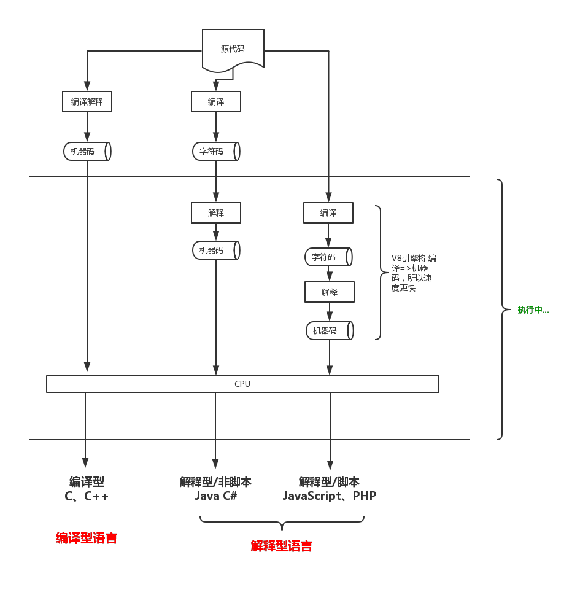

### 我们的IDE里代码是如何让机器认识的？

我们知道机器最后识别的都是机器码，也就是我们说的010101二进制码。 学名机器语言指令，有时也被称为原生码（Native Code），是电脑的CPU可直接解读的数据。  

但是直接去写01代码，对人的要求实在太高，所以就有代码大神发明了高级语言，通过固定规则定义一些逻辑，我们只需按照规则写完自己的代码，然后通过一个方法把它变成机器翻译认识的机器码。  

那么按照这个说法是不是所有高级语言，除了直接写机器码的语言外，需要翻译的语言都是编译型语言呢？
答案是否定的，这里需要明白两个概念：

### 一、编译型语言和解释型语言

 1. #### 编译型语言
    程序在执行之前需要一个专门的编译过程，把程序编译成 为机器语言的文件，运行时不需要重新翻译，直接使用编译的结果就行了。程序执行效率高，依赖编译器，跨平台性差些。如C、C++、Delphi等. 程序在执行之前需要一个专门的编译过程，把程序编译成 为机器语言的文件，运行时不需要重新翻译，直接使用编译的结果就行了。程序执行效率高，依赖编译器，跨平台性差些。如C、C++、Delphi等.

 2. #### 解释型语言
    程序不需要编译，程序在运行时才翻译成机器语言，每执 行一次都要翻译一次。因此效率比较低。比如Basic，JavaScript语言，专门有一个解释器能够直接执行Basic程序，每个语句都是执行的时候才翻译。

可以明显的看出， 一个是编译，一个是解释。两种方式只是翻译的时间不同。  
 
编译时一下子翻译完，然后让cpu去读，而解释是边翻译边读，两者同时进行。  

通俗的说，就像日常翻译一本书，“编译”是把一整本书全部翻译好，你读的时候直接读翻译好的文字，而解释就像是同声翻译，你什么时候读就什么时候翻译，读到哪里就翻译到哪里。

所以两者的区别也就来了

||优点|不足|代表语言|
|-|-|-|-|
|编译型|一次翻译好，运行时不需要翻译，执行效率高|执行前已翻译完成，跨平台性差，因为不同的平台（Windows,Unix,Linux）对应的机器码是不同的|C  C++|
|解释型|运行时翻译，可根据不同的平台翻译成对应的机器码，跨平台性好（就像是拿到一本中文书，我可以根据读者的语言翻译成其能听得懂得语言）|由于需要一边执行一边翻译|Java,JavaScript,Python,PHP|

可能有同学会发现，Java和JavaScript都属于解释性语言，这和我们日常的认知不太一样啊，Java不应该是由编译过程的吗？

那么久需要区分这两个概念了：

### 二、解释型语言和脚本语言
   
脚本语言： 脚本语言是为了缩短传统的编写-编译-链接-运行（edit-compile-link-run）过程而创建的计算机编程语言。它的命名起源于一个脚本“screenplay”，每次运行都会使对话框逐字重复。早期的脚本语言经常被称为批量处理语言或工作控制语言。

可以理解的是脚本语言不仅仅是在执行时翻译，而且它前期也没有编译操作。举个例子，
Java和JavaScript  
我们编写的Java代码会事前编译成为.class文件，然后.class文件会在JVM上解释为机器语言，也就是在执行前做了一次编译操作，但是并未将代码编译为机器码，需要再解释操作。  
而javascript解释的更彻底一些。他把编译和解释操作都放在了执行过程中，所以有种即写即用的感觉，更加便捷，随着解释器性能的不断提高和强大，JavaScript火起来可以说是在情理之中。
      

综上，解释性分为脚本语言和非脚本语言，他们的差异在于是否在执行解释前需要编译操作。

### 三、最终的理解

1. #### 大类区分

2. #### 执行过程中的图

### 四、Reference
[什么是“脚本语言”](http://www.yinwang.org/blog-cn/2013/03/29/scripting-language)

https://www.zhihu.com/question/19608553

