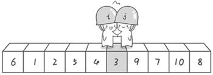
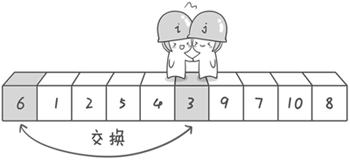
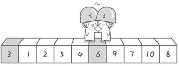
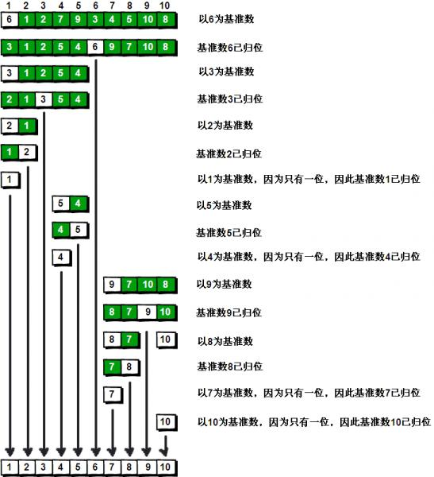

# 一个快速排序的实现

## 我第一次的思路(有问题)

``` javascript
// 快速排序
function fast(array,start, end) {
    if (array.length < 2) return;
    if (start!=undefined && end!=undefined && start>=end) return;
    var i = (start==undefined?1:start), j = (end==undefined?array.length-1:end);
    var baseEle = array[0];
    while(array[j]>=baseEle && j>0) {
        j--;
    }
    while((array[i]<=baseEle) && i<j) {
        i++;
    }
    if(i == j) {
        if (j==0) {
            return;
        };
        var changeEle = baseEle;
        array[0] = array[i];
        array[j] = changeEle;
        fast(array, 0, i-1);
    } else {
        var changeEle = array[i];
        array[i] = array[j];
        array[j] = changeEle;
        fast(array,i,j);
    }

    return array;
}

```


## 百度百科的实现

```javascript
function quickSort(array) {
   function sort(prev, numsize) {
       var nonius = prev;
       var j = numsize - 1;
       var flag = array[prev];
       if ((numsize - prev) > 1) {
           while (nonius < j) {
               for (; nonius < j; j--) {
                   if (array[j] < flag) {
                       array[nonius++] = array[j];　//a[i] = a[j]; i += 1;
                       break;
                   };
               }
               for (; nonius < j; nonius++) {
                   if (array[nonius] > flag) {
                       array[j--] = array[nonius];
                       break;
                   }
               }
           }
           array[nonius] = flag;
           sort(0, nonius);
           sort(nonius + 1, numsize);
       }
   }
   sort(0, array.length);
   return array;
}
```


## 结合我的想法 （遍历次数超出预期 需要调整）

```javascript
function fast(array) {
    
    function sort(start, end) {
        if (array.length < 2) return;
        if (start!=undefined && end!=undefined && start>=end) return;
        var i = (start==undefined?1:start), j = (end==undefined?array.length-1:end);
        var baseEle = array[start];
        while(i!=j) {
            while(array[j]>=baseEle && i<j) {
                j--;
            }
            while((array[i]<=baseEle) && i<j) {
                i++;
            }
            
            if (i<j) {
                 var changeEle = array[i];
                    array[i] = array[j];
                    array[j] = changeEle;
            }
        }

        array[start] = array[i];
        array[i] = baseEle;
        sort(0,i);//继续处理左边的，这里是一个递归的过程 
        sort(i+1,end);//继续处理右边的 ，这里是一个递归的过程 
    }

    sort(0, array.length-1);
    return array;
}
```

## 简单版本

```javascript
 function quickSort2(array) {
    function sort(prev, end) {        
        if (prev > end) return;
        var mark = array[prev];
        var i = prev;
        var j = end
        while (i < j) {
            // 从小到大排序 这里要求把大的留在右边
            while (i < j && array[j] > mark) {
                j--;
            }
            array[i] = array[j];
            // array[j] = mark;
            while (i < j && array[i] < mark) {
                i++;
            }
            array[j] = array[i];
        }
        array[i] = mark;

        sort(0,i-1);
        sort(j+1,end);
    }
    sort(0, array.length-1)
    return array;
 }
```

## 总结

### 几点收获
1. 合理使用循环和递归，找到循环体和终止条件。
2. 第一次没有实现的原因就是将while循环做的工作放到了递归里。
3. 快速排序图解  
          
          
          
          
          
          
          
          
        

### 为什么要从右边开始  
当从左边开始后，最左边的元素可能会找到一个比基准元素大的元素（j此时未移动，没有了i\<j的约束）,那么此时让这个元素与基准元素进行替换，显然不合理，会让大的元素在基准元素的左边。
比如说  
  
i出发会找到7，然后7和6互换，不合理。

### 发散 一个从大到小的排序
刚才的排序是从小到大，那如果是从大到小呢
```javascript
// 倒序排列
function reverseOrder(array) {
    function sort(start, end) {
        if (array.length < 2) return;
        if (start!=undefined && end!=undefined && start>=end) return;
        var i = (start==undefined?1:start), j = (end==undefined?array.length-1:end);
        var baseEle = array[start];
        while(i!=j) {
            while(array[j]<=baseEle && i<j) {
                j--;
            }
            while((array[i]>=baseEle) && i<j) {
                i++;
            }
            
            if (i<j) {
                 var changeEle = array[i];
                    array[i] = array[j];
                    array[j] = changeEle;
            }
        }

        array[start] = array[i];
        array[i] = baseEle;
        sort(0,i);//继续处理左边的，这里是一个递归的过程 
        sort(i+1,end);//继续处理右边的 ，这里是一个递归的过程 
    }

    sort(0, array.length-1);
    return array;
}
```


[refrence-【坐在马桶上看算法】算法3：最常用的排序——快速排序](
http://ahalei.blog.51cto.com/);